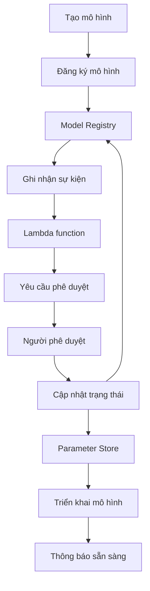

# Điều Chỉnh Siêu Tham Số và Các Tính Năng Mới của SageMaker

[Phần nội dung trước đó giữ nguyên]

## SageMaker Model Registry

SageMaker Model Registry là một công cụ để quản lý và tổ chức các mô hình học máy trong tổ chức của bạn.

### Tính năng chính

1. Catalog mô hình:
   - Lưu trữ thông tin về các mô hình
   - Quản lý phiên bản mô hình

2. Quản lý metadata:
   - Liên kết metadata tùy chỉnh với mô hình
   - Lưu trữ thông tin như trạng thái phê duyệt

3. Quản lý phê duyệt:
   - Theo dõi trạng thái phê duyệt của mô hình
   - Hỗ trợ quy trình phê duyệt thủ công trước khi triển khai

4. Tích hợp với quy trình triển khai:
   - Có thể là một phần của quy trình CI/CD
   - Kiểm tra trạng thái phê duyệt trước khi triển khai

5. Chia sẻ mô hình:
   - Tạo thư viện mô hình tập trung cho tổ chức
   - Cho phép chia sẻ mô hình giữa các ứng dụng khác nhau

6. Tích hợp với SageMaker Model Cards:
   - Liên kết mô hình với thông tin quản trị cấp cao
   - Lưu trữ thông tin về thuộc tính, hạn chế và dữ liệu đào tạo của mô hình

### Ví dụ quy trình làm việc

1. Tạo mô hình thông qua quy trình đào tạo
2. Đăng ký mô hình vào Model Registry
3. EventBridge ghi nhận sự kiện đăng ký mô hình mới
4. Kích hoạt Lambda function để yêu cầu phê duyệt
5. Gửi yêu cầu phê duyệt đến người phê duyệt
6. Người phê duyệt chấp nhận hoặc từ chối mô hình
7. Cập nhật trạng thái phê duyệt trong Model Registry
8. Cập nhật Parameter Store để kích hoạt triển khai
9. Triển khai mô hình thông qua SageMaker Inference Pipelines
10. Thông báo sẵn sàng cho các môi trường dev, test và production

### Lợi ích

- Quản lý tập trung các mô hình trong tổ chức
- Hỗ trợ quy trình phê duyệt và quản lý phiên bản
- Tích hợp dễ dàng với quy trình CI/CD
- Cải thiện khả năng chia sẻ và tái sử dụng mô hình

## Kết luận

SageMaker Model Registry cung cấp một giải pháp tập trung để quản lý, theo dõi và chia sẻ các mô hình học máy trong tổ chức. Bằng cách tích hợp với các công cụ khác của AWS như EventBridge, Lambda và Parameter Store, nó cho phép xây dựng các quy trình làm việc tự động hóa cho việc phê duyệt và triển khai mô hình, đồng thời cải thiện khả năng quản lý và tái sử dụng mô hình trong các dự án khác nhau.
