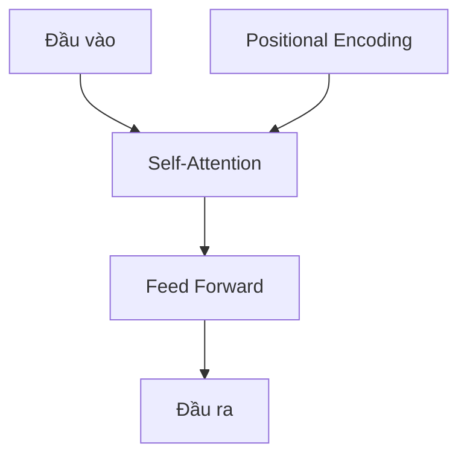

# Tính năng Nâng cao của AWS SageMaker và Mô hình Ngôn ngữ Lớn

[Phần nội dung trước đó giữ nguyên]

## Mô hình Ngôn ngữ Lớn và Kiến trúc Transformer

### Giới thiệu

Năm 2023 đánh dấu sự bùng nổ của mô hình ngôn ngữ lớn (LLM) trong thế giới công nghệ. Các mô hình như GPT và Claude đã tạo ra những bước đột phá đáng kể trong xử lý ngôn ngữ tự nhiên và AI tổng quát. Để hiểu sâu hơn về cách hoạt động của chúng, chúng ta cần tìm hiểu về kiến trúc cơ bản: Transformer.

### Kiến trúc Transformer

Transformer là nền tảng của hầu hết các mô hình ngôn ngữ lớn hiện đại. Dưới đây là cấu trúc cơ bản của một mô hình Transformer:

Các thành phần chính:
1. **Self-Attention**: Cho phép mô hình tập trung vào các phần quan trọng của đầu vào
2. **Feed Forward**: Xử lý thông tin từ self-attention
3. **Positional Encoding**: Cung cấp thông tin về vị trí của từng token trong chuỗi đầu vào

### Cách hoạt động của LLM

1. **Tiền xử lý**: Văn bản đầu vào được chia thành các token
2. **Mã hóa**: Mỗi token được chuyển đổi thành vector số học
3. **Xử lý**: Thông tin đi qua nhiều lớp transformer
4. **Dự đoán**: Mô hình dự đoán token tiếp theo dựa trên ngữ cảnh

### Ứng dụng thực tế với SageMaker

Trong các bài thực hành sắp tới, chúng ta sẽ:
- Xây dựng mô hình transformer đơn giản
- Sử dụng SageMaker để đào tạo mô hình
- Tìm hiểu cách tinh chỉnh mô hình ngôn ngữ lớn
- Khám phá các ứng dụng của LLM trong các tác vụ khác nhau

### Tầm quan trọng

Hiểu biết về LLM và kiến trúc Transformer giúp:
- Tối ưu hóa việc sử dụng AI trong các ứng dụng thực tế
- Nắm bắt cơ hội và thách thức của công nghệ AI hiện đại
- Phát triển các giải pháp AI tiên tiến và sáng tạo

### Kết luận

Mô hình ngôn ngữ lớn và kiến trúc Transformer đã mở ra một kỷ nguyên mới trong lĩnh vực AI. Thông qua việc kết hợp lý thuyết với thực hành trên SageMaker, chúng ta sẽ không chỉ hiểu sâu hơn về cách AI hiện đại hoạt động mà còn có thể áp dụng kiến thức này vào các dự án thực tế.

[Các phần tiếp theo sẽ đi sâu vào chi tiết của từng thành phần trong kiến trúc Transformer và hướng dẫn cụ thể về cách triển khai chúng trên SageMaker]
