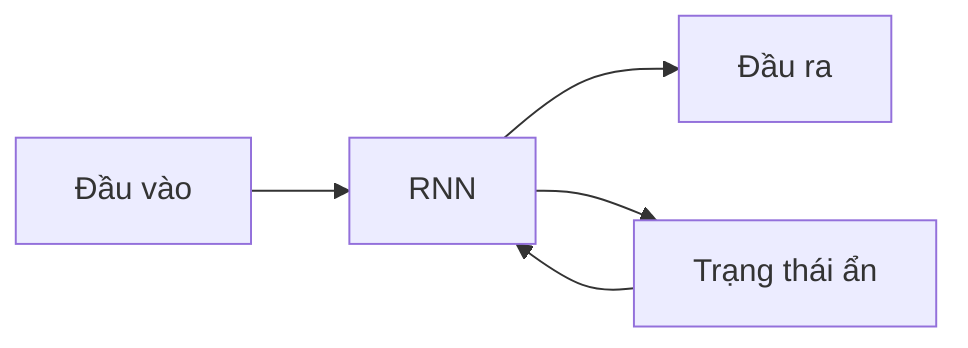
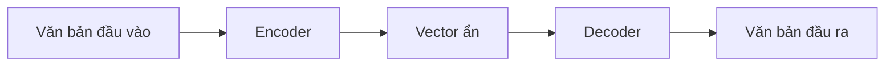
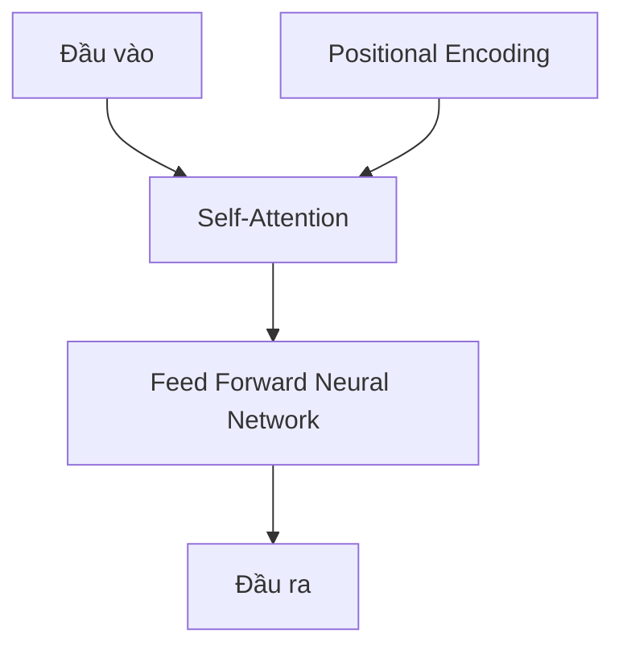

# Sự Phát Triển Của Mô Hình Ngôn Ngữ Lớn Và Kiến Trúc Transformer

## Lịch sử Phát triển

1. **RNN (Recurrent Neural Networks)**: 
   - Mạng neural có khả năng xử lý dữ liệu tuần tự
   - Sử dụng vòng lặp phản hồi để lưu trữ thông tin

2. **LSTM (Long Short-Term Memory)**:
   - Cải tiến của RNN, giải quyết vấn đề mất mát thông tin dài hạn

3. **Kiến trúc Encoder-Decoder**:
   - Sử dụng trong dịch máy
   - Encoder mã hóa câu đầu vào thành vector ẩn
   - Decoder giải mã vector ẩn thành câu đích

4. **Attention Mechanism**:
   - Giới thiệu trong bài báo "Attention is All You Need" (2017)
   - Cho phép mô hình tập trung vào các phần quan trọng của đầu vào

5. **Transformer**:
   - Loại bỏ RNN, sử dụng hoàn toàn cơ chế attention
   - Cho phép xử lý song song, tăng khả năng học từ dữ liệu lớn

## Cơ chế Hoạt động của RNN và LSTM

- RNN xử lý dữ liệu tuần tự bằng cách duy trì trạng thái ẩn
- LSTM cải thiện khả năng lưu trữ thông tin dài hạn

## Kiến trúc Encoder-Decoder

- Encoder chuyển đổi câu đầu vào thành vector ẩn
- Decoder tạo ra câu đích từ vector ẩn
- Hạn chế: Thông tin bị nén vào một vector duy nhất (bottleneck)

## Cơ chế Attention

- Cho phép mô hình tập trung vào các phần quan trọng của đầu vào
- Giải quyết vấn đề mất mát thông tin trong câu dài
- Cải thiện khả năng xử lý ngữ cảnh và quan hệ giữa các từ

## Kiến trúc Transformer

Đặc điểm chính:
1. **Loại bỏ RNN**: Sử dụng hoàn toàn mạng neural feed-forward
2. **Self-Attention**: Cho phép mô hình học mối quan hệ giữa các từ trong câu
3. **Xử lý song song**: Tăng đáng kể tốc độ và khả năng học từ dữ liệu lớn
4. **Positional Encoding**: Cung cấp thông tin về vị trí của từ trong câu

## Ý nghĩa và Tác động

- Cho phép đào tạo trên lượng dữ liệu khổng lồ (ví dụ: toàn bộ Wikipedia, sách điện tử)
- Tạo nền tảng cho các mô hình ngôn ngữ lớn như GPT, BERT
- Mở ra khả năng ứng dụng AI trong nhiều lĩnh vực: dịch thuật, tạo văn bản, trả lời câu hỏi, v.v.

## Kết luận

Sự phát triển từ RNN đến Transformer đã tạo ra bước đột phá trong xử lý ngôn ngữ tự nhiên. Kiến trúc Transformer, với khả năng xử lý song song và hiểu sâu về ngữ cảnh, đã mở ra kỷ nguyên mới cho AI tạo sinh và các ứng dụng ngôn ngữ tiên tiến.

[Phần tiếp theo sẽ đi sâu vào cách triển khai và tối ưu hóa các mô hình dựa trên Transformer bằng AWS SageMaker]
