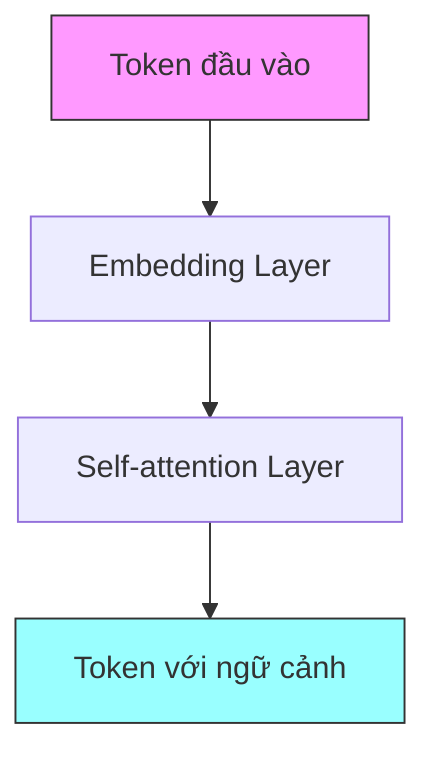
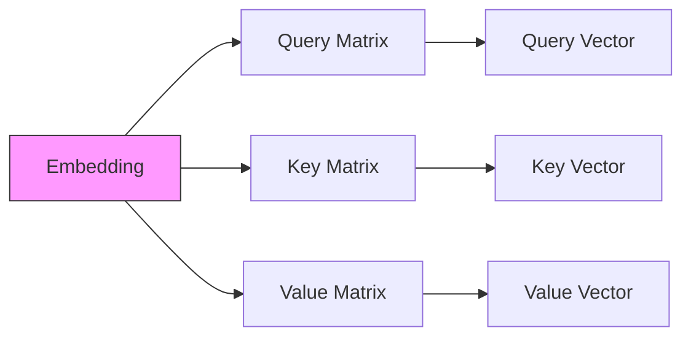
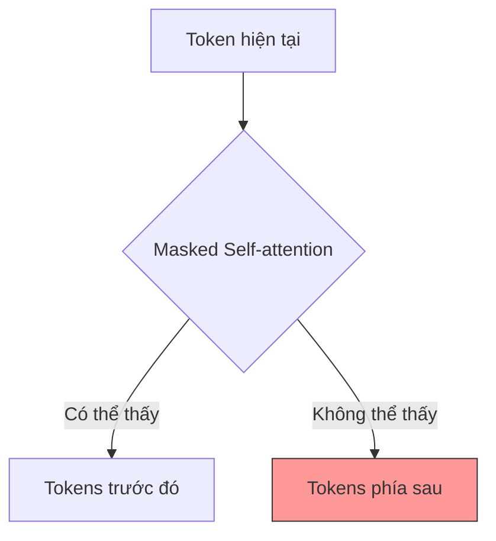
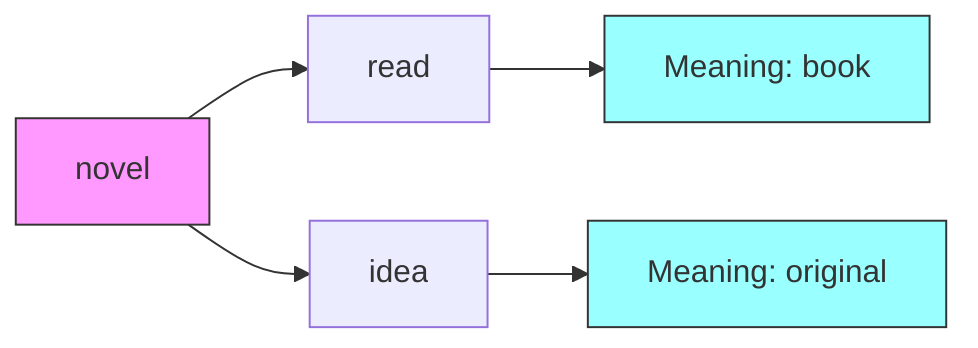

# Hướng dẫn chi tiết về Self-attention trong Transformer

## Mục lục
1. [Giới thiệu về Self-attention](#giới-thiệu-về-self-attention)
2. [Cơ chế hoạt động](#cơ-chế-hoạt-động)
3. [Các thành phần chính](#các-thành-phần-chính)
4. [Quy trình xử lý](#quy-trình-xử-lý)
5. [Multi-headed Self-attention](#multi-headed-self-attention)
6. [Ví dụ thực tế](#ví-dụ-thực-tế)

## Giới thiệu về Self-attention

Self-attention là một cơ chế quan trọng trong kiến trúc Transformer, giúp mô hình hiểu được mối quan hệ giữa các từ trong câu và nắm bắt được ngữ cảnh của chúng. Mục tiêu chính là tạo ra một biểu diễn mới cho mỗi token dựa trên sự tương tác với các token khác trong cùng câu.

## Cơ chế hoạt động

### Embedding Layer
- Mỗi token được chuyển đổi thành vector số học đa chiều
- Các token có ý nghĩa tương tự sẽ nằm gần nhau trong không gian vector
- Vector embedding là đầu vào cho quá trình self-attention

### Ma trận trọng số
Self-attention sử dụng 3 ma trận trọng số chính:
1. Query Matrix (Q)
2. Key Matrix (K)
3. Value Matrix (V)

## Quy trình xử lý

1. **Tính toán vector Q, K, V**:
   - Nhân embedding với ma trận Q để có query vector
   - Nhân embedding với ma trận K để có key vector
   - Nhân embedding với ma trận V để có value vector

2. **Tính điểm attention**:
   - Sử dụng phép nhân dot product giữa query và key
   - Áp dụng hàm softmax để chuẩn hóa điểm số
   - Kết quả là trọng số attention cho mỗi token

3. **Tạo biểu diễn cuối cùng**:
   - Nhân trọng số attention với value vectors
   - Tổng hợp kết quả thành vector Z cuối cùng

## Masked Self-attention

Đây là một biến thể đặc biệt được sử dụng trong các mô hình như GPT:

- Ngăn token nhìn thấy thông tin từ tương lai
- Xử lý tuần tự mặc dù tính toán song song
- Sử dụng mask matrix để che đi các token phía sau

## Multi-headed Self-attention

Đây là phiên bản tối ưu của self-attention:

1. **Cấu trúc**:
   - Chia vector Q, K, V thành nhiều ma trận nhỏ hơn
   - Mỗi phần được gọi là một "head"
   - Xử lý song song các head

2. **Ưu điểm**:
   - Tăng khả năng xử lý song song
   - Cho phép mô hình học nhiều kiểu mối quan hệ khác nhau
   - Cải thiện hiệu suất tổng thể

## Ví dụ thực tế

### Ví dụ 1: Từ "novel" trong các ngữ cảnh khác nhau

1. "I read a good novel"
   - Attention cao với từ "read"
   - Ý nghĩa: "sách, tiểu thuyết"

2. "This is a novel idea"
   - Attention cao với từ "idea"
   - Ý nghĩa: "mới mẻ, độc đáo"

## Ứng dụng trong các mô hình khác nhau

1. **GPT**:
   - Sử dụng stack của các decoder
   - Áp dụng masked self-attention
   - Chỉ nhìn context từ trái sang phải

2. **BERT**:
   - Sử dụng stack của các encoder
   - Masked language modeling
   - Có thể nhìn context hai chiều

## Tài liệu tham khảo và học thêm

1. Transformer paper gốc: "Attention Is All You Need"
2. Hugging Face documentation về self-attention
3. Các tutorial thực hành trên PyTorch và TensorFlow