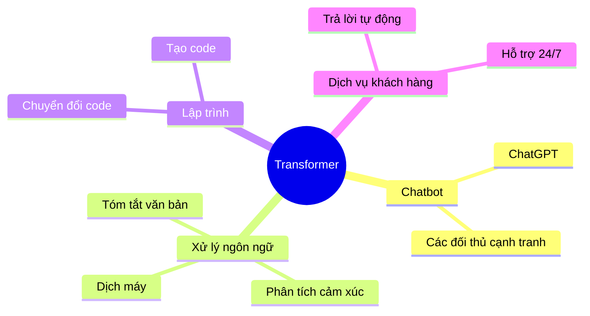
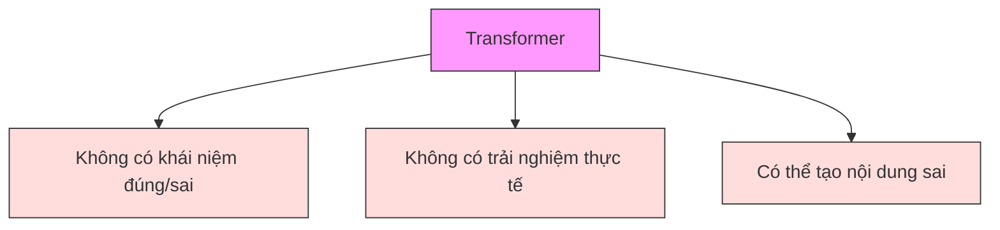

# Ứng dụng của Transformer trong thực tế

## Mục lục
1. [Tổng quan](#tổng-quan)
2. [Các ứng dụng chính](#các-ứng-dụng-chính)
3. [Chatbot và trợ lý ảo](#chatbot-và-trợ-lý-ảo)
4. [Xử lý văn bản](#xử-lý-văn-bản)
5. [Lưu ý khi triển khai](#lưu-ý-khi-triển-khai)

## Tổng quan

## Các ứng dụng chính

### 1. Trò chuyện và hỗ trợ
- **Chatbot thông minh**
  - Transformer là nền tảng cơ bản
  - Cần thêm các lớp huấn luyện bổ sung
  - Yêu cầu kiểm duyệt nội dung
  - Khả năng duy trì ngữ cảnh hội thoại

### 2. Hệ thống hỏi đáp
- **Đặc điểm**
  - Chuyển câu hỏi thành vector
  - Sinh câu trả lời dựa trên dữ liệu huấn luyện
  - Không đảm bảo tính chính xác 100%

### 3. Phân tích và xử lý văn bản
- **Các nhiệm vụ chính**
  - Phân tích cảm xúc (Sentiment Analysis)
  - Nhận diện thực thể (Named Entity Recognition)
  - Tóm tắt văn bản (Text Summarization)

### 4. Dịch thuật đa ngôn ngữ
- **Khả năng**
  - Dịch giữa các ngôn ngữ tự nhiên 
  - Chuyển đổi giữa các ngôn ngữ lập trình
  - Dịch từ yêu cầu sang mã code

## Lưu ý khi triển khai

### 1. Giới hạn của Transformer

### 2. Khuyến nghị khi sử dụng
- **Kiểm tra kỹ đầu ra**
  - Xác minh tính chính xác
  - Đảm bảo phù hợp ngữ cảnh
  - Thử nghiệm nhiều tình huống

- **Trong dịch vụ khách hàng**
  - Tích hợp với hệ thống thực tế
  - Đảm bảo thực hiện được lời hứa
  - Có cơ chế chuyển tiếp cho con người
  - Xử lý các trường hợp ngoại lệ

## Kết luận

Transformer là một công nghệ mạnh mẽ nhưng cần được sử dụng một cách thận trọng:

1. **Ưu điểm**
   - Đa dạng ứng dụng
   - Xử lý ngôn ngữ tự nhiên tốt
   - Tiết kiệm thời gian và nguồn lực

2. **Thách thức**
   - Cần kiểm soát chất lượng
   - Đòi hỏi giám sát của con người
   - Phải có cơ chế dự phòng

3. **Khuyến nghị**
   - Triển khai từng bước
   - Kết hợp với chuyên gia
   - Thường xuyên đánh giá hiệu quả