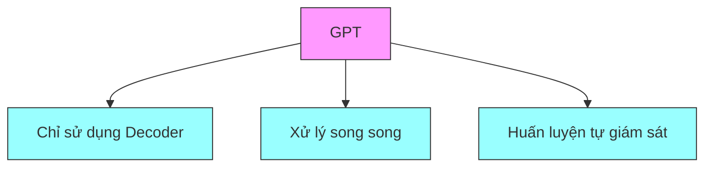
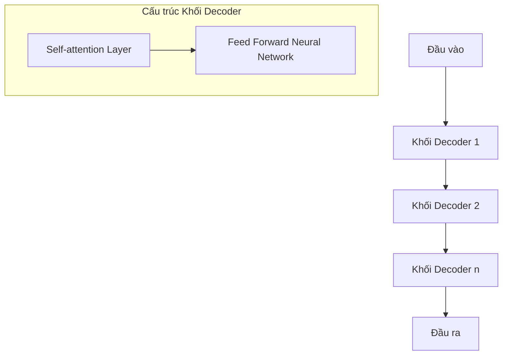
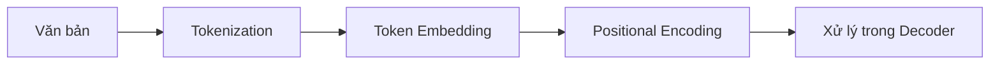
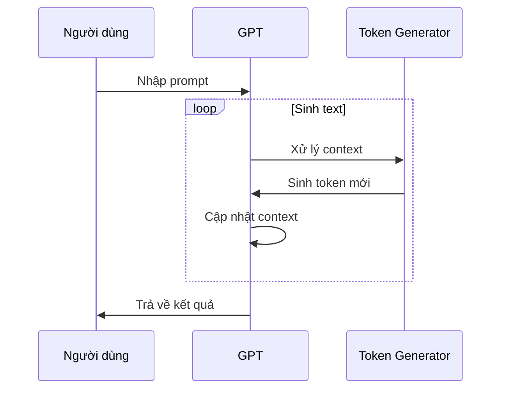
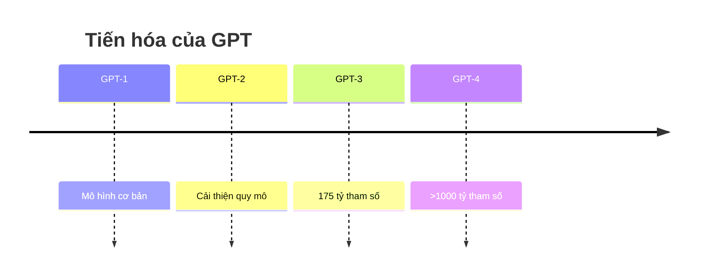

# Kiến trúc và Cơ chế Hoạt động của GPT

## Mục lục
1. [Tổng quan về GPT](#tổng-quan-về-gpt)
2. [Kiến trúc cơ bản](#kiến-trúc-cơ-bản)
3. [Quy trình xử lý đầu vào](#quy-trình-xử-lý-đầu-vào)
4. [Cơ chế sinh text](#cơ-chế-sinh-text)
5. [So sánh với các mô hình khác](#so-sánh-với-các-mô-hình-khác)

## Tổng quan về GPT

GPT (Generative Pre-trained Transformer) là một kiến trúc đặc biệt của Transformer, được phát triển bởi OpenAI. 

### Đặc điểm chính:
- Chỉ sử dụng các khối decoder
- Xử lý song song toàn bộ văn bản
- Không có khái niệm đầu vào/đầu ra riêng biệt
- Số lượng tham số rất lớn (hàng trăm tỷ)

## Kiến trúc cơ bản

### Cấu trúc khối Decoder:
1. **Self-attention Layer**
   - Xử lý mối quan hệ giữa các token
   - Áp dụng masked attention
   
2. **Feed Forward Neural Network**
   - Xử lý thông tin từ self-attention
   - Số lượng tham số rất lớn

## Quy trình xử lý đầu vào

### 1. Tokenization
- Chuyển đổi từ thành các token số
- Một từ có thể chia thành nhiều token
- Ví dụ: "indivisible" → ["in", "divis", "ible"]

### 2. Token Embedding
- Chuyển token thành vector đa chiều
- Vector gần nhau = nghĩa tương tự
- Số chiều có thể lên đến hàng nghìn

### 3. Positional Encoding
- Sử dụng hàm sin/cos
- Mã hóa vị trí tương đối
- Đan xen sóng sin và cos
- Có thể mở rộng với độ dài bất kỳ

## Cơ chế sinh text

### Quy trình sinh token:
1. Nhận văn bản đầu vào
2. Xử lý song song toàn bộ
3. Dự đoán token tiếp theo
4. Lặp lại quá trình

## So sánh với các mô hình khác

### 1. BERT
- Chỉ sử dụng Encoder
- Hiểu ngữ cảnh 2 chiều
- Tập trung vào hiểu văn bản

### 2. T5
- Sử dụng cả Encoder-Decoder
- Cấu trúc phức tạp hơn
- Phù hợp nhiều tác vụ

## Ứng dụng và Giới hạn

### Ứng dụng:
1. Sinh văn bản
2. Dịch thuật
3. Trả lời câu hỏi
4. Tóm tắt văn bản

### Giới hạn:
1. Cần tài nguyên tính toán lớn
2. Không đảm bảo tính chính xác
3. Có thể sinh ra nội dung sai lệch

## Tiến hóa của GPT

## Tài liệu tham khảo
1. Tài liệu kỹ thuật OpenAI
2. Hugging Face Documentation
3. Research papers về Transformer và GPT