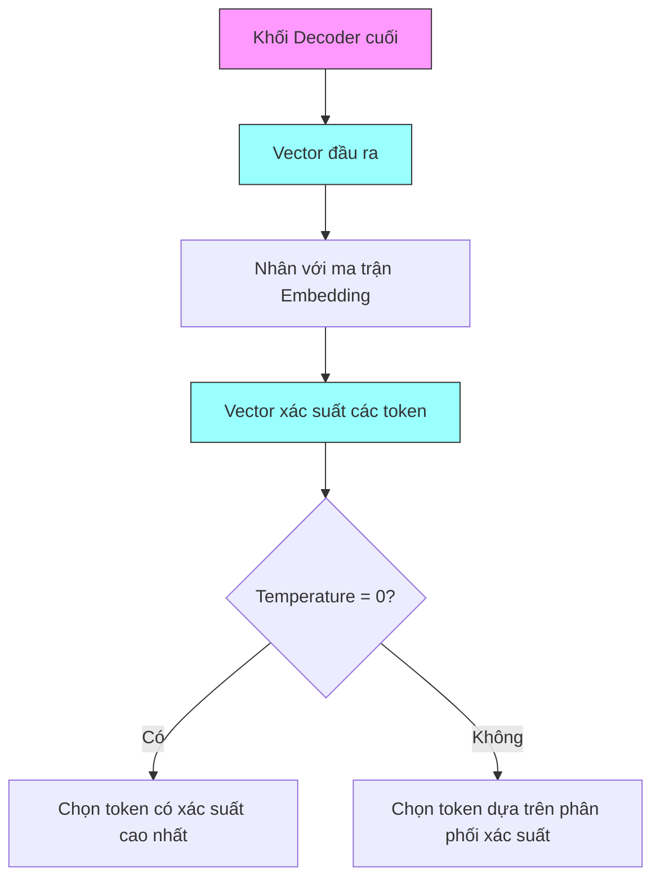
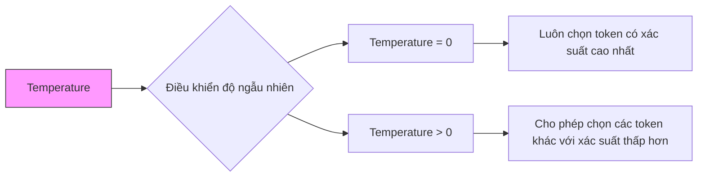
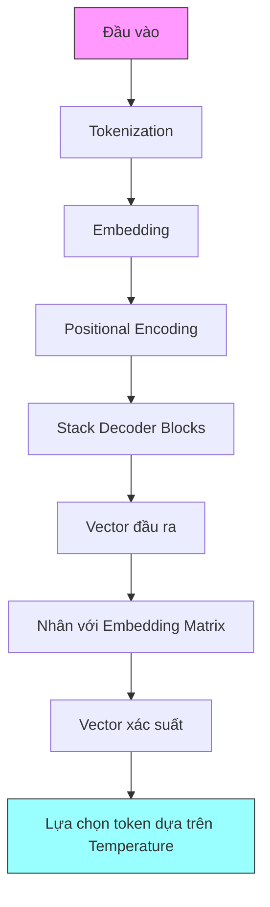

# Giai đoạn đầu ra của GPT

## Quy trình tạo token tiếp theo

## Các bước chi tiết

### 1. Vector đầu ra từ Decoder
- Đại diện ngữ nghĩa của token tiếp theo
- Kết quả từ việc xử lý ngữ cảnh trước đó
- Chứa thông tin về ý nghĩa cần biểu đạt

### 2. Ánh xạ với ma trận Embedding
- Nhân vector đầu ra với ma trận embedding
- Chuyển đổi từ không gian ngữ nghĩa sang không gian token
- Tạo ra vector xác suất cho mỗi token

### 3. Xử lý Temperature

#### Ví dụ về ảnh hưởng của Temperature
Câu đầu vào: "This course is..."

Temperature = 0:
- Luôn chọn token có xác suất cao nhất
- Ví dụ: "interesting" (nếu đây là token có xác suất cao nhất)
- Kết quả nhất quán mỗi lần chạy

Temperature > 0:
- Có thể chọn các token khác:
  - "incredible"
  - "challenging"
  - "hard"
- Tạo ra sự đa dạng trong câu trả lời

## Ứng dụng của Temperature

### 1. Temperature thấp (gần 0)
- Phù hợp cho các tác vụ cần độ chính xác cao
- Trả lời câu hỏi về sự kiện, dữ liệu
- Tính toán, lập trình

### 2. Temperature cao hơn
- Sáng tạo nội dung đa dạng
- Brainstorming ý tưởng
- Tạo văn bản có tính nghệ thuật

## Tổng quan quy trình GPT

## Ưu điểm của cơ chế này

1. **Tính linh hoạt**
   - Điều chỉnh được độ sáng tạo
   - Cân bằng giữa độ chính xác và đa dạng
   - Phù hợp nhiều loại ứng dụng khác nhau

2. **Khả năng tùy chỉnh**
   - Điều chỉnh temperature theo nhu cầu
   - Tạo nhiều phiên bản câu trả lời khác nhau
   - Thử nghiệm nhiều khả năng

3. **Hiệu quả trong thực tế**
   - Sinh văn bản tự nhiên
   - Đáp ứng nhiều nhu cầu khác nhau
   - Dễ dàng điều chỉnh theo mục đích sử dụng