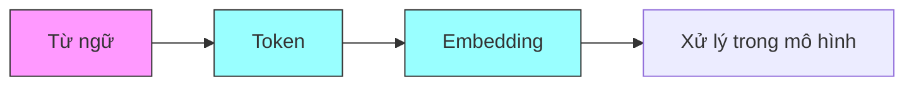
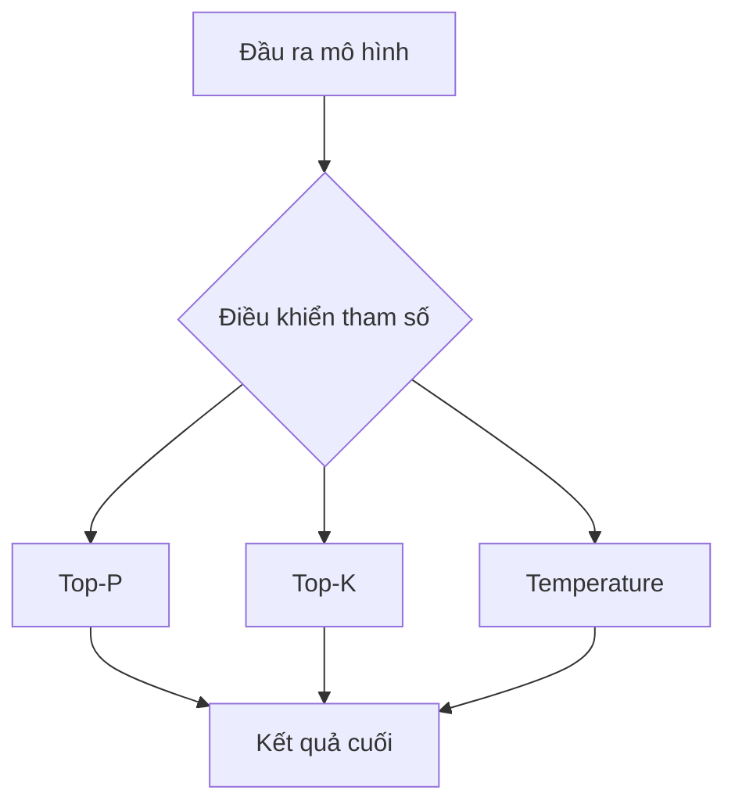
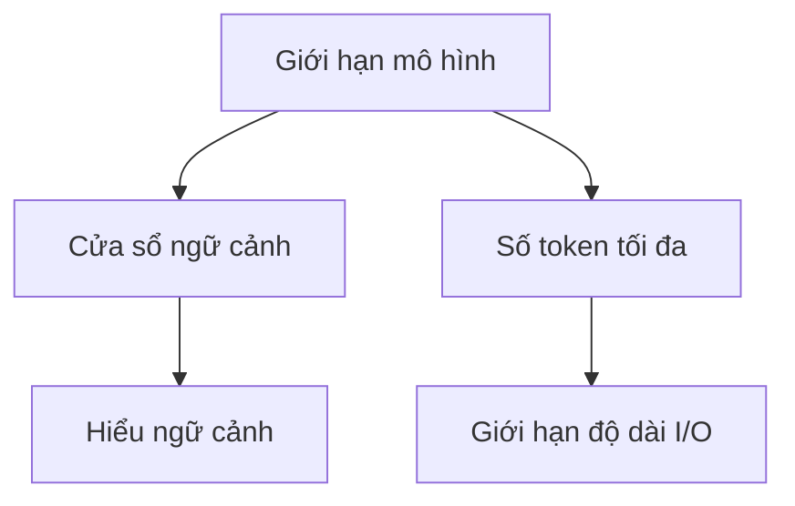

# Các Khái Niệm và Tham Số Chính trong Mô Hình Ngôn Ngữ Lớn

## Khái Niệm Cơ Bản

### Token
- Biểu diễn số học của từ hoặc phần của từ
- Đơn vị cơ bản mà máy tính có thể xử lý
- Ví dụ: "playing" có thể tách thành "play" và "ing"
- Chuyển đổi văn bản thành số để mô hình xử lý

### Embedding
- Vector toán học biểu diễn ý nghĩa của token
- Các từ có nghĩa tương tự có vector gần nhau
- Biểu diễn độc lập với ngôn ngữ
- Nắm bắt mối quan hệ ngữ nghĩa giữa các từ

## Các Tham Số Sinh Kết Quả

### Top-P (Lấy mẫu theo nhân)
- Đặt ngưỡng xác suất cho việc chọn token
- Giá trị cao = kết quả ngẫu nhiên hơn
- Lọc token theo xác suất tích lũy
- Lựa chọn thích ứng dựa trên phân phối xác suất

### Top-K
- Chọn K token có khả năng cao nhất
- K quyết định số lượng ứng viên
- Ví dụ: K = 2, 3, 4, 5
- K cao = kết quả đa dạng hơn

### Temperature (Nhiệt độ)
- Kiểm soát tính ngẫu nhiên trong lựa chọn cuối
- Thang đo: 0.0 đến 1.0
  - 0.0: Luôn chọn token có khả năng cao nhất
  - 1.0: Hoàn toàn ngẫu nhiên
- Cân bằng giữa sáng tạo và nhất quán

## Giới Hạn Xử Lý

### Cửa sổ ngữ cảnh (Context Window)
- Số lượng token xử lý đồng thời
- Xác định phạm vi nhận biết ngữ cảnh
- Ảnh hưởng đến khả năng hiểu văn bản dài
- Quan trọng cho cơ chế tự chú ý

### Số Token Tối đa
- Giới hạn tổng số token cho đầu vào/ra
- Giới hạn riêng cho đầu vào và đầu ra
- Tránh quá tải bộ nhớ
- Đảm bảo hiệu suất ổn định

## Bảng So Sánh Tham Số

| Tham số | Mục đích | Ảnh hưởng khi cao | Ảnh hưởng khi thấp |
|---------|----------|-------------------|-------------------|
| Top-P | Lọc xác suất | Kết quả đa dạng | Kết quả tập trung |
| Top-K | Giới hạn lựa chọn | Nhiều lựa chọn | Ít lựa chọn |
| Temperature | Kiểm soát ngẫu nhiên | Sáng tạo hơn | Nhất quán hơn |

## Khuyến Nghị Sử Dụng

### Cho Kết Quả Nhất Quán
- Temperature thấp (0.1 - 0.3)
- Top-K thấp (≤ 5)
- Top-P thấp (≤ 0.3)

### Cho Kết Quả Sáng Tạo
- Temperature cao (0.7 - 1.0)
- Top-K cao (≥ 20)
- Top-P cao (≥ 0.7)

### Theo Loại Ứng Dụng
1. **Trả lời câu hỏi**:
   - Temperature thấp
   - Cửa sổ ngữ cảnh đủ lớn

2. **Viết văn sáng tạo**:
   - Temperature cao
   - Top-P cao

3. **Sinh mã nguồn**:
   - Temperature thấp
   - Số token tối đa cao

## Lưu ý thực tế
- Điều chỉnh các tham số tùy theo mục đích sử dụng
- Thử nghiệm để tìm giá trị tối ưu
- Cân nhắc đánh đổi giữa tính sáng tạo và độ chính xác
- Theo dõi hiệu suất để điều chỉnh phù hợp