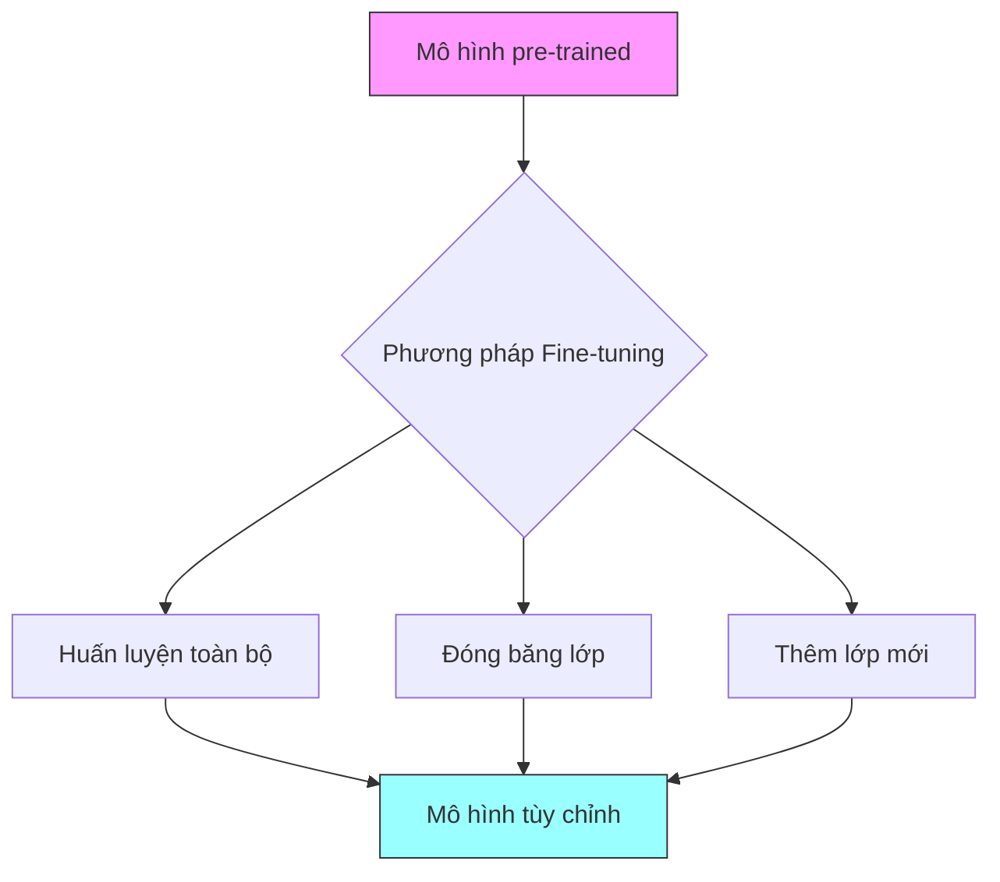
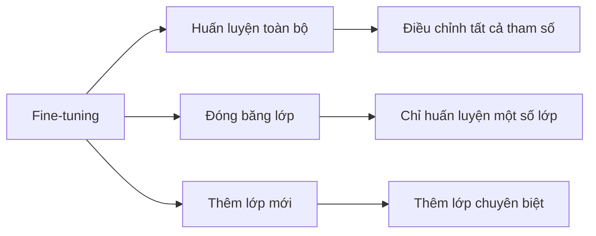
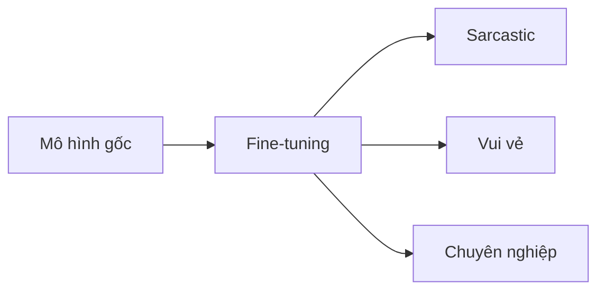

# Transfer Learning và Fine-tuning trong Transformer

## Tổng quan

## 1. Khái niệm cơ bản

### 1.1 Transfer Learning là gì?
- Sử dụng mô hình đã được huấn luyện làm nền tảng
- Tận dụng kiến thức ngôn ngữ có sẵn
- Tiết kiệm thời gian và tài nguyên
- Có thể áp dụng cho nhiều mô hình (GPT, LLAMA, ...)

### 1.2 Ưu điểm
- Không cần huấn luyện từ đầu
- Tận dụng được kiến thức tổng quát
- Điều chỉnh nhanh cho mục đích cụ thể
- Yêu cầu ít dữ liệu huấn luyện hơn

## 2. Các phương pháp Fine-tuning

### 2.1 Huấn luyện toàn bộ
- Điều chỉnh tất cả tham số trong mô hình
- Phù hợp khi có nhiều dữ liệu
- Tốn nhiều tài nguyên tính toán
- Có thể thay đổi hoàn toàn hành vi mô hình

### 2.2 Đóng băng lớp
- Giữ nguyên một số lớp
- Chỉ huấn luyện lớp trên cùng
- Tiết kiệm tài nguyên
- Phù hợp cho việc học tokenizer mới

### 2.3 Thêm lớp mới
- Thêm lớp chuyên biệt vào mô hình
- Giữ nguyên kiến thức cơ bản
- Dễ điều chỉnh cho tác vụ cụ thể
- Yêu cầu ít dữ liệu huấn luyện

## 3. Ứng dụng thực tế

### 3.1 Điều chỉnh tính cách

### 3.2 Tác vụ cụ thể
1. **Phân loại cảm xúc**
   - Huấn luyện nhận diện sentiment
   - Phân loại thành các nhóm
   - Thêm lớp phân loại

2. **Trả lời email**
   - Học từ email và phản hồi cũ
   - Bắt chước phong cách viết
   - Tạo phản hồi tự động

3. **Dịch vụ khách hàng**
   - Huấn luyện từ transcript cũ
   - Tùy chỉnh theo tổ chức
   - Tạo phản hồi phù hợp

4. **Mô phỏng nhân vật**
   - Học từ kịch bản/script
   - Bắt chước phong cách nói
   - Tạo tương tác như nhân vật

## 4. Hướng dẫn thực hành

### 4.1 Chuẩn bị
1. Chọn mô hình cơ sở phù hợp
2. Thu thập dữ liệu huấn luyện
3. Xác định phương pháp fine-tuning

### 4.2 Thực hiện
1. Tiền xử lý dữ liệu
2. Chọn tham số học tập
3. Huấn luyện và đánh giá
4. Điều chỉnh cho đến khi đạt yêu cầu

## 5. Lưu ý quan trọng

### 5.1 Kỹ thuật
- Cân nhắc kỹ lượng dữ liệu cần thiết
- Chọn phương pháp phù hợp với nguồn lực
- Theo dõi hiệu suất trong quá trình huấn luyện
- Tránh overfitting

### 5.2 Ứng dụng
- Đảm bảo chất lượng dữ liệu huấn luyện
- Kiểm tra kết quả trên nhiều trường hợp
- Cân nhắc yếu tố đạo đức và pháp lý
- Duy trì tính nhất quán của mô hình