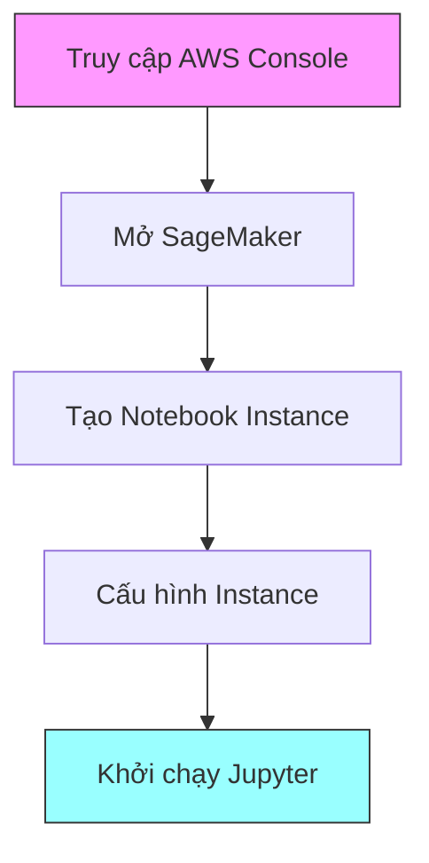
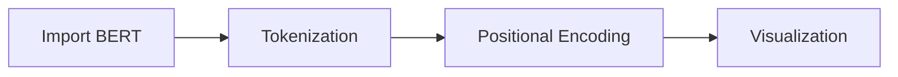

# Hướng dẫn thực hành Transformer trên Amazon SageMaker

## 1. Thiết lập môi trường



### 1.1 Tạo Notebook Instance
- Chọn SageMaker từ AWS Console
- Vào mục "Notebook instances"
- Tạo instance mới
- Đặt tên (ví dụ: "Transformers")

### 1.2 Cấu hình Instance
- Chọn instance type: t3.medium (tiết kiệm chi phí)
- Sử dụng Amazon Linux 2
- JupyterLab 3
- Giữ cấu hình mặc định cho permissions và encryption

⚠️ **Lưu ý về chi phí**: 
- Instance sẽ tính phí liên tục khi đang chạy
- Nhớ tắt instance khi không sử dụng
- Sử dụng t3.medium để tiết kiệm chi phí

## 2. Cài đặt thư viện

### 2.1 Cài đặt Transformers
```python
!pip install git+https://github.com/huggingface/transformers
```

### 2.2 Cài đặt các gói phụ thuộc
```python
!pip install jupyterlab ipywidgets viz xformers evaluate matplotlib
```

### 2.3 Thư viện đã cài đặt
- Transformers (từ Hugging Face)
- PyTorch (tự động cài đặt)
- Các công cụ trực quan hóa

## 3. Hugging Face và các công cụ

### 3.1 Giới thiệu Hugging Face
- Repository chứa các mô hình pre-trained
- Địa chỉ: huggingface.co
- Cung cấp nhiều mô hình miễn phí:
  - GPT-2
  - GPT-J
  - LLAMA
  - Stable Diffusion

### 3.2 Tài nguyên học tập
- Tài liệu chi tiết cho từng mô hình
- Hướng dẫn sử dụng
- Tutorial video
- Documentation đầy đủ

## 4. Thực hành với BERT



### 4.1 Import mô hình
```python
from transformers import BertModel, BertTokenizer
```

### 4.2 Ví dụ Tokenization
```python
text = "I read a good novel."
# Kết quả tokenization
['[CLS]', 'I', 'read', 'a', 'good', 'novel', '.', '[SEP]']
```

### 4.3 Positional Encoding
- Sử dụng hàm sin và cos
- Mã hóa vị trí của từng token
- Visualization bằng matplotlib

## 5. Kết quả và trực quan hóa

### 5.1 Token và Mask
- Tokens: Biểu diễn số của từng từ
- Special tokens: [CLS], [SEP]
- Attention mask: Kiểm soát attention

### 5.2 Positional Matrix
- Ma trận vị trí được tạo từ sin/cos
- Trực quan hóa bằng matplotlib
- Mô tả vị trí tương đối của tokens

## 6. Lưu ý quan trọng

### 6.1 Quản lý tài nguyên
- Tắt notebook instance khi không dùng
- Theo dõi chi phí AWS
- Sao lưu notebook thường xuyên

### 6.2 Thực hành tốt nhất
- Test với dữ liệu nhỏ trước
- Tối ưu code trước khi chạy
- Kiểm tra memory usage

## 7. Tài liệu tham khảo
1. AWS SageMaker Documentation
2. Hugging Face Documentation
3. Transformer Documentation
4. PyTorch Documentation