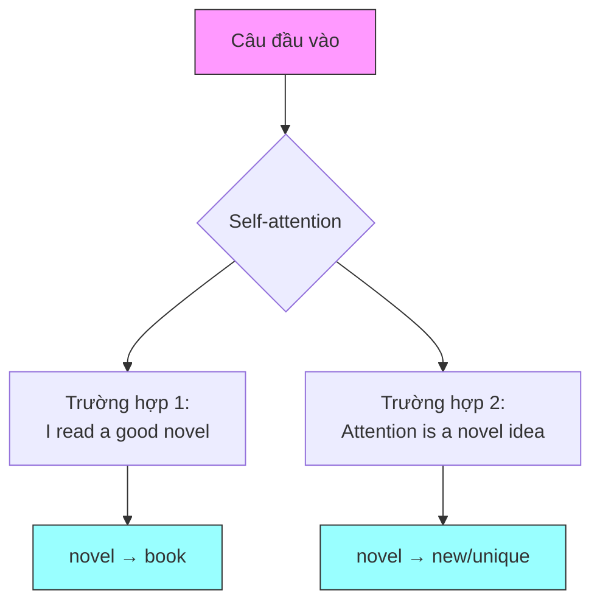
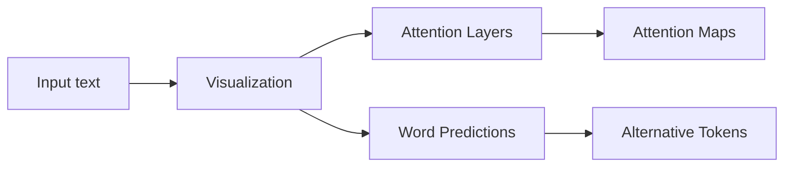

# Thực hành và Trực quan hóa Self-attention

## 1. Thiết lập môi trường

### 1.1 Import thư viện cần thiết
```python
from bertvis.transformers import BertModel, BertTokenizer
from bertvis.neuronview import show
```

### 1.2 Khởi tạo mô hình
- Sử dụng mô hình BERT pre-trained từ Hugging Face
- Tải tokenizer tương ứng

## 2. Phân tích ví dụ "Novel"



### 2.1 Trường hợp 1: "I read a good novel"
- **Quan sát attention**:
  - Từ "novel" có kết nối mạnh với "read"
  - Ngữ cảnh chỉ ra nghĩa "sách/tiểu thuyết"
  - Ma trận Query-Key-Value xác nhận mối liên hệ

### 2.2 Trường hợp 2: "Attention is a novel idea"
- **Quan sát attention**:
  - "novel" kết nối mạnh với "idea"
  - Một phần kết nối với "attention"
  - Ngữ cảnh chỉ ra nghĩa "mới mẻ/độc đáo"

## 3. Sử dụng công cụ trực quan hóa Hugging Face

### 3.1 Exbert Tool


### 3.2 Phân tích kết quả
**Trường hợp 1: "I read a good novel"**
- Top prediction: "novel"
- Second prediction: "book"
- Attention map cho thấy kết nối với "read"

**Trường hợp 2: "Attention is a novel idea"**
- Tokenization của "attention": chia thành 3 token
- Top prediction cho "novel": "new"
- Attention map thể hiện kết nối với "idea"

## 4. Quan sát chi tiết

### 4.1 Cấu trúc Attention
- Nhiều attention head
- Mỗi head tập trung vào các mối quan hệ khác nhau
- Có thể quan sát từng layer riêng biệt

### 4.2 Query-Key-Value matrices
- Trực quan hóa ma trận QKV
- Thể hiện cách tính toán attention scores
- Minh họa softmax normalization

## 5. Kết luận và hiểu biết

### 5.1 Insights chính
1. Self-attention hiệu quả trong nắm bắt ngữ cảnh
2. Một từ có thể có nhiều nghĩa khác nhau
3. Mối quan hệ giữa các từ quyết định nghĩa

### 5.2 Ứng dụng thực tế
- Hiểu văn bản trong ngữ cảnh
- Phân biệt nghĩa của từ đa nghĩa
- Tạo biểu diễn phong phú cho tokens

## 6. Lưu ý quan trọng

### 6.1 Kỹ thuật
- Theo dõi memory usage
- Tối ưu hiệu suất visualization
- Lưu kết quả phân tích

### 6.2 Quản lý tài nguyên
⚠️ **Nhắc nhở quan trọng**:
- Tắt notebook khi không sử dụng
- Tránh phát sinh chi phí không cần thiết
- Sao lưu kết quả trước khi đóng

## 7. Tài liệu tham khảo
1. Hugging Face Exbert Tool
2. BERT Visualization Documentation
3. Self-attention Papers
4. AWS SageMaker Best Practices