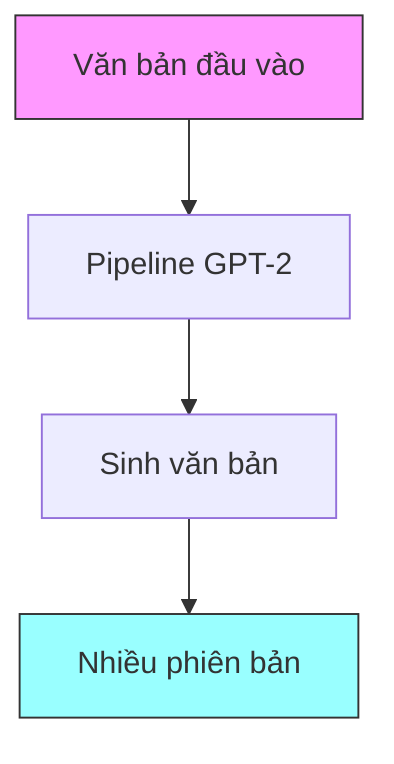
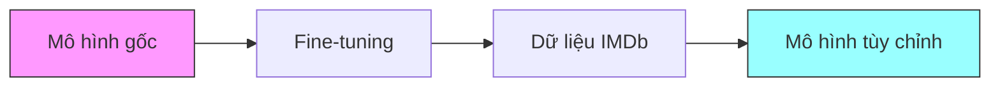

# Sử dụng mô hình Pre-trained từ Hugging Face

## 1. Thiết lập cơ bản

### 1.1 Import thư viện
```python
from transformers import pipeline
```

### 1.2 Tạo Pipeline
```python
generator = pipeline('text-generation', model='gpt2')
```

## 2. Thử nghiệm sinh văn bản



### 2.1 Ví dụ 1: Tiểu thuyết
```python
text = "I read a good novel"
results = generator(text, max_length=50, num_return_sequences=5)
```

### 2.2 Ví dụ 2: Đánh giá phim
```python
text = "This movie seemed really long"
results = generator(text, max_length=300, num_return_sequences=5)
```

### 2.3 Ví dụ 3: Star Trek
```python
text = "Star Trek"
results = generator(text, max_length=100, num_return_sequences=5)
```

## 3. Phân tích kết quả

### 3.1 Quan sát chính
1. **Tính đa dạng**
   - Mỗi lần sinh tạo kết quả khác nhau
   - Văn phong tự nhiên
   - Nội dung phù hợp ngữ cảnh

2. **Nguồn dữ liệu**
   - Dấu hiệu của dữ liệu từ Wikipedia
   - Thông tin chung, không chuyên sâu
   - Phong cách viết tương tự nguồn

3. **Giới hạn**
   - Không có kiến thức thực tế
   - Có thể tạo thông tin sai
   - Chỉ dựa trên dữ liệu huấn luyện

## 4. Cải thiện mô hình

### 4.1 Khả năng fine-tuning
- Huấn luyện thêm với dữ liệu IMDb
- Tùy chỉnh cho domain cụ thể
- Cải thiện chất lượng đầu ra



## 5. Lưu ý quan trọng

### 5.1 Về mô hình ngôn ngữ
- Không tìm kiếm sự thật
- Tạo văn bản dựa trên pattern
- Có thể tạo thông tin không chính xác

### 5.2 Về quản lý tài nguyên
⚠️ **Quan trọng**:
- Tắt notebook khi không sử dụng
- Kiểm tra dung lượng ổ đĩa
- Lưu kết quả trước khi đóng

## 6. Ứng dụng thực tế

### 6.1 Các use case phổ biến
1. Sinh nội dung tự động
2. Hoàn thành văn bản
3. Tạo variation cho nội dung

### 6.2 Cải thiện kết quả
- Fine-tune với dữ liệu chuyên ngành
- Điều chỉnh tham số sinh
- Kết hợp với hệ thống kiểm tra

## 7. Code mẫu tham khảo
```python
# Tạo pipeline
from transformers import pipeline
generator = pipeline('text-generation', model='gpt2')

# Sinh văn bản
text = "Your input text"
results = generator(text, 
                   max_length=100, 
                   num_return_sequences=5)

# In kết quả
for i, result in enumerate(results, 1):
    print(f"Version {i}:", result['generated_text'])
```