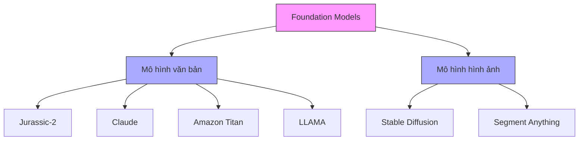
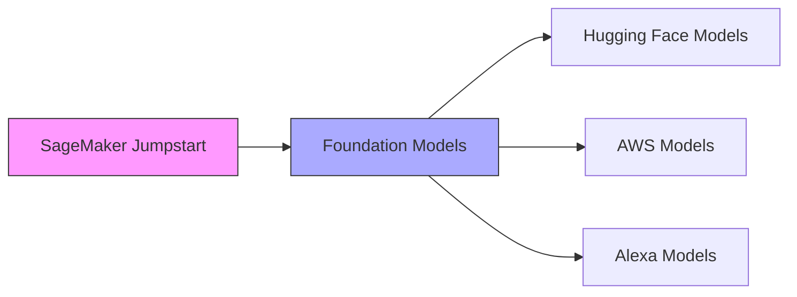
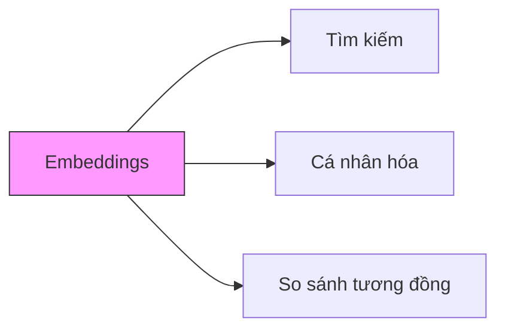

# Foundation Models trên AWS

## 1. Tổng quan về Foundation Models

### 1.1 Định nghĩa
- Mô hình Transformer đã được pre-trained
- Có thể fine-tune cho tác vụ cụ thể
- Nền tảng cho các ứng dụng AI

## 2. Các mô hình có sẵn trên AWS

### 2.1 Text Generation
1. **Jurassic-2 (AI21 Labs)**
   - Đa ngôn ngữ
   - Hỗ trợ: Tây Ban Nha, Pháp, Đức, Bồ Đào Nha, Ý, Hà Lan

2. **Claude (Anthropic)**
   - Hội thoại
   - Trả lời câu hỏi
   - Tự động hóa quy trình

3. **Amazon Titan**
   - Tạo văn bản
   - Tóm tắt
   - Embeddings cho tìm kiếm/cá nhân hóa

### 2.2 Image Generation
1. **Stable Diffusion**
   - Tạo hình ảnh
   - Thiết kế logo
   - Tạo nghệ thuật

2. **Segment Anything (Meta)**
   - Xử lý hình ảnh
   - Phân đoạn đối tượng

## 3. SageMaker Jumpstart

### 3.1 Tính năng chính
- Khởi tạo notebook nhanh
- Tích hợp sẵn mô hình
- Ví dụ code mẫu
- Hướng dẫn fine-tuning

### 3.2 Các mô hình tích hợp
1. **Từ Hugging Face**
   - Falcon
   - BLOOM
   - GPT-J
   - GPT-2

2. **Từ AWS**
   - Stable Diffusion
   - Amazon Titan
   - Alexa Models

## 4. Ứng dụng và Use Cases

### 4.1 Xử lý văn bản
- Tạo nội dung
- Tóm tắt văn bản
- Trả lời câu hỏi
- Dịch đa ngôn ngữ

### 4.2 Embeddings

- Tính toán độ tương tự
- Gợi ý sản phẩm
- Tìm kiếm ngữ nghĩa

## 5. Lưu ý và Thực hành tốt nhất

### 5.1 Lựa chọn mô hình
- Xác định nhu cầu cụ thể
- Cân nhắc khả năng và giới hạn
- Kiểm tra tính khả dụng trong region

### 5.2 Tối ưu hóa chi phí
- Sử dụng instance phù hợp
- Tắt tài nguyên khi không dùng
- Theo dõi việc sử dụng

## 6. Tài liệu tham khảo
1. AWS SageMaker Documentation
2. Hugging Face Documentation
3. AWS Foundation Models Guide
4. SageMaker Jumpstart Tutorial