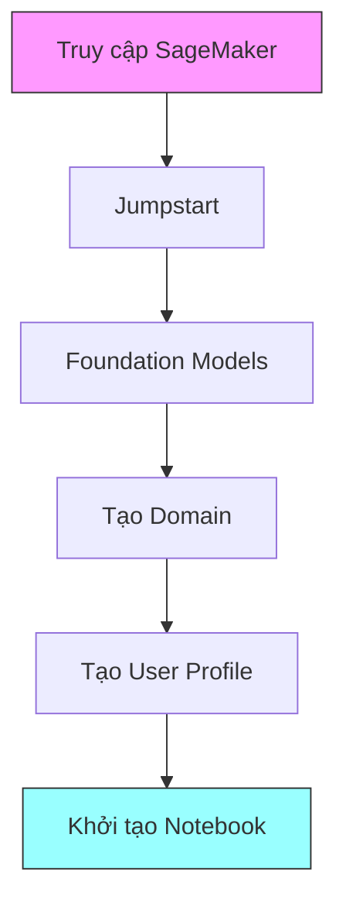
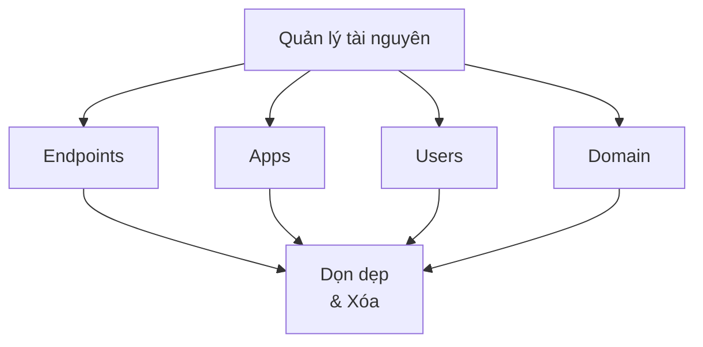

# Hướng dẫn Sử dụng Foundation Models trên SageMaker

## 1. Thiết lập ban đầu



### 1.1 Tạo SageMaker Domain
- Đặt tên domain duy nhất
- Thiết lập user profile
- Chọn execution role
- Cấu hình VPC và subnet

### 1.2 Chọn mô hình
- Hugging Face models
- Meta models
- Amazon models
- Stable Diffusion

## 2. Triển khai mô hình

### 2.1 Setup Notebook
```python
# Import model từ Hugging Face
from transformers import AutoModelForCausalLM

# Tạo predictor
predictor = model.deploy(
    instance_type="ml.m5.xlarge",
    initial_instance_count=1
)
```

### 2.2 Tham số quan trọng
- Temperature (độ ngẫu nhiên)
- Top P (lọc token)
- Max tokens (giới hạn độ dài)
- Stop tokens

## 3. Fine-tuning

### 3.1 Chuẩn bị dữ liệu
```json
{
    "prompt": "Input text here",
    "completion": "Expected output here",
    "end_token": "<|endoftext|>"
}
```

### 3.2 Yêu cầu định dạng
- File JSONL
- Template JSON định nghĩa format
- End tokens đặc biệt
- Whitespace chuẩn

## 4. Quản lý tài nguyên và chi phí



### 4.1 Dọn dẹp tài nguyên
1. **Xóa endpoints**
   ```python
   predictor.delete_endpoint()
   ```

2. **Xóa apps**
   - Dừng tất cả notebooks
   - Xóa tất cả apps

3. **Xóa users**
   - Đảm bảo không còn apps
   - Xác nhận xóa user

4. **Xóa domain**
   - Xóa tất cả users
   - Xác nhận xóa domain

### 4.2 Theo dõi chi phí
- Kiểm tra instance đang chạy
- Tắt tài nguyên không sử dụng
- Theo dõi billing thường xuyên

## 5. Lưu ý quan trọng

### 5.1 Về hiệu suất
- Thời gian khởi tạo lâu
- Chi phí fine-tuning cao
- Cần cân nhắc scale

### 5.2 Về tài nguyên
⚠️ **Cảnh báo**:
- Endpoint tiếp tục tính phí khi chạy
- Domain có thể có tài nguyên ẩn
- Xóa triệt để để tránh phí

## 6. Best Practices

### 6.1 Phát triển
1. Test với dữ liệu nhỏ
2. Theo dõi logs
3. Kiểm tra output

### 6.2 Triển khai
1. Chọn instance phù hợp
2. Thiết lập monitoring
3. Backup dữ liệu

## 7. Troubleshooting

### 7.1 Lỗi thường gặp
- Format dữ liệu không đúng
- Thiếu quyền truy cập
- Lỗi khởi tạo endpoint

### 7.2 Giải pháp
- Kiểm tra logs
- Verify IAM roles
- Kiểm tra format dữ liệu