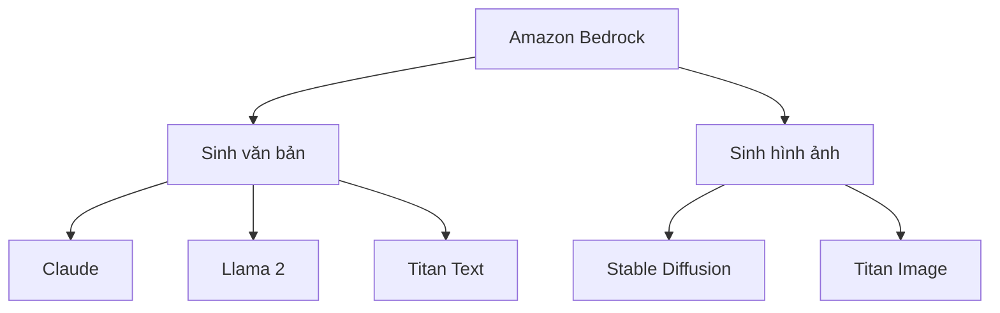
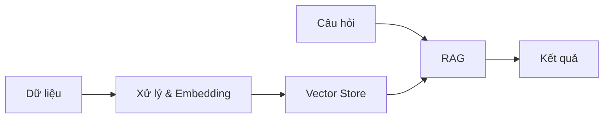
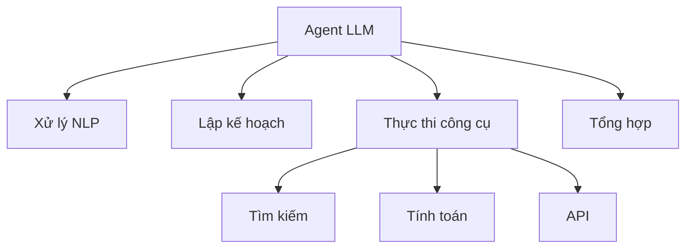

# Xây dựng ứng dụng AI với Amazon Bedrock

## Mục lục
1. [Giới thiệu](#giới-thiệu)
2. [Các mô hình nền tảng](#các-mô-hình-nền-tảng)
3. [Tích hợp với cơ sở tri thức](#tích-hợp-với-cơ-sở-tri-thức)
4. [Xây dựng Agent LLM](#xây-dựng-agent-llm)

## Giới thiệu

Amazon Bedrock là một nền tảng serverless cho phép xây dựng và triển khai các ứng dụng AI generative một cách dễ dàng. Nền tảng này cung cấp:

- Truy cập đến các mô hình foundation hàng đầu
- Khả năng tùy chỉnh và tinh chỉnh mô hình
- Tích hợp với các dịch vụ AWS khác
- Bảo mật và quản lý chi phí hiệu quả

## Các mô hình nền tảng

### Sinh văn bản
- Claude (Anthropic)
- Llama 2 (Meta)
- Titan Text (Amazon)

### Sinh hình ảnh  
- Stable Diffusion
- Titan Image Generator

## Tích hợp với cơ sở tri thức

### Vector Store
- Lưu trữ và tìm kiếm embedding vectors
- Hỗ trợ tìm kiếm ngữ nghĩa
- Tích hợp với các cơ sở dữ liệu vector phổ biến

### RAG (Retrieval Augmented Generation)
1. **Thu thập dữ liệu**
   - Tài liệu
   - Cơ sở dữ liệu
   - API

2. **Xử lý và lập chỉ mục**
   - Tách đoạn văn bản
   - Tạo embedding
   - Lưu vào vector store

3. **Truy vấn và sinh nội dung**
   - Tìm kiếm thông tin liên quan
   - Kết hợp với prompt
   - Sinh nội dung mới

## Xây dựng Agent LLM

### Kiến trúc Agent
- Xử lý ngôn ngữ tự nhiên
- Lập kế hoạch hành động
- Thực thi công cụ
- Tổng hợp kết quả

### Các công cụ tùy chỉnh
1. **Công cụ tìm kiếm**
   - Truy vấn web
   - Tìm kiếm tài liệu
   
2. **Công cụ tính toán**
   - Xử lý số liệu
   - Phân tích dữ liệu

3. **Công cụ tương tác API**
   - Gọi dịch vụ bên ngoài
   - Xử lý kết quả

## Ứng dụng thực tế

### Chatbot thông minh
- Tích hợp với cơ sở tri thức doanh nghiệp
- Trả lời câu hỏi dựa trên tài liệu nội bộ
- Thực hiện các tác vụ tự động

### Phân tích tài liệu
- Trích xuất thông tin quan trọng
- Tổng hợp và tạo báo cáo
- Phân loại tài liệu tự động

### Sinh nội dung
- Tạo bài viết marketing
- Sinh mã nguồn
- Tạo hình ảnh theo yêu cầu

## Kết luận
Amazon Bedrock cung cấp một nền tảng mạnh mẽ để xây dựng các ứng dụng AI generative. Bằng cách kết hợp các mô hình nền tảng với RAG và các công cụ tùy chỉnh, chúng ta có thể tạo ra các ứng dụng AI thông minh và hữu ích cho nhiều lĩnh vực khác nhau.

## Tài nguyên học tập
- [Tài liệu Amazon Bedrock](https://docs.aws.amazon.com/bedrock)
- [Workshop và hướng dẫn](https://workshop.aws)
- [Mẫu ứng dụng](https://github.com/aws-samples)