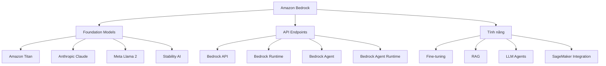

# Amazon Bedrock: Nền tảng AI Tổng quát của AWS

## Tổng quan
Amazon Bedrock là nền tảng serverless cho phép xây dựng và triển khai các ứng dụng AI tổng quát (Generative AI). Nó cung cấp một API thống nhất để làm việc với nhiều mô hình nền tảng (Foundation Models) khác nhau.

## Foundation Models
Foundation Models là tên gọi khác của các mô hình ngôn ngữ lớn (LLM) hoặc mô hình sinh ảnh được sử dụng làm nền tảng trong AWS.

### Các mô hình chính:
- **Amazon Titan**: Mô hình riêng của Amazon
- **Anthropic Claude**: Đối tác chiến lược của Amazon
- **Meta Llama 2**: Mô hình mã nguồn mở từ Meta
- **Stability AI**: Cho sinh ảnh

*Lưu ý: OpenAI không có mặt trong danh sách do làm việc với đối thủ cạnh tranh của Amazon*

## API Endpoints

### 1. Bedrock API
- Quản lý mô hình
- Triển khai mô hình
- Huấn luyện và tinh chỉnh

### 2. Bedrock Runtime
- Thực hiện inference (suy luận)
- Các phương thức chính:
  - `invoke_model`
  - `invoke_model_with_response_stream`
  - `converse`
  - `converse_stream`

### 3. Bedrock Agent
- Quản lý, triển khai và huấn luyện agents
- Tích hợp knowledge bases
- Xây dựng công cụ tùy chỉnh

### 4. Bedrock Agent Runtime
- Thực thi agents
- Các phương thức chính:
  - `invoke_agent`
  - `retrieve`
  - `retrieve_and_generate`

## Bảo mật và Quyền truy cập

### IAM Requirements
- **Bắt buộc** sử dụng tài khoản IAM User
- Không hỗ trợ tài khoản Root
- Các quyền cần thiết:
  - `AmazonBedrockFullAccess`
  - `AmazonBedrockReadOnly`
  - Hoặc quyền Administrator

### Truy cập Mô hình
1. Yêu cầu quyền truy cập riêng cho từng mô hình
2. Đồng ý với điều khoản sử dụng (EULA)
3. Thời gian phê duyệt:
   - Titan: Tức thì
   - Mô hình khác: Vài phút

## Định giá
- Tính phí thông qua AWS
- Mỗi mô hình có cấu trúc giá riêng
- Kiểm tra giá tại: aws.amazon.com/bedrock/pricing
- Lưu ý: Giá không hiển thị khi yêu cầu truy cập

## Môi trường Thử nghiệm (Playground)

### Các loại playground:
1. Chat Interface
2. Text Generation
3. Image Generation

### Tính năng:
- Thử nghiệm nhanh với foundation models
- Đánh giá mô hình tùy chỉnh
- Hỗ trợ mô hình import từ bên ngoài

## Tích hợp với SageMaker

### SageMaker Canvas
- Bedrock có thể được sử dụng dưới SageMaker
- Tích hợp với các công cụ AI level thấp
- Xây dựng workflow AI/ML phức tạp

## Ứng dụng và Use Cases

### 1. Xử lý Ngôn ngữ
- Chatbots
- Phân tích văn bản
- Sinh nội dung

### 2. Sinh Ảnh
- Tạo ảnh từ text
- Chỉnh sửa ảnh
- Style transfer

### 3. RAG (Retrieval Augmented Generation)
- Tích hợp với dữ liệu doanh nghiệp
- Tìm kiếm thông tin
- Trả lời câu hỏi dựa trên tài liệu

### 4. Agents
- Tự động hóa tác vụ
- Tích hợp với API bên ngoài
- Xử lý workflow phức tạp

## Lời khuyên khi sử dụng
1. Lên kế hoạch sử dụng mô hình trước
2. Kiểm tra cấu trúc giá
3. Yêu cầu quyền truy cập sớm
4. Sử dụng tài khoản IAM phù hợp
5. Tận dụng playground để thử nghiệm