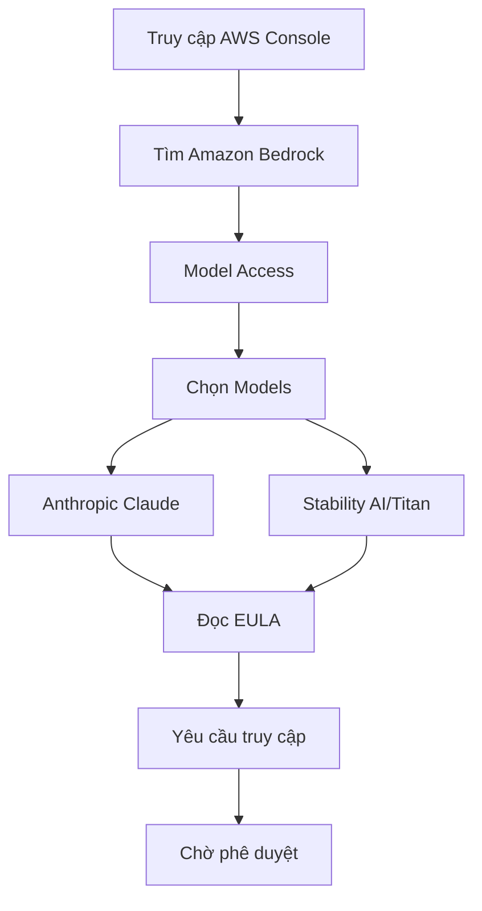

# Hướng dẫn Thực hành Amazon Bedrock Playground

## Chuẩn bị
### 1. Truy cập Model
1. Vào AWS Console và tìm Amazon Bedrock
2. Chọn "Model Access" trong menu
3. Yêu cầu quyền truy cập các mô hình:
   - Anthropic Claude (cho xử lý văn bản)
   - Stability AI hoặc Titan (cho sinh ảnh)
4. Đọc và chấp nhận EULA
5. Chờ phê duyệt (khoảng vài phút)



## Playground Chat
### Thiết lập
1. Chọn mô hình (ví dụ: Claude 3.5 Sonnet)
2. Điều chỉnh tham số:
   - Temperature: Độ ngẫu nhiên trong câu trả lời
   - Top P: Ngưỡng cho token tiếp theo
   - Top K: Số lượng token xem xét
   - Maximum length: Độ dài tối đa

### Tính năng
1. **Chat tương tác**
   - Ghi nhớ ngữ cảnh hội thoại
   - Cho phép trò chuyện liên tục
   
2. **Tải file**
   - Hỗ trợ đọc và phân tích tài liệu
   - Trả lời dựa trên nội dung tài liệu

3. **System Prompt**
   - Thêm hướng dẫn cho mọi tương tác
   - Tùy chỉnh phong cách trả lời

### Ví dụ Sử dụng
1. **Hỏi đáp cơ bản**
```
User: Tell me the meaning of life
Claude: [Câu trả lời triết học]
```

2. **Phân tích tài liệu**
```
[Tải file bylaws.txt]
User: What are the requirements for a quorum?
Claude: [Trích dẫn chi tiết từ tài liệu]
```

## Playground Text
### Đặc điểm
- Xử lý văn bản một lần (one-shot)
- Không lưu ngữ cảnh hội thoại
- Phù hợp cho sinh nội dung độc lập

### Ví dụ
```
Prompt: Write a Shakespearean sonnet about AWS
[Kết quả: Bài thơ về cloud computing theo phong cách Shakespeare]
```

## Playground Image
### Thiết lập
1. Chọn mô hình (Stability AI/Titan)
2. Tùy chọn:
   - Định hướng (ngang/dọc)
   - Kích thước
   - Prompt strength
   - Generation steps
   - Seed (cho kết quả lặp lại)

### Tính năng
1. **Sinh ảnh từ text**
   - Mô tả chi tiết
   - Negative prompt (những gì không muốn)

2. **Tạo biến thể**
   - Dựa trên ảnh có sẵn
   - Điều chỉnh phong cách

### Ví dụ
```
Prompt: Generate a cartoon style logo of a calico cat wearing headphones
[Kết quả: Logo mèo tam thể đeo tai nghe]
```

## Lưu ý Quan trọng
1. **Chi phí**
   - Mỗi mô hình có giá riêng
   - Tính phí theo token/request
   - Kiểm tra aws.amazon.com/bedrock/pricing

2. **Hiệu suất**
   - Temperature ảnh hưởng đến tính sáng tạo
   - Generation steps ảnh hưởng đến chất lượng ảnh
   - Maximum length ảnh hưởng đến độ dài output

3. **Thực hành tốt**
   - Thử nghiệm nhiều mô hình
   - So sánh kết quả và chi phí
   - Lưu lại các cấu hình hiệu quả