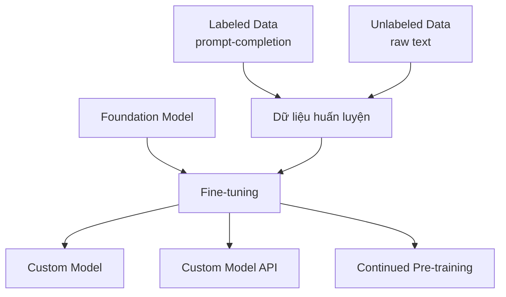

# Fine-tuning trong Amazon Bedrock

## Tổng quan Fine-tuning

Fine-tuning là quá trình mở rộng việc huấn luyện một mô hình nền tảng để thích ứng với các trường hợp sử dụng cụ thể. Trong Bedrock, fine-tuning được gọi là "Custom Models".



## Ưu điểm của Fine-tuning

1. **Tích hợp Thông tin**
   - Thông tin được "nướng" vào mô hình
   - Không cần prompt engineering phức tạp
   - Tiết kiệm token trong dài hạn

2. **Khả năng Mở rộng**
   - Có thể fine-tune nhiều lần
   - Cập nhật với dữ liệu mới
   - Thích ứng với nhiều domain khác nhau

## Hai Phương Pháp Fine-tuning

### 1. Custom Models (Labeled Data)
- Sử dụng cặp prompt-completion
- Format JSON đơn giản
- Ví dụ cấu trúc:
```json
{
    "prompt": "Câu hỏi hoặc input",
    "completion": "Câu trả lời mong muốn"
}
```

### 2. Continued Pre-training (Unlabeled Data)
- Sử dụng dữ liệu thô
- Không cần label
- Phù hợp với tài liệu doanh nghiệp
- Tích hợp thông tin trực tiếp vào mô hình

## Ứng dụng Thực tế

### 1. Chatbot Tùy chỉnh
- Xây dựng phong cách riêng
- Tính cách nhất quán
- Giọng điệu brand

### 2. Hỗ trợ Khách hàng
- Training từ transcript cũ
- Học từ tương tác thực tế
- Phản hồi theo style công ty

### 3. Xử lý Văn bản
- Viết quảng cáo theo brand voice
- Phân loại văn bản
- Đánh giá thông tin

### 4. Sinh Ảnh
- Fine-tune với bộ ảnh riêng
- Tùy chỉnh style
- Image embedding

## Quy trình Thực hiện

1. **Chuẩn bị Dữ liệu**
   - Tổ chức dữ liệu theo format
   - Tải lên S3
   - Đảm bảo chất lượng

2. **Thiết lập Fine-tuning**
   - Chọn mô hình cơ sở
   - Xác định phương pháp
   - Cấu hình tham số

3. **Triển khai và Sử dụng**
   - Train mô hình
   - Tạo model identifier mới
   - Sử dụng như mô hình thông thường

## Bảo mật và Chi phí

### Bảo mật
- Sử dụng VPC với PrivateLink
- Bảo vệ dữ liệu nhạy cảm
- Kiểm soát truy cập

### Chi phí và Thời gian
1. **Chi phí**
   - Đắt trong ngắn hạn
   - Tiết kiệm trong dài hạn
   - Phụ thuộc kích thước dữ liệu

2. **Thời gian**
   - Quá trình train lâu
   - Cần lên kế hoạch
   - Cân nhắc deadline

## Lưu ý Quan trọng

1. **Kiểm tra Khả năng**
   - Không phải mô hình nào cũng hỗ trợ fine-tuning
   - Đọc kỹ thông tin mô hình
   - Kiểm tra yêu cầu kỹ thuật

2. **Đánh giá Hiệu quả**
   - So sánh với các phương pháp khác
   - Đánh giá ROI
   - Theo dõi hiệu suất

3. **Cập nhật và Bảo trì**
   - Lên kế hoạch cập nhật
   - Theo dõi chất lượng
   - Đánh giá định kỳ

## So sánh với Phương pháp Khác

| Phương pháp | Ưu điểm | Nhược điểm |
|-------------|---------|------------|
| Fine-tuning | - Tích hợp sâu<br>- Tiết kiệm token<br>- Hiệu quả dài hạn | - Chi phí cao<br>- Thời gian dài<br>- Phức tạp |
| Prompt Engineering | - Đơn giản<br>- Nhanh chóng<br>- Linh hoạt | - Tốn token<br>- Giới hạn context<br>- Khó scale |
| RAG | - Cập nhật nhanh<br>- Dễ triển khai<br>- Linh hoạt | - Chi phí token<br>- Phụ thuộc retrieval<br>- Có thể chậm |