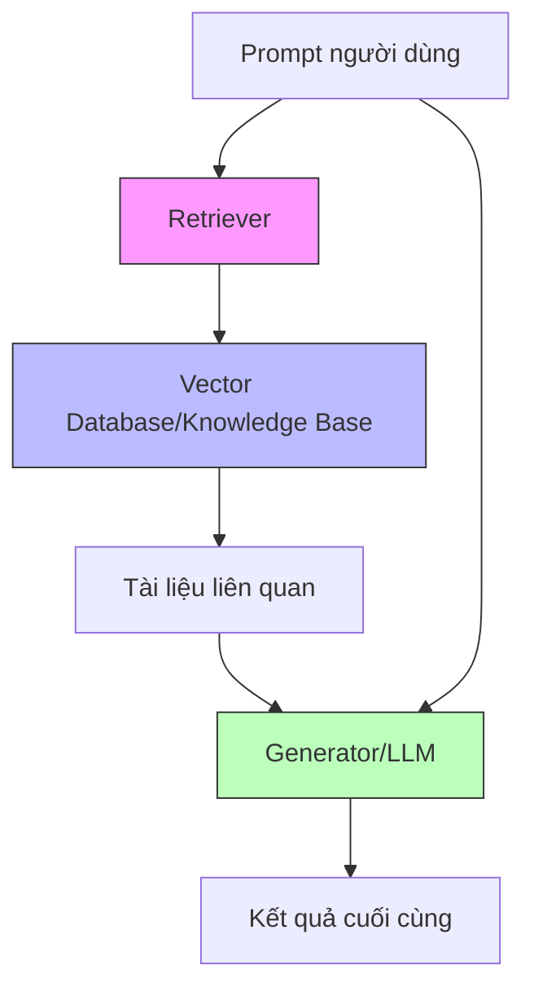
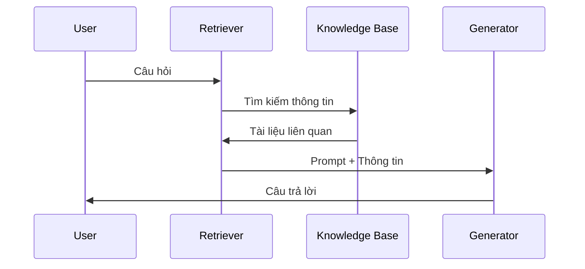

# Retrieval Augmented Generation (RAG) và Knowledge Base

## Tổng quan RAG
RAG là phương pháp "thi mở sách" cho các mô hình ngôn ngữ lớn, cho phép tích hợp thông tin từ nguồn bên ngoài vào quá trình sinh nội dung.

## Quy trình Hoạt động

### 1. Retrieval (Truy xuất)
- Chuyển đổi prompt thành embedding
- Tìm kiếm ngữ nghĩa trong knowledge base
- Chọn lọc thông tin liên quan

### 2. Augmentation (Tăng cường)
- Kết hợp thông tin truy xuất với prompt
- Tạo prompt mở rộng
- Đảm bảo ngữ cảnh phù hợp

### 3. Generation (Sinh nội dung)
- Xử lý prompt mở rộng
- Tạo câu trả lời tổng hợp
- Kết hợp kiến thức từ mô hình và dữ liệu ngoài

## Ưu điểm

### 1. Hiệu quả Thời gian và Chi phí
- Nhanh hơn fine-tuning trong ngắn hạn
- Dễ cập nhật thông tin mới
- Không cần huấn luyện lại mô hình

### 2. Tính Linh hoạt
- Tìm kiếm ngữ nghĩa (semantic search)
- Tích hợp nhiều nguồn dữ liệu
- Dễ mở rộng knowledge base

### 3. Chất lượng
- Giảm thiểu hallucination
- Cung cấp thông tin cập nhật
- Tích hợp dữ liệu riêng

## Nhược điểm

### 1. Chi phí Token
- Tăng số lượng token trong prompt
- Chi phí tích lũy theo thời gian
- Tốn tài nguyên lưu trữ vector

### 2. Độ phức tạp
- Nhạy cảm với template prompt
- Khó kiểm thử (non-deterministic)
- Phụ thuộc chất lượng retrieval

### 3. Hạn chế
- Vẫn có thể hallucinate
- Phụ thuộc độ liên quan của thông tin
- Có thể trở thành "search engine phức tạp"

## Knowledge Base trong Amazon Bedrock

### 1. Cấu trúc
- Vector store cho embedding
- Hệ thống tìm kiếm ngữ nghĩa
- Tích hợp với foundation models

### 2. Quản lý Dữ liệu
- Phân đoạn tài liệu
- Tạo và lưu trữ embedding
- Cập nhật thông tin

### 3. Tích hợp
- API thống nhất
- Tương thích nhiều mô hình
- Hỗ trợ nhiều định dạng dữ liệu

## Ví dụ Thực tế: Hệ thống Trả lời Câu hỏi

### Quy trình:
1. Người dùng đặt câu hỏi
2. Retriever tìm thông tin trong knowledge base
3. Kết hợp thông tin vào prompt
4. Generator tạo câu trả lời
5. Trả kết quả cho người dùng

## Lưu ý Triển khai

### 1. Chuẩn bị Dữ liệu
- Phân đoạn hợp lý
- Đảm bảo chất lượng
- Cập nhật thường xuyên

### 2. Tối ưu Hệ thống
- Điều chỉnh embedding
- Tinh chỉnh prompt template
- Cân bằng độ chính xác và tốc độ

### 3. Đánh giá Hiệu suất
- Theo dõi chất lượng kết quả
- Đo lường thời gian phản hồi
- Phân tích chi phí-lợi ích

## So sánh với Fine-tuning

| Tiêu chí | RAG | Fine-tuning |
|----------|-----|-------------|
| Thời gian triển khai | Nhanh | Chậm |
| Chi phí ban đầu | Thấp | Cao |
| Chi phí dài hạn | Có thể cao | Có thể thấp |
| Cập nhật thông tin | Dễ | Khó |
| Kiểm soát kết quả | Thấp | Cao |
| Độ chính xác | Phụ thuộc retrieval | Ổn định |