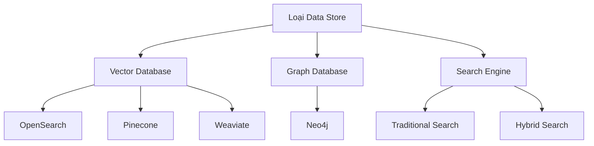
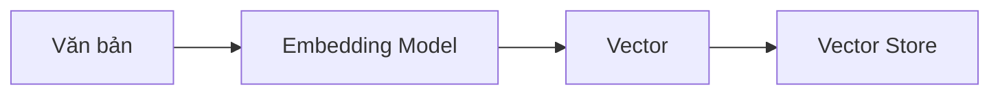
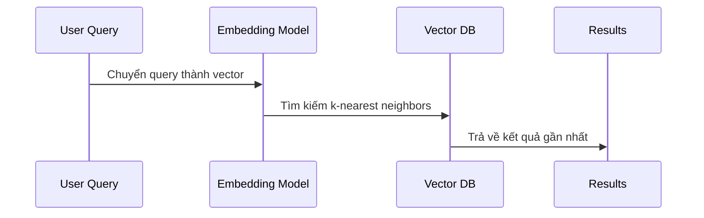
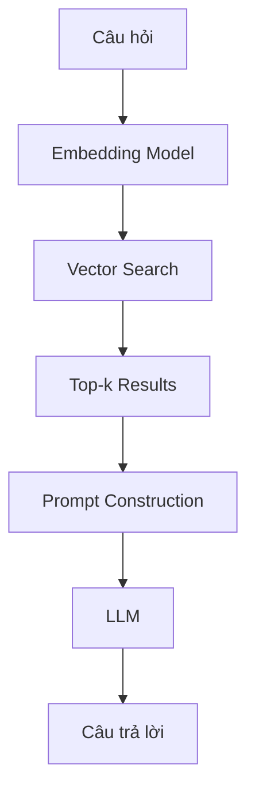

# Data Store và Vector Database trong RAG

## Tổng quan Data Store
Data Store trong Bedrock (Knowledge Base) là thành phần quan trọng quyết định hiệu quả của hệ thống RAG.

## Vector Database và Embeddings

### Embeddings là gì?
- Vector đa chiều (thường hàng nghìn chiều)
- Mã hóa ngữ nghĩa của dữ liệu
- Được tính toán bởi mô hình embedding

### Đặc điểm Embeddings
1. **Biểu diễn Ngữ nghĩa**
   - Các điểm gần nhau = nghĩa tương tự
   - Khoảng cách = độ khác biệt ngữ nghĩa
   - Tính toán similarity dễ dàng

2. **Kích thước**
   - Thường từ 100-1000+ chiều
   - Nén thông tin ngữ nghĩa
   - Tối ưu cho tìm kiếm

## Quy trình Tìm kiếm Vector

### 1. Chuẩn bị Dữ liệu
- Chuyển đổi text thành embeddings
- Lưu trữ cặp (text, vector)
- Tổ chức chỉ mục hiệu quả

### 2. Xử lý Truy vấn

### 3. Tối ưu Hóa
- Sử dụng approximate nearest neighbors
- Phân vùng dữ liệu
- Caching kết quả phổ biến

## Các Loại Vector Database

### 1. Database với Hỗ trợ Vector
- **OpenSearch/Elasticsearch**
  - Tích hợp sẵn với AWS
  - Hỗ trợ hybrid search
  - Khả năng mở rộng cao

- **Cơ sở dữ liệu truyền thống**
  - PostgreSQL với pgvector
  - MongoDB với Atlas Vector Search
  - Redis với VSS

### 2. Vector Database Chuyên dụng
- **Pinecone**
  - Được tối ưu cho vector search
  - Khả năng scale tốt
  - API đơn giản

- **Weaviate**
  - Mô hình dữ liệu linh hoạt
  - Hỗ trợ nhiều loại embedding
  - Tích hợp GraphQL

## Tối ưu Hiệu suất

### 1. Chiến lược Indexing
- Phân vùng thông minh
- Cân bằng tốc độ/chính xác
- Cập nhật index định kỳ

### 2. Query Optimization
- Lọc trước khi search
- Tinh chỉnh k nearest neighbors
- Sử dụng metadata filtering

### 3. Caching và Scale
- Cache kết quả phổ biến
- Phân tán dữ liệu
- Load balancing

## Ví dụ Thực tế: Hệ thống Q&A

### Quy trình:
1. Chuyển câu hỏi thành vector
2. Tìm k documents gần nhất
3. Kết hợp vào prompt
4. Sinh câu trả lời

## Các Yếu tố Ảnh hưởng Chất lượng

### 1. Chất lượng Embedding
- Chọn mô hình phù hợp
- Tiền xử lý dữ liệu
- Chuẩn hóa vector

### 2. Tham số Tìm kiếm
- Số lượng k neighbors
- Ngưỡng similarity
- Chiến lược ranking

### 3. Prompt Engineering
- Template hiệu quả
- Kết hợp kết quả hợp lý
- Xử lý trường hợp đặc biệt

## So sánh Các Giải pháp

| Giải pháp | Ưu điểm | Nhược điểm |
|-----------|---------|------------|
| OpenSearch | Tích hợp AWS, Hybrid search | Phức tạp setup |
| Pinecone | Đơn giản, hiệu quả | Chi phí cao |
| Self-hosted | Kiểm soát cao | Khó maintain |
| Traditional DB | Quen thuộc | Hiệu suất thấp |

## Lưu ý Triển khai

1. **Bảo mật**
   - Mã hóa dữ liệu
   - Kiểm soát truy cập
   - Audit logging

2. **Monitoring**
   - Theo dõi latency
   - Đo lường accuracy
   - Resource usage

3. **Backup & Recovery**
   - Sao lưu regular
   - Chiến lược phục hồi
   - Dữ liệu phân tán