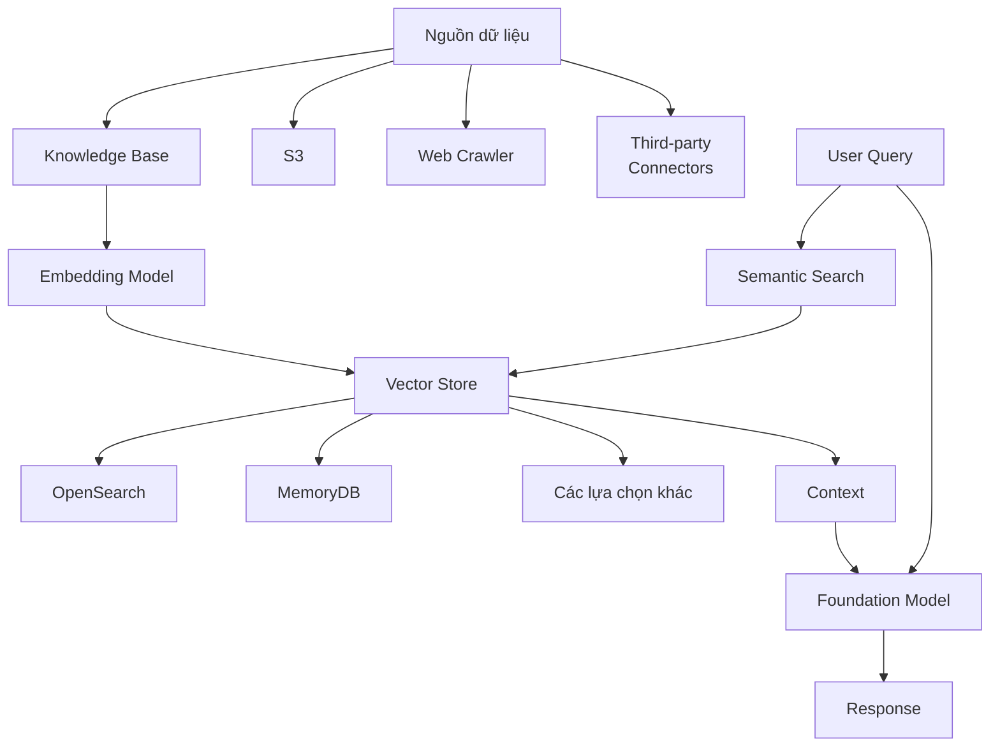
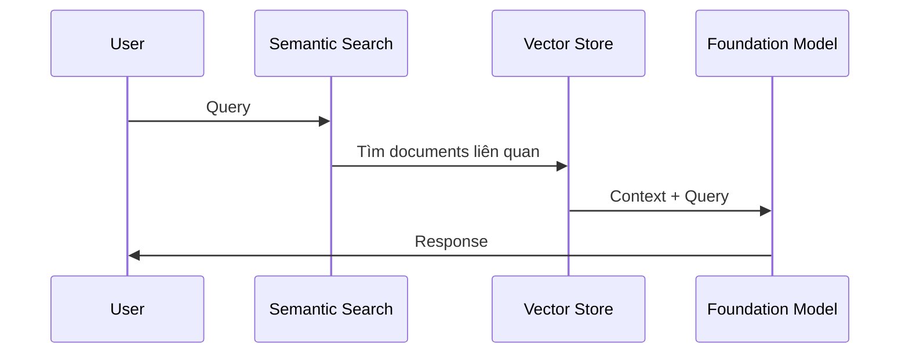

# Knowledge Base trong Amazon Bedrock

## Tổng quan
Knowledge Base trong Bedrock là cách triển khai RAG (Retrieval Augmented Generation), cho phép tích hợp thông tin ngoài vào quá trình sinh nội dung.

## Nguồn Dữ liệu

### 1. Amazon S3
- Dữ liệu có cấu trúc
- Dữ liệu phi cấu trúc
- Văn bản thô, JSON

### 2. Web Crawler
- Crawl trang web được chỉ định
- Cần có quyền truy cập
- Thu thập thông tin tự động

### 3. Third-party Connectors
- Confluence
- Salesforce
- SharePoint

## Quy trình Xử lý

### 1. Embedding
- Chọn mô hình (Cohere/Amazon Titan)
- Cấu hình kích thước vector
- Xử lý chunk dữ liệu

### 2. Vector Store
- **OpenSearch (mặc định)**
  - Tích hợp sẵn với AWS
  - Hỗ trợ vector search
  
- **Các lựa chọn khác**
  - MemoryDB
  - Aurora
  - MongoDB Atlas
  - Pinecone
  - Redis Enterprise Cloud

### 3. Chunking
- Kích thước mặc định: 300 ký tự
- Tùy chỉnh overlap
- Phương pháp phân đoạn

## Sử dụng Knowledge Base

### 1. Chat với Tài liệu

### 2. Tích hợp API
- Bedrock API trực tiếp
- Tích hợp vào ứng dụng
- Xử lý batch

### 3. Agentic RAG
- Kết hợp với LLM Agents
- Mở rộng khả năng
- Tự động hóa tác vụ

## Cấu hình và Tối ưu

### 1. Chunking Strategy
- **Phân đoạn theo nghĩa**
  - Câu/đoạn văn
  - Đơn vị logic
  - Cấu trúc tài liệu

- **Tham số điều chỉnh**
  - Kích thước chunk
  - Độ chồng lấp
  - Phương pháp chia

### 2. Vector Store
- Chọn giải pháp phù hợp
- Cấu hình index
- Tối ưu tìm kiếm

### 3. Embedding
- Chọn mô hình phù hợp
- Cấu hình kích thước
- Đánh giá chất lượng

## Ví dụ Triển khai

### 1. Chuẩn bị
- Tạo S3 bucket
- Upload tài liệu
- Cấu hình quyền truy cập

### 2. Thiết lập Knowledge Base
- Chọn nguồn dữ liệu
- Cấu hình embedding
- Chọn vector store

### 3. Tích hợp và Sử dụng
- Test với chat interface
- Đánh giá kết quả
- Tinh chỉnh cấu hình

## Lưu ý Quan trọng

### 1. Hiệu suất
- Kích thước chunk ảnh hưởng kết quả
- Chất lượng embedding quan trọng
- Tối ưu tìm kiếm semantic

### 2. Chi phí
- Chi phí lưu trữ vector
- Chi phí tính toán embedding
- Chi phí API calls

### 3. Bảo mật
- Kiểm soát truy cập
- Mã hóa dữ liệu
- Audit logging

## Best Practices

1. **Chunking**
   - Ưu tiên phân đoạn theo nghĩa
   - Tránh chia cắt ý nghĩa
   - Cân nhắc overlap

2. **Vector Store**
   - Chọn phù hợp scale
   - Cân nhắc chi phí
   - Tối ưu performance

3. **Monitoring**
   - Theo dõi độ chính xác
   - Đo lường latency
   - Phân tích usage