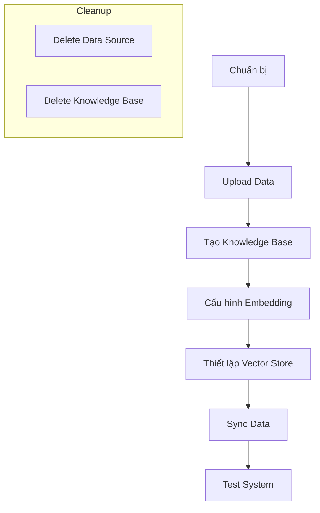
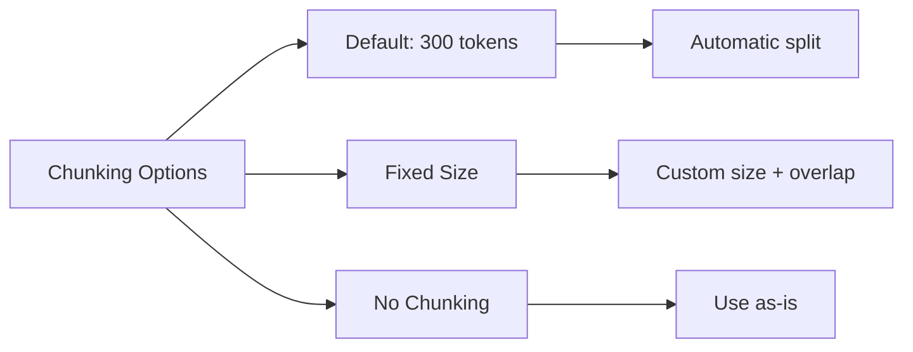
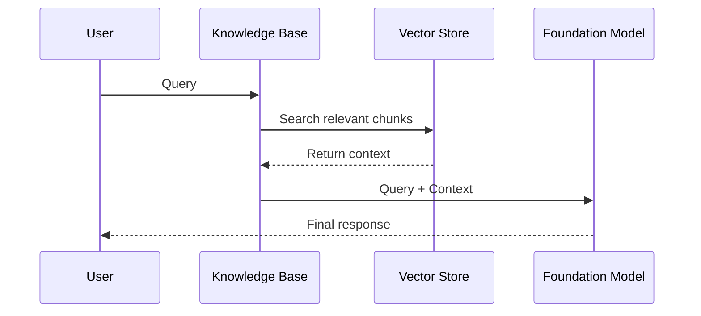

# Hướng dẫn Tạo RAG System trong Amazon Bedrock

## Quy trình Tổng quan



## 1. Chuẩn bị
### Yêu cầu trước khi bắt đầu
- Tài khoản AWS (không phải Root account)
- Quyền truy cập vào Bedrock
- Model Access cho embedding model

## 2. Tạo Knowledge Base

### 2.1. Thiết lập Ban đầu
1. Vào AWS Console → Bedrock → Builder Tools → Knowledge Bases
2. Click "Create Knowledge Base"
3. Điền thông tin:
   - Tên Knowledge Base
   - Mô tả (tùy chọn)
   - IAM role (có thể để tự động tạo)

### 2.2. Upload Dữ liệu
1. Tạo S3 bucket mới:
   ```
   <tên_unique>-book-rag
   ```
2. Upload file vào bucket
3. Trong Bedrock, chọn data source:
   - Đặt tên cho data source
   - Browse và chọn file từ S3

### 2.3. Cấu hình Chunking


- **Default Chunking**: 300 tokens
- **Fixed Size**: Tùy chỉnh kích thước và overlap
- **No Chunking**: Sử dụng file nguyên bản

## 3. Cấu hình Embedding

### 3.1. Chọn Model
1. Yêu cầu quyền truy cập embedding model:
   - Vào Model Access
   - Request các model cần thiết (ví dụ: Titan Text Embeddings)
   - Chờ phê duyệt

### 3.2. Cấu hình Vector
- Vector dimensions: 1024 (mặc định)
- Có thể điều chỉnh theo nhu cầu

## 4. Thiết lập Vector Store

### 4.1. Lựa chọn Storage
- OpenSearch Serverless (tự động)
- Các lựa chọn khác:
  - OpenSearch có sẵn
  - Aurora
  - MongoDB
  - Pinecone
  - Redis Enterprise

### 4.2. Cấu hình OpenSearch
- Standard deployment
- Không cần redundancy cho test
- Sử dụng default encryption

## 5. Sync và Test

### 5.1. Sync Data
1. Vào Data Sources
2. Chọn data source
3. Click "Sync"
4. Chờ quá trình hoàn tất

### 5.2. Test System
1. Chọn foundation model (ví dụ: Claude)
2. Đặt câu hỏi liên quan đến nội dung
3. Xem kết quả và source details



## 6. Lưu ý Chi phí và Cleanup

### Chi phí phát sinh
- OpenSearch Serverless
- API calls cho embedding
- Foundation model usage

### Quy trình Cleanup
1. **Xóa Data Source**
   - Vào Knowledge Bases
   - Chọn data source
   - Click Delete

2. **Xóa Knowledge Base**
   - Chọn knowledge base
   - Click Delete

## Các Lưu ý Quan trọng

1. **Bảo mật**
   - Không dùng Root account
   - Kiểm tra IAM permissions
   - Xem xét encryption options

2. **Hiệu suất**
   - Chunking strategy ảnh hưởng kết quả
   - Vector dimensions vs. performance
   - Query latency considerations

3. **Chi phí**
   - Theo dõi usage
   - Cleanup resources
   - Optimize vector storage