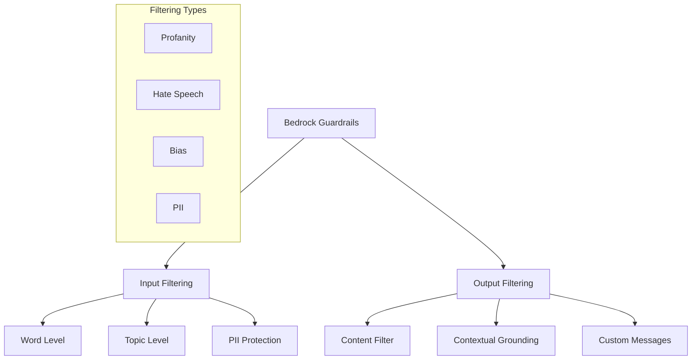
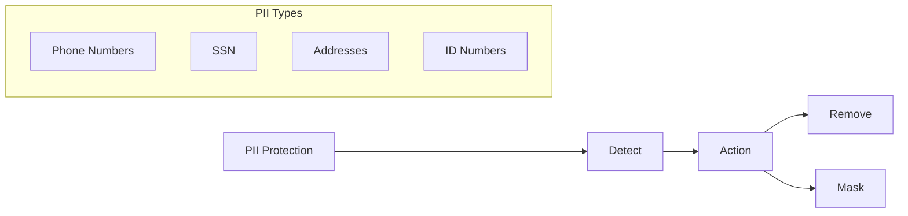
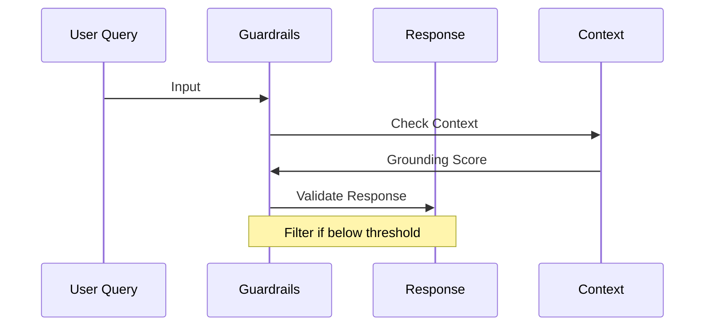

# Amazon Bedrock Guardrails

## Tổng quan
Bedrock Guardrails là hệ thống lọc nội dung cho cả prompts và responses, đảm bảo an toàn và tuân thủ trong ứng dụng AI.

## Các Tính năng Chính

### 1. Lọc Nội dung
- **Cấp độ từ (Word Level)**
  - Chặn từ ngữ cụ thể
  - Danh sách đen tùy chỉnh
  - Bộ lọc tự động

- **Cấp độ chủ đề (Topic Level)**
  - Giới hạn chủ đề nhạy cảm
  - Loại bỏ nội dung không phù hợp
  - Tùy chỉnh theo domain

### 2. Bảo vệ Thông tin Cá nhân (PII)

#### Loại thông tin được bảo vệ:
- Số điện thoại
- Số an sinh xã hội
- Địa chỉ
- Số ID/CMND
- Email

#### Phương thức xử lý:
- Xóa hoàn toàn
- Che dấu (masking)
- Thay thế bằng placeholder

### 3. Contextual Grounding Check

#### Đo lường hai chỉ số:
1. **Grounding Score**
   - Đo độ tương đồng với dữ liệu context
   - Ngăn chặn hallucination
   - Threshold có thể điều chỉnh

2. **Relevance Score**
   - Đánh giá độ liên quan với câu hỏi
   - Đảm bảo phản hồi phù hợp
   - Lọc nội dung không liên quan

## Tích hợp và Triển khai

### 1. Tích hợp với Hệ thống
- Knowledge Bases
- Agents
- Foundation Models

### 2. Cấu hình Thông báo
- Tùy chỉnh blocked messages
- Thông báo rõ ràng cho người dùng
- Hướng dẫn điều chỉnh

## Ưu điểm và Hạn chế

### Ưu điểm
1. **Bảo mật toàn diện**
   - Lọc cả input và output
   - Bảo vệ PII
   - Kiểm soát nội dung

2. **Tính linh hoạt**
   - Tùy chỉnh theo nhu cầu
   - Nhiều cấp độ lọc
   - Dễ tích hợp

3. **Quản trị hiệu quả**
   - Giám sát tự động
   - Báo cáo vi phạm
   - Đảm bảo tuân thủ

### Hạn chế
1. **Phạm vi áp dụng**
   - Chỉ cho text models
   - Chưa hỗ trợ image models
   - Một số giới hạn kỹ thuật

2. **Độ chính xác**
   - Phụ thuộc chất lượng vector store
   - Có thể có false positives
   - Cần tinh chỉnh thường xuyên

## Best Practices

### 1. Cấu hình Ban đầu
- Xác định mức độ bảo vệ cần thiết 
- Thiết lập thresholds phù hợp
- Test kỹ trước triển khai

### 2. Monitoring
- Theo dõi blocked contents
- Phân tích patterns
- Cập nhật rules định kỳ

### 3. Maintenance
- Review và cập nhật regular
- Thu thập feedback
- Tối ưu threshold