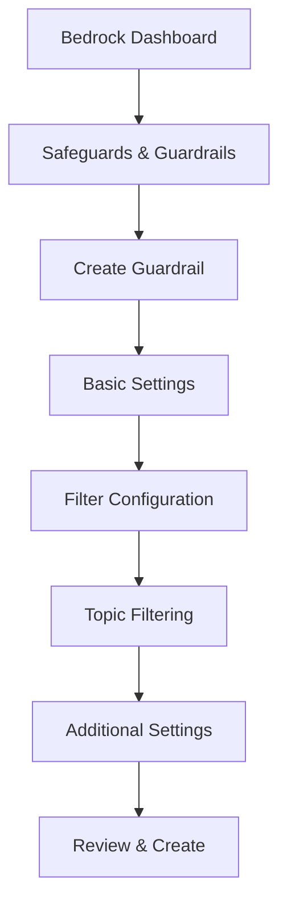
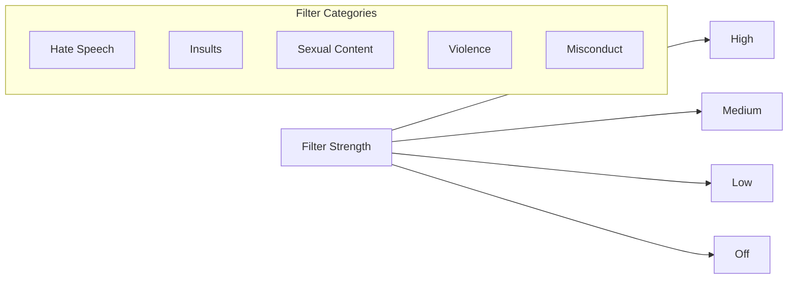
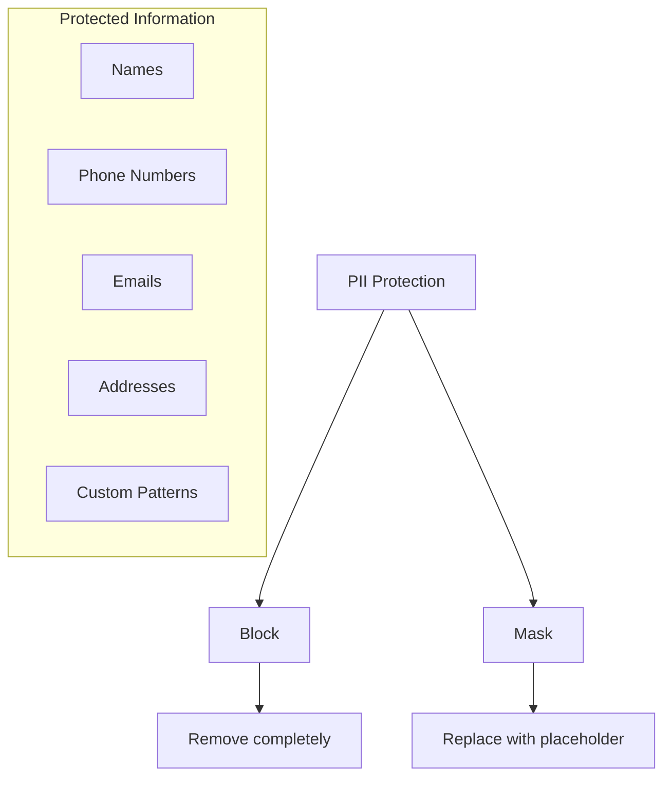

# Hướng dẫn Tạo Guardrail trong Amazon Bedrock

## Quy trình Tạo Guardrail



## 1. Thiết lập Cơ bản
1. Vào Bedrock → Safeguards → Guardrails
2. Click "Create Guardrail"
3. Điền thông tin:
   - Tên Guardrail
   - Mô tả
   - KMS key (tùy chọn)
   - Tags (tùy chọn)

## 2. Cấu hình Bộ lọc

### 2.1. Phạm vi Lọc
- Prompts
- Responses
- Cả hai

### 2.2. Mức độ Lọc


#### Các loại nội dung:
- **Hate Speech**: Mức cao
- **Insults**: Mức trung bình
- **Sexual Content**: Tùy văn hóa
- **Violence**: Mức cao
- **Misconduct**: Mức cao
- **Prompt Attack**: Mức trung bình

## 3. Lọc Chủ đề

### 3.1. Thêm Chủ đề Cấm
1. Click "Add denied topic"
2. Nhập tên chủ đề
3. Thêm mô tả
4. Cung cấp ví dụ

### 3.2. Bộ lọc Từ ngữ
- Bật filter profanity
- Tùy chọn thêm từ ngữ:
  - Upload file
  - Từ S3
  - Nhập thủ công

## 4. Bảo vệ Thông tin Cá nhân (PII)



### 4.1. Loại thông tin
- Tên
- Số điện thoại
- Email
- Địa chỉ
- SSN
- ID Numbers

### 4.2. Hành động
- Block: Chặn hoàn toàn
- Mask: Thay thế bằng placeholder

### 4.3. Custom Patterns
- Định nghĩa regex patterns
- Tùy chỉnh format

## 5. Thông báo Chặn

### 5.1. Prompt Block Message
```
"Sorry, the model cannot answer this question"
```

### 5.2. Response Block Message
- Tùy chỉnh thông báo
- Hướng dẫn người dùng
- Giải thích lý do

## 6. Test Guardrail

### 6.1. Thiết lập Test
1. Chọn foundation model
2. Đảm bảo có quyền truy cập
3. Chuẩn bị test cases

### 6.2. Kiểm tra
- Test các trường hợp vi phạm
- Xem View Trace
- Đánh giá kết quả

## 7. Quản lý và Bảo trì

### 7.1. Monitoring
- Theo dõi blocked content
- Phân tích patterns
- Đánh giá hiệu quả

### 7.2. Cập nhật
- Review định kỳ
- Điều chỉnh rules
- Thêm/xóa filters

### 7.3. Cleanup
- Xóa guardrail khi không cần
- Quản lý tài nguyên
- Theo dõi chi phí

## Lưu ý Quan trọng

1. **Hiệu suất**
   - Test kỹ trước triển khai
   - Cân nhắc false positives
   - Điều chỉnh độ nhạy

2. **Bảo mật**
   - Kiểm tra PII protection
   - Đảm bảo compliance
   - Regular audits

3. **Tối ưu hóa**
   - Fine-tune filters
   - Cập nhật banned words
   - Thu thập feedback