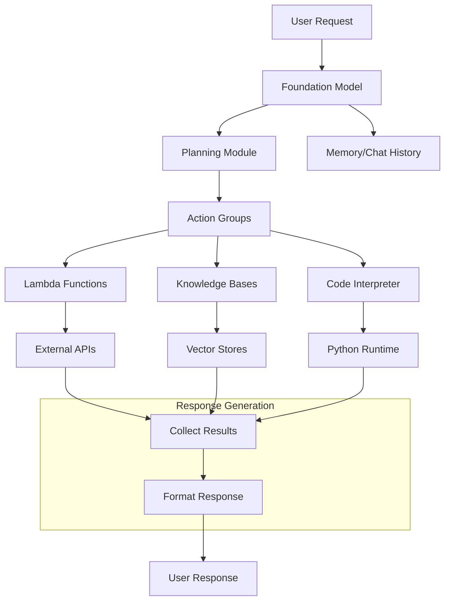
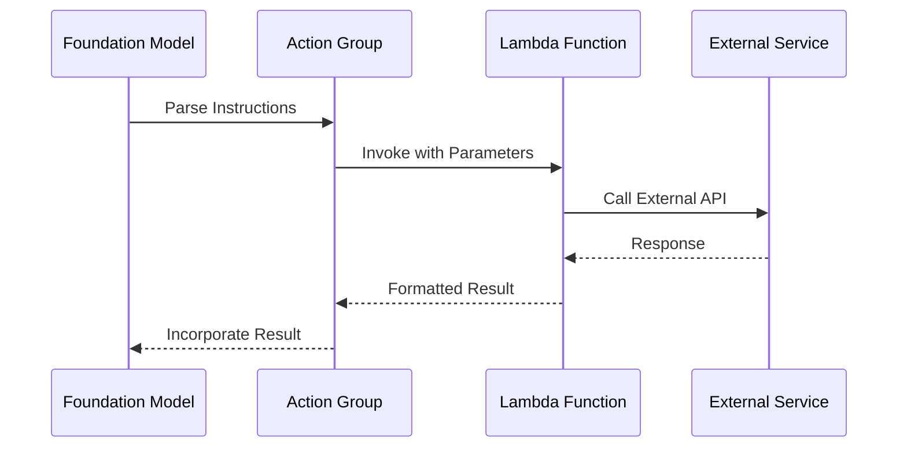
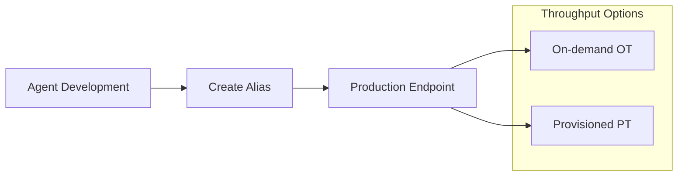
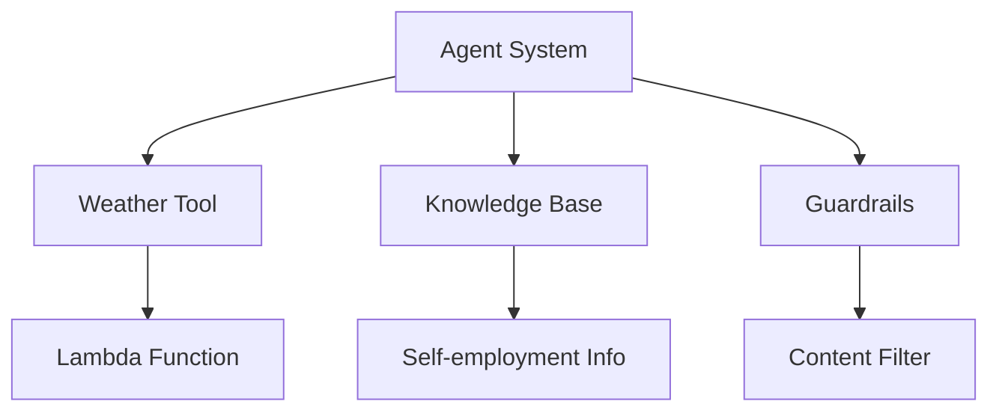

# LLM Agents trong Amazon Bedrock

## Tổng quan Kiến trúc



## Thành phần Chính

### 1. Foundation Model
- Nền tảng xử lý ngôn ngữ
- Hiểu và phân tích yêu cầu
- Lập kế hoạch thực thi

### 2. Action Groups
#### 2.1 Lambda Functions


#### Cấu trúc Parameters
- Tên parameter
- Mô tả sử dụng
- Kiểu dữ liệu
- Tính bắt buộc

### 3. Knowledge Bases (Agent RAG)
- Tích hợp vector stores
- Tìm kiếm ngữ nghĩa
- Bổ sung thông tin

### 4. Code Interpreter
- Tự động viết code Python
- Tính toán phức tạp
- Tạo biểu đồ

## Triển khai Sản phẩm

### 1. Agent Aliases


### 2. Throughput Models
1. **On-demand (OT)**
   - Quota cấp account
   - Phù hợp traffic vừa phải
   - Linh hoạt về chi phí

2. **Provisioned (PT)**
   - Tăng throughput
   - Xử lý nhiều token
   - Phù hợp high traffic

## Tính năng Đặc biệt

### 1. Tool Discovery
- Tự động chọn công cụ
- Dựa trên mô tả plain text
- Thông minh trong lựa chọn

### 2. Parameter Handling
- Trích xuất tự động
- Hỏi thông tin thiếu
- Validate dữ liệu

### 3. Response Integration
- Kết hợp nhiều nguồn
- Format nhất quán
- Tối ưu chất lượng

## Ví dụ Tích hợp

### 1. Weather Service Agent
```python
def get_weather(city: str, units: str = "F"):
    """
    Get current weather for a city
    
    Parameters:
    - city: City name
    - units: Temperature units (F/C)
    """
    return {
        "temperature": 75,
        "condition": "sunny",
        "units": units
    }
```

### 2. Combined Agent System


## Lưu ý Triển khai

### 1. Bảo mật
- Kiểm soát quyền truy cập
- Validate input
- Monitor usage

### 2. Performance
- Optimize response time
- Cache when possible
- Scale resources

### 3. Maintenance
- Update tools
- Monitor errors
- Improve prompts

## Best Practices

1. **Tool Design**
   - Mô tả rõ ràng
   - Parameters đơn giản
   - Error handling tốt

2. **Knowledge Base**
   - Dữ liệu có cấu trúc
   - Cập nhật regular
   - Optimize retrieval

3. **Code Interpreter**
   - Set resource limits
   - Handle timeouts
   - Validate output

4. **Production Deployment**
   - Test kỹ lưỡng
   - Monitor performance 
   - Backup plans