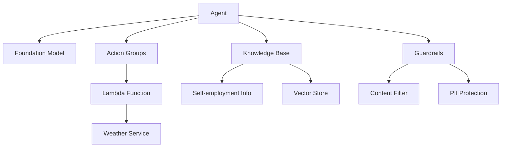
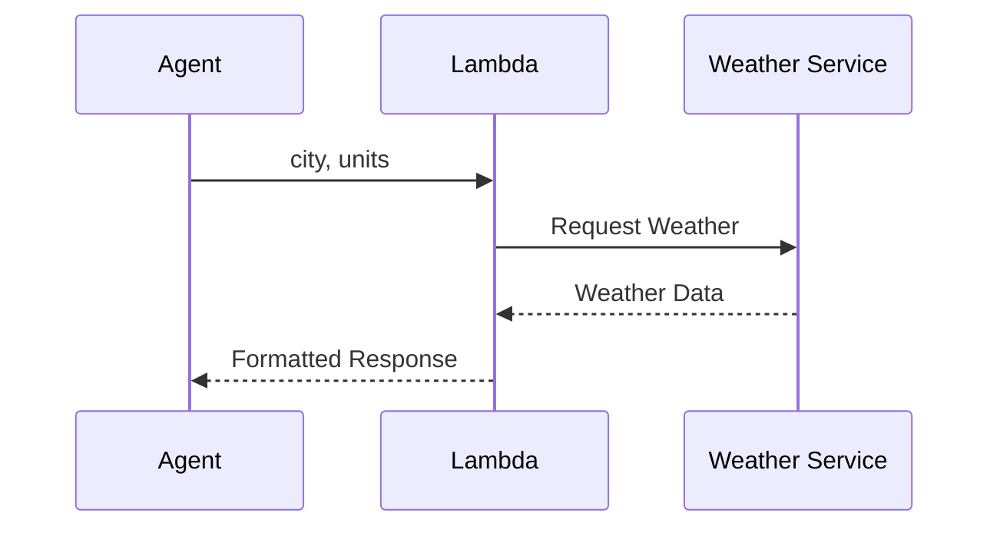
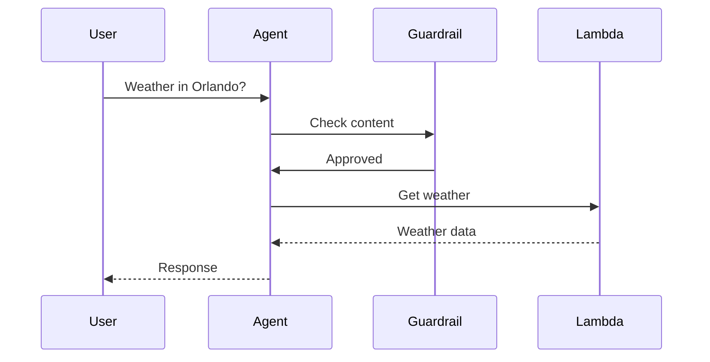
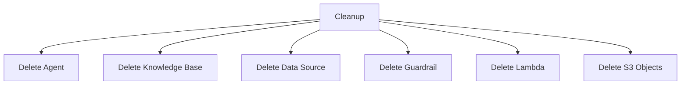

# Tạo Agent Tích hợp trong Amazon Bedrock

## Tổng quan Hệ thống



## Quy trình Tạo Agent

### 1. Thiết lập Cơ bản
1. Vào Bedrock → Builder Tools → Agents
2. Click "Create Agent"
3. Cấu hình cơ bản:
   - Tên: "self-employment-and-weather"
   - Mô tả (tùy chọn)
   - Service role (tự động)
   - Chọn foundation model (Claude)

### 2. Tạo Action Group



#### 2.1. Cấu hình Function
1. Tạo action group "current_weather"
2. Define function details:
   ```python
   Parameters:
   - city (required): string
   - units (optional): string
   ```

#### 2.2. Lambda Function
```python
def lambda_handler(event, context):
    # Extract parameters
    city = ""
    units = "Fahrenheit"  # default
    
    for param in event['parameters']:
        if param['name'] == 'city':
            city = param['value']
        elif param['name'] == 'units':
            units = param['value']
            
    # Return mock weather data
    return {
        "messageVersion": "1.0",
        "response": {
            "city": city,
            "temperature": "75",
            "units": units,
            "condition": "sunny"
        }
    }
```

### 3. Tích hợp Knowledge Base
1. Add knowledge base
2. Thêm hướng dẫn:
   ```
   Use this knowledge base to answer questions about self-employment
   ```

### 4. Áp dụng Guardrails
1. Thêm guardrail "no_profanity"
2. Cấu hình PII protection
3. Thiết lập content filtering

## Test và Debug

### 1. Weather Query Test


### 2. Knowledge Base Query
- Test với câu hỏi về self-employment
- Kiểm tra citations
- Xem trace để debug

### 3. Trace Analysis
1. Pre-processing
2. Orchestration
3. Knowledge base
4. Post-processing

## Triển khai Production

### 1. Tạo Alias
- Production endpoint
- Chọn throughput model:
  - On-demand (OT)
  - Provisioned (PT)

### 2. Monitoring
- Track usage
- Monitor performance
- Check costs

## Cleanup Process

### 1. Xóa Resources


### 2. Verification
- Kiểm tra OpenSearch
- Xác nhận Lambda removal
- Verify S3 cleanup

## Best Practices

### 1. Development
- Save thường xuyên
- Test từng component
- Verify trace logs

### 2. Security
- Use IAM roles
- Monitor access
- Protect sensitive data

### 3. Cost Management
- Track resource usage
- Clean up test resources
- Use appropriate throughput

## Lưu ý Quan trọng

1. **Costs**
   - Cleanup resources
   - Monitor usage
   - Avoid surprises

2. **Testing**
   - Verify all components
   - Check guardrails
   - Test edge cases

3. **Maintenance**
   - Update components
   - Monitor performance
   - Optimize as needed