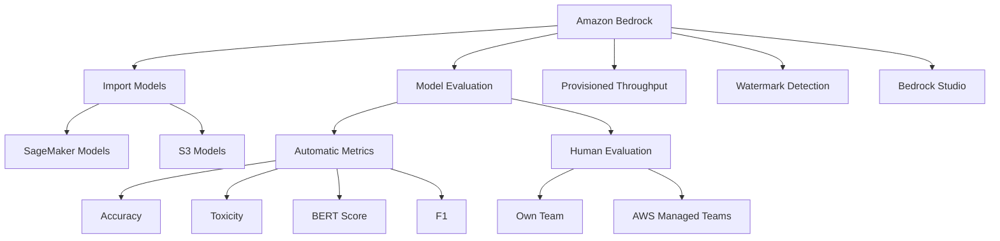
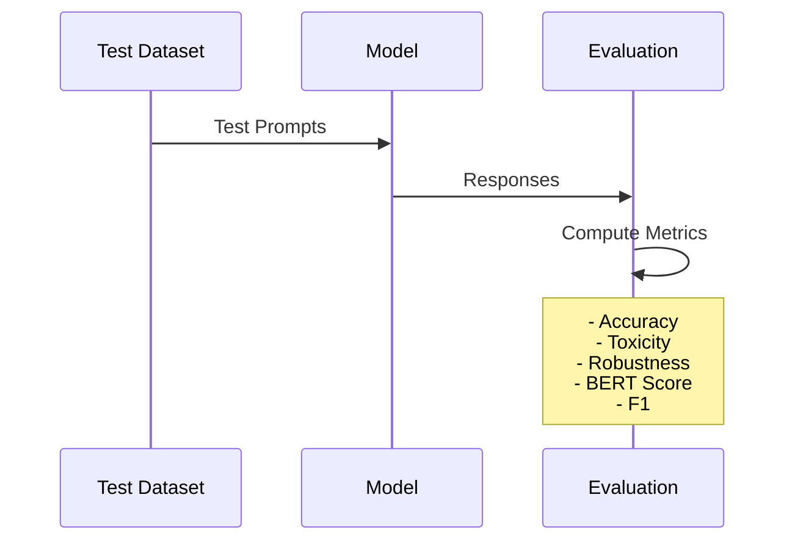
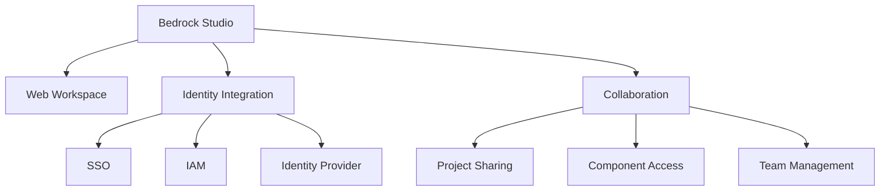

# Các Tính năng Bổ sung của Amazon Bedrock

## Tổng quan Tính năng

## 1. Import Models

### Nguồn Model
- **SageMaker Models**
  - Models được train từ đầu
  - Custom foundation models
  - LLMs tùy chỉnh

- **S3 Models**
  - Lưu trữ trong S3
  - Dễ quản lý và phiên bản
  - Tích hợp linh hoạt

## 2. Model Evaluation

### Automatic Metrics

#### Test Datasets
1. **Custom Test Sets**
   - Prompts tùy chỉnh
   - Responses mẫu
   - Đặc thù domain

2. **Built-in Sets**
   - Standard test sets
   - Reasoning tests
   - Performance benchmarks

### Human Evaluation

#### 1. Tự quản lý
- Team nội bộ
- Đánh giá chất lượng
- Feedback trực tiếp

#### 2. AWS Managed Teams
- Tương tự Mechanical Turk
- Đội ngũ đánh giá chuyên nghiệp
- Scale linh hoạt

## 3. Provisioned Throughput

### Đặc điểm
- Đảm bảo capacity
- Xử lý steady load
- Inference layer optimization

### Use Cases
- High-traffic applications 
- Consistent performance
- SLA requirements

## 4. Watermark Detection

### Titan Image Generation
- Embedded watermarks
- Unique identifiers
- Verification capability

### Detection Module
- Check image origin
- Verify authenticity
- Tracking và monitoring

## 5. Bedrock Studio

### Đặc điểm Chính
1. **Web-based Environment**
   - Không cần AWS account
   - Truy cập dễ dàng
   - Interface thân thiện

2. **Security Integration**
   - Single Sign-On (SSO)
   - IAM integration
   - Identity provider support

3. **Collaboration Features**
   - Project sharing
   - Team workspace
   - Component management

## Best Practices

### 1. Model Import
- Validate trước khi import
- Test performance
- Monitor resources

### 2. Evaluation
- Kết hợp nhiều metrics
- Balance auto/human evaluation
- Regular assessment

### 3. Resource Management
- Optimize throughput
- Monitor costs
- Scale appropriately

## Lưu ý Triển khai

### 1. Security
- IAM roles/permissions
- Data protection
- Access control

### 2. Cost Management
- Monitor usage
- Optimize resources
- Track evaluation costs

### 3. Performance
- Benchmark regularly
- Monitor throughput
- Optimize as needed