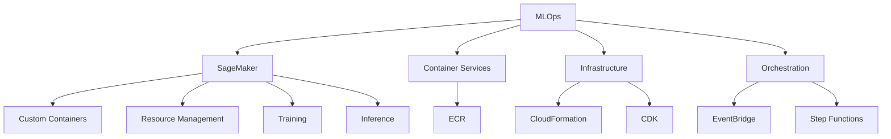
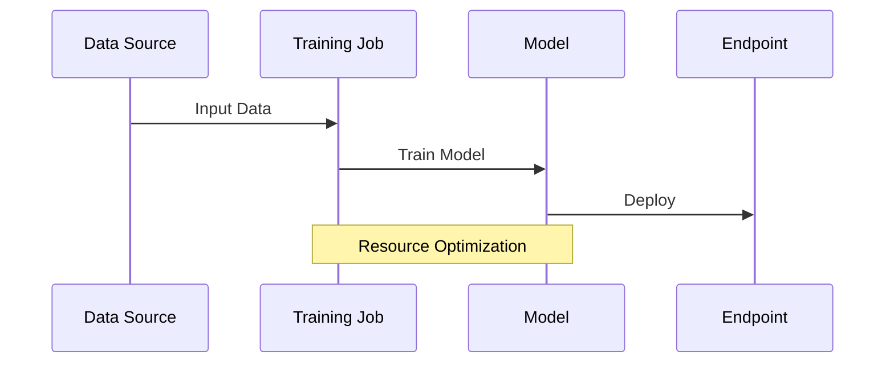
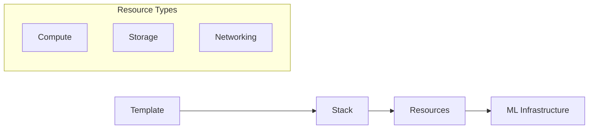
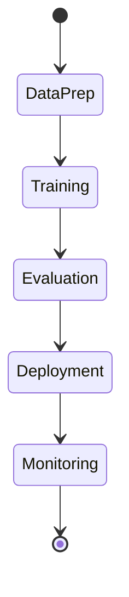

# MLOps và Kiến trúc Hệ thống AI/ML trong AWS

## Tổng quan Kiến trúc

## 1. Amazon SageMaker Deep Dive

### Custom Containers
- Tích hợp container riêng
- Dockerfile tùy chỉnh
- Container requirements
- Runtime environment

### Resource Management
- Training resources
- Inference endpoints
- Optimization strategies
- Cost control

### Training Process

### Inference Deployment
- Endpoint configuration
- Auto scaling
- Resource allocation
- Performance monitoring

## 2. Container Services

### Amazon ECR
- Container registry
- Version control
- Access management
- Integration với SageMaker

### Best Practices
1. **Image Management**
   - Tagging strategy
   - Cleanup policies
   - Security scanning

2. **Resource Optimization**
   - Layer caching
   - Multi-stage builds
   - Image size optimization

## 3. Infrastructure as Code

### CloudFormation

### AWS CDK
- Infrastructure as code
- TypeScript/Python support
- ML constructs
- Deployment automation

## 4. Orchestration Services

### Amazon EventBridge
- Event-driven architecture
- ML workflow triggers
- Monitoring và alerts
- Integration patterns

### AWS Step Functions

#### Use Cases
1. **Training Pipelines**
   - Data preprocessing
   - Model training
   - Evaluation
   - Deployment

2. **Inference Workflows**
   - Request handling
   - Batch processing
   - Error handling
   - Results aggregation

## 5. MLOps Best Practices

### 1. Version Control
- Code versioning
- Model versioning
- Data versioning
- Infrastructure versioning

### 2. Automation
- CI/CD pipelines
- Testing automation
- Deployment automation
- Monitoring automation

### 3. Monitoring
- Model performance
- Resource utilization
- Cost tracking
- Alerts and notifications

## 6. Resource Optimization

### Training Optimization
1. **Compute Resources**
   - Instance selection
   - Distributed training
   - Spot instances
   - Multi-GPU utilization

2. **Storage Management**
   - Data formats
   - Caching strategies
   - Pipeline optimization
   - Storage classes

### Inference Optimization
1. **Endpoint Management**
   - Auto scaling
   - Instance selection
   - Traffic routing
   - Load balancing

2. **Cost Control**
   - Multi-model endpoints
   - Serverless inference
   - Batch transform
   - Elastic inference

## 7. Security Considerations

### Data Security
- Encryption at rest
- Encryption in transit
- Access controls
- Audit logging

### Network Security
- VPC configuration
- Security groups
- Network ACLs
- API security

### Identity Management
- IAM roles
- Service roles
- Cross-account access
- Fine-grained permissions

## 8. Monitoring và Logging

### Metrics Collection
- CloudWatch metrics
- Custom metrics
- Performance KPIs
- Cost metrics

### Logging Strategy
- CloudWatch Logs
- Log aggregation
- Log analysis
- Alert configuration

## Exam Tips

1. **SageMaker Focus**
   - Container integration
   - Resource management
   - Training optimization
   - Inference deployment

2. **Infrastructure Services**
   - ECR usage
   - CloudFormation
   - CDK implementation
   - Service integration

3. **Orchestration Understanding**
   - EventBridge patterns
   - Step Functions workflow
   - Error handling
   - State management