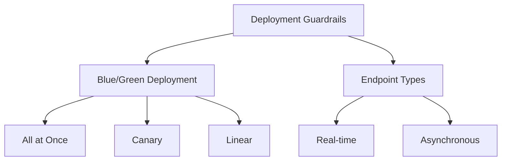
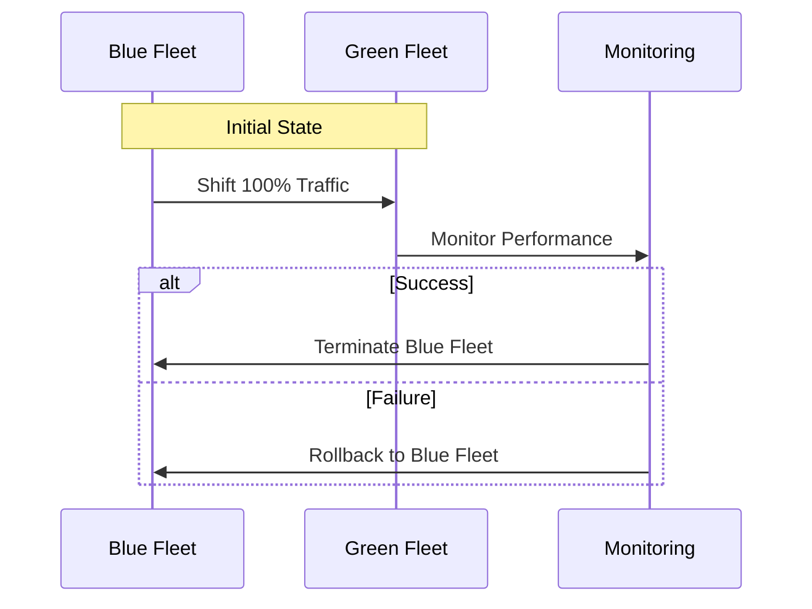
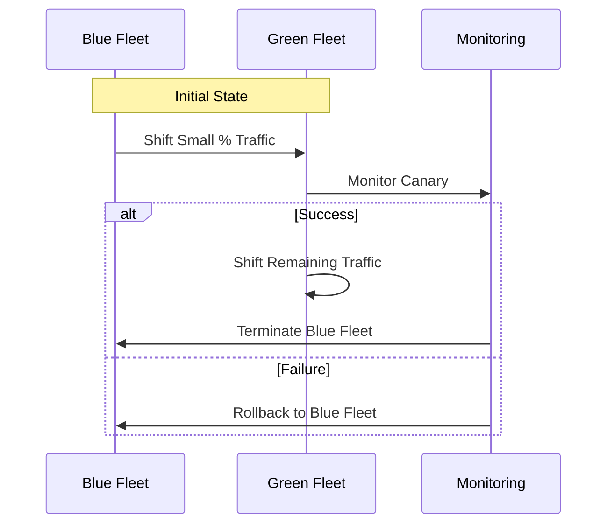
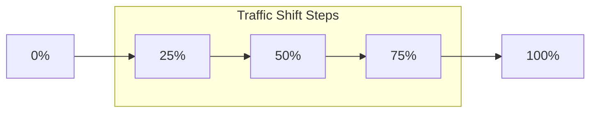
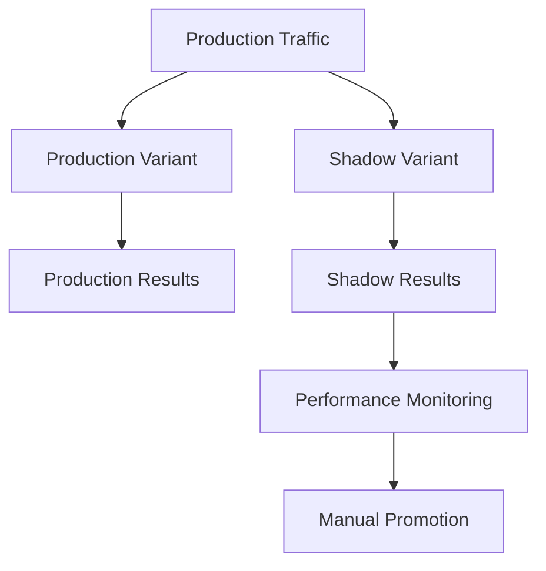
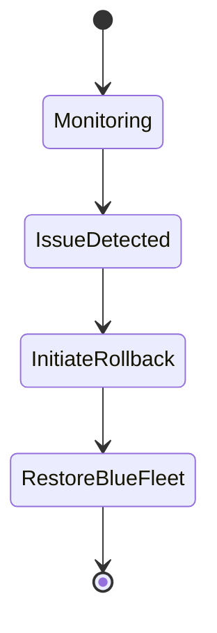

# Tính năng Bảo vệ Triển khai trong SageMaker

## Tổng quan Deployment Guardrails

## 1. Blue/Green Deployment

### Khái niệm cơ bản
- **Blue Fleet**: Model hiện tại
- **Green Fleet**: Model mới
- Chuyển traffic có kiểm soát
- Giám sát tự động

### Các Mode Triển khai

#### 1. All at Once Mode

#### 2. Canary Mode

#### 3. Linear Mode

## 2. Shadow Tests

### Cấu trúc

### Đặc điểm
1. **Shadow Variant**
   - Nhận % traffic
   - Không ảnh hưởng production
   - Giám sát hiệu năng

2. **Monitoring**
   - Console SageMaker
   - So sánh metrics
   - Đánh giá manual

3. **Promotion**
   - Quyết định thủ công
   - Dựa trên performance
   - Kiểm soát hoàn toàn

## 3. Rollback Tự động

### Triggers
- Performance degradation
- Error rates
- Latency issues
- Resource utilization

### Process

## 4. Best Practices

### 1. Chuẩn bị Triển khai
- Test kỹ model mới
- Cấu hình monitoring
- Định nghĩa rollback criteria
- Backup plans

### 2. Monitoring Setup
- Key metrics
- Alert thresholds
- Response plans
- Documentation

### 3. Traffic Management
- Phân tích traffic patterns
- Capacity planning
- Load testing
- Performance baselines

## 5. Use Cases

### 1. High-Stakes Deployments
- Financial systems
- Healthcare applications
- Mission-critical services
- High-traffic platforms

### 2. Gradual Rollouts
- New model versions
- Algorithm updates
- Infrastructure changes
- Feature releases

### 3. Performance Testing
- A/B testing
- Load testing
- Stress testing
- Reliability validation

## 6. Lưu ý Triển khai

### 1. Security
- IAM roles
- Endpoint security
- Network configuration
- Access controls

### 2. Cost Management
- Resource utilization
- Parallel endpoints
- Traffic costs
- Monitoring overhead

### 3. Performance
- Latency requirements
- Throughput goals
- Resource scaling
- Error handling