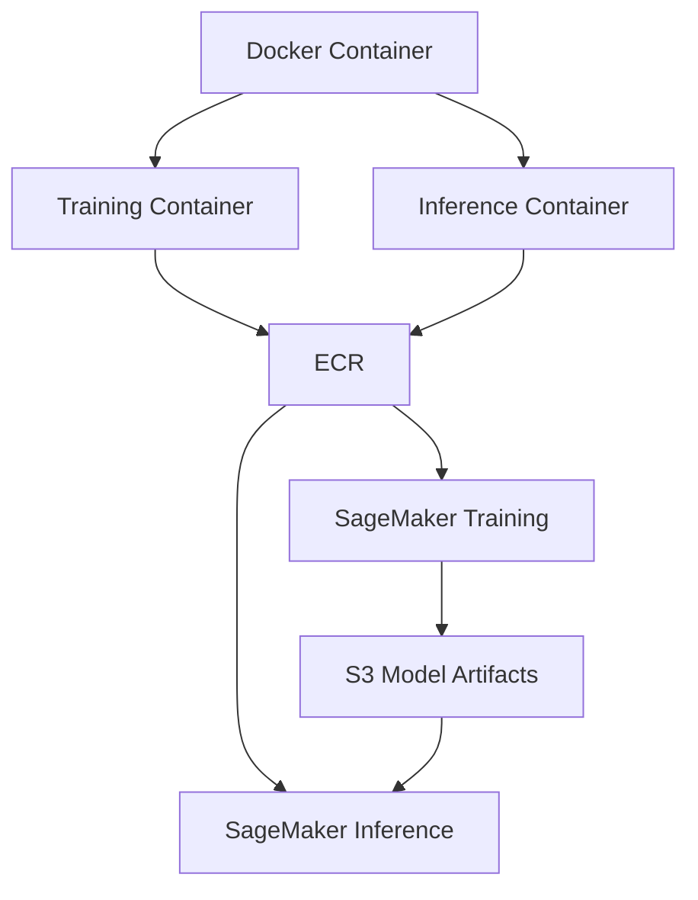
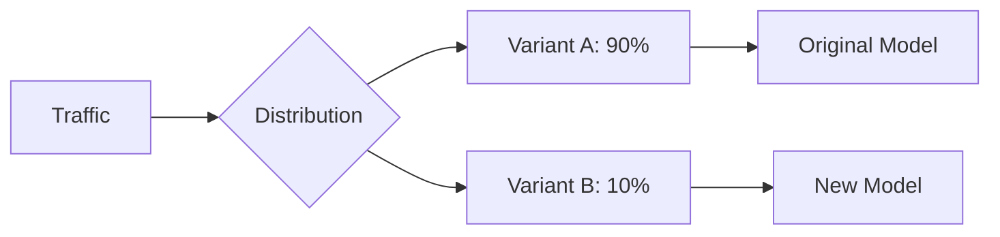

# SageMaker và Docker Containers

## Tổng quan Kiến trúc



## 1. Container Framework Support

### Supported Frameworks
- TensorFlow
- MXNet
- PyTorch
- Scikit-learn
- SparkML
- Chainer

### Distributed Training
- **Horovod**
  - Phân tán TensorFlow
  - Multi-GPU support
- **Parameter Servers**
  - Distributed learning
  - Model synchronization

## 2. Container Structure

### Training Container
```
/opt/ml/
├── input/
│   ├── config/
│   │   ├── hyperparameters.json
│   │   └── resourceconfig.json
│   └── data/
│       └── <channel_name>/
├── code/
│   └── training_script.py
├── model/
└── output/
    └── failure/
```

### Inference Container
```
working_dir/
├── nginx.conf
├── predictor.py
├── server/
├── train/
└── wsgi.py
```

## 3. Container Components

### Web Server Configuration 
- nginx.conf: Cấu hình web server
- wsgi.py: Flask application wrapper
- predictor.py: Flask server implementation

### Deployment Files
- server/: Hosting startup code
- train/: Training algorithm code
- Environment variables setup

## 4. Docker File Example

```dockerfile
FROM tensorflow:latest

RUN pip install sagemaker-containers

COPY train.py /opt/ml/code/

ENV SAGEMAKER_PROGRAM train.py
```

### Environment Variables
1. **Required**
   - SAGEMAKER_PROGRAM

2. **Optional**
   - TRAINING_MODULE
   - SERVICE_MODULE
   - MODEL_DIR
   - SM_CHANNELS
   - HYPERPARAMETERS

## 5. Production Variants



### Variant Weights
- Phân phối traffic
- A/B testing
- Gradual rollout
- Risk management

### Deployment Strategy
1. **Initial Deployment**
   - Low traffic percentage
   - Monitor performance
   - Collect metrics

2. **Scaling Up**
   - Increase traffic gradually
   - Validate performance
   - Compare metrics

3. **Full Deployment/Rollback**
   - Switch to 100% or
   - Quick rollback if needed

## 6. Best Practices

### 1. Container Development
- Modular design
- Clear directory structure
- Proper error handling
- Logging implementation

### 2. Production Deployment
- Resource optimization
- Monitoring setup
- Scaling configuration
- Backup strategy

### 3. Testing
- Local testing
- Integration testing
- Performance testing
- Load testing

## 7. Container Management

### ECR Integration
1. **Image Storage**
   - Version control
   - Access management
   - Security scanning

2. **Deployment Flow**
   - Build process
   - Push to ECR
   - SageMaker integration

### Resource Management
1. **Training Resources**
   - Instance selection
   - Storage configuration
   - Network setup

2. **Inference Resources**
   - Endpoint configuration
   - Auto scaling
   - Load balancing

## 8. Monitoring và Logging

### Training Monitoring
- Progress tracking
- Resource utilization
- Error detection
- Performance metrics

### Inference Monitoring
- Endpoint health
- Latency tracking
- Error rates
- Traffic patterns

## Exam Tips

1. **Container Structure**
   - `/opt/ml/` layout
   - Required files
   - Environment variables

2. **Framework Support**
   - Distributed training
   - Horovod knowledge
   - Parameter servers

3. **Production Deployment**
   - Variant weights
   - A/B testing
   - Rollout strategies