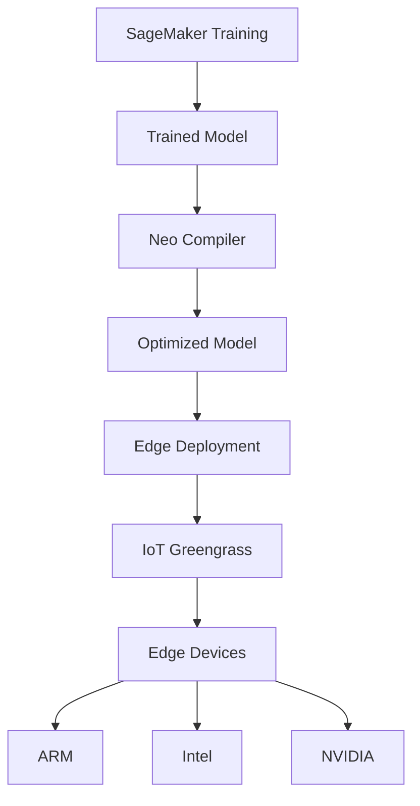
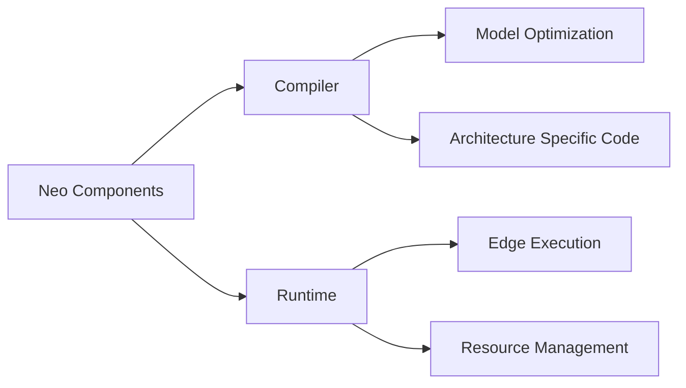
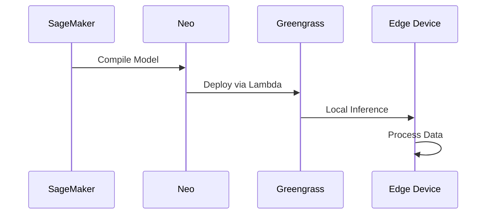
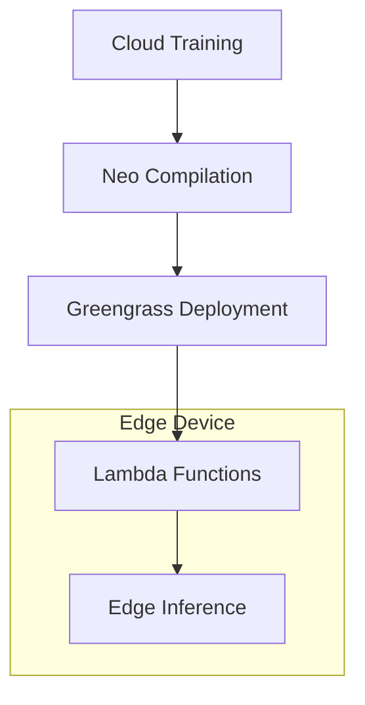

# SageMaker Neo và Edge Computing

## Tổng quan Kiến trúc

## 1. SageMaker Neo

### Đặc điểm Chính
- Train once, run anywhere
- Tối ưu cho edge devices
- Low latency inference
- Cross-platform support

### Supported Frameworks
1. **Deep Learning**
   - TensorFlow
   - MXNet
   - PyTorch
   - ONNX

2. **Machine Learning**
   - XGBoost

## 2. Kiến trúc Neo

### Compiler
- Chuyển đổi model
- Tối ưu hóa cho target platform
- Sinh mã máy tối ưu

### Runtime
- Thư viện chạy trên edge
- Quản lý tài nguyên
- Xử lý inference

## 3. Edge Deployment

### Supported Platforms
- ARM processors
- Intel processors
- NVIDIA processors
- Custom hardware

### Use Cases
1. **Automotive**
   - Self-driving cars
   - Real-time decision making
   - Local processing

2. **Smart Cameras**
   - AWS DeepLens
   - Video analytics
   - Object detection

3. **IoT Devices**
   - Smart sensors
   - Industrial automation
   - Edge computing

## 4. IoT Greengrass Integration

### Deployment Flow
1. Train model in SageMaker
2. Compile with Neo
3. Deploy via Greengrass
4. Run on edge device

### Lambda Functions
- Inference code
- Data processing
- Event triggers
- Resource management

## 5. Hosting Options

### Cloud Endpoints
- C5 instances
- M5 instances
- M4 instances
- P3 instances
- P2 instances

### Edge Deployment
1. **Local Processing**
   - Reduced latency
   - Offline capability
   - Data privacy

2. **Resource Optimization**
   - Platform specific
   - Memory efficient
   - Power efficient

## 6. Best Practices

### 1. Model Optimization
- Compress model size
- Reduce complexity
- Optimize for target hardware

### 2. Deployment Strategy
- Test thoroughly
- Monitor performance
- Backup plans
- Update mechanism

### 3. Security
- Secure communication
- Access control
- Data protection
- Regular updates

## 7. Integration Pattern

### Components
1. **Cloud Side**
   - Model training
   - Compilation
   - Deployment management

2. **Edge Side**
   - Local inference
   - Data processing
   - Event handling

## Exam Tips

1. **Neo Knowledge**
   - Compiler và runtime
   - Framework support
   - Platform compatibility

2. **Integration**
   - IoT Greengrass
   - Lambda functions
   - Deployment patterns

3. **Use Cases**
   - Edge computing
   - Real-time processing
   - Local inference

4. **Architecture**
   - Compilation requirements
   - Runtime environment
   - Resource constraints