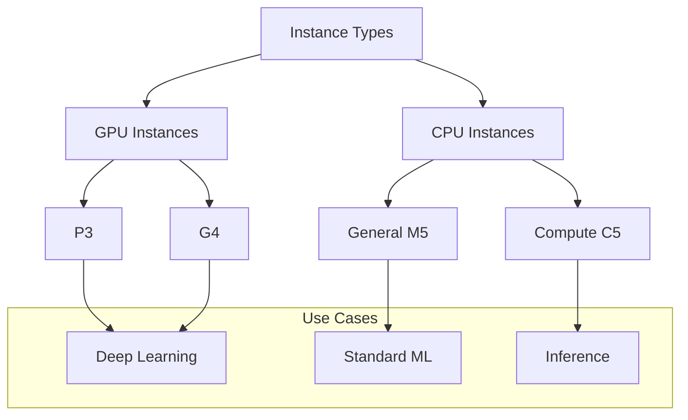
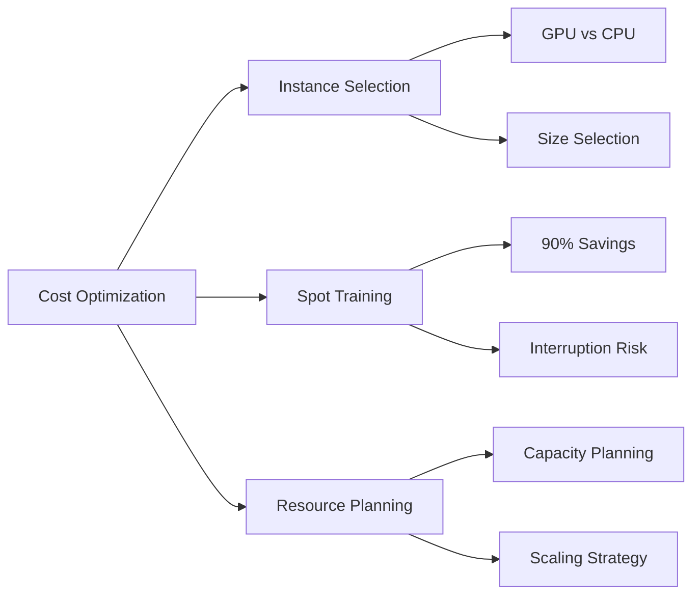
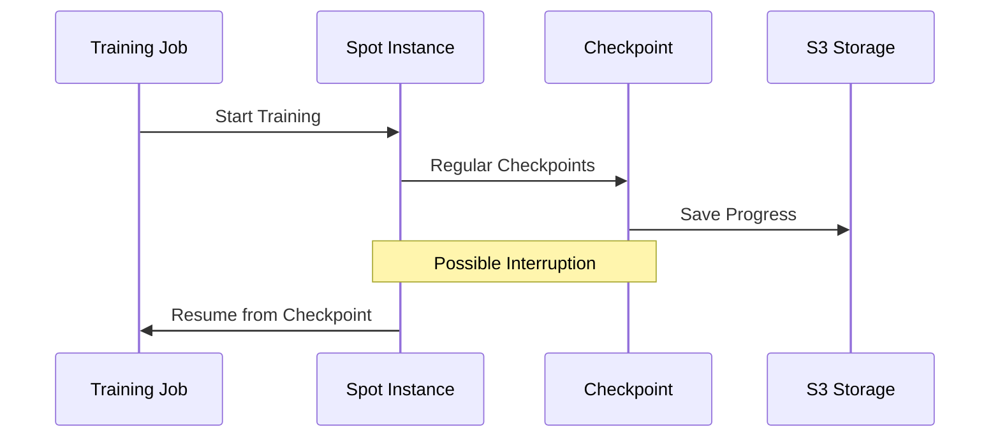

# Quản lý Tài nguyên trong SageMaker

## Tổng quan Instance Types

## 1. Lựa Chọn Instance Type

### Deep Learning
- **Training**
  - P3 instances
  - G4 instances
  - Multi-GPU support
  - High performance

- **Inference**
  - C5 instances
  - Lightweight
  - Cost-effective
  - Lower demand

### Standard Machine Learning
- M5 instances
- General purpose
- Cost-effective
- CPU optimization

## 2. Cost Optimization

### GPU vs CPU Considerations
1. **GPU Advantages**
   - Nhanh hơn cho deep learning
   - Hiệu quả cho parallel processing
   - Tiết kiệm thời gian

2. **CPU Advantages**
   - Chi phí thấp hơn
   - Phù hợp standard ML
   - Linh hoạt hơn

## 3. Managed Spot Training

### Ưu điểm
- Tiết kiệm đến 90% chi phí
- Tích hợp với SageMaker
- Tự động quản lý

### Thách thức

### Implementation
1. **Checkpoint System**
   - Regular saves to S3
   - Progress tracking
   - Resume capability

2. **Time Management**
   - Waiting for availability
   - Training interruptions
   - Recovery time

## 4. Best Practices

### 1. Instance Selection
- Match task requirements
- Consider cost constraints
- Evaluate performance needs
- Plan for scaling

### 2. Cost Management
- Monitor usage
- Optimize instance size
- Use spot when possible
- Regular cost review

### 3. Performance Optimization
- Test different instances
- Benchmark performance
- Monitor metrics
- Adjust resources

## 5. Resource Planning

### Training Phase
1. **High Performance**
   - GPU instances
   - Multiple GPUs
   - Large memory
   - Fast storage

2. **Cost Saving**
   - Spot instances
   - Checkpointing
   - Resource scheduling
   - Capacity planning

### Inference Phase
1. **Production**
   - C5 instances
   - Auto scaling
   - Load balancing
   - Monitoring

2. **Development**
   - Smaller instances
   - Testing environments
   - Quick iterations
   - Cost control

## Exam Tips

1. **Instance Knowledge**
   - GPU vs CPU use cases
   - Instance type characteristics
   - Cost considerations

2. **Spot Training**
   - Savings potential
   - Checkpoint requirements
   - Interruption handling

3. **Resource Optimization**
   - Best fit selection
   - Cost-performance balance
   - Scaling strategies

4. **Deployment Considerations**
   - Production requirements
   - Development needs
   - Monitoring setup