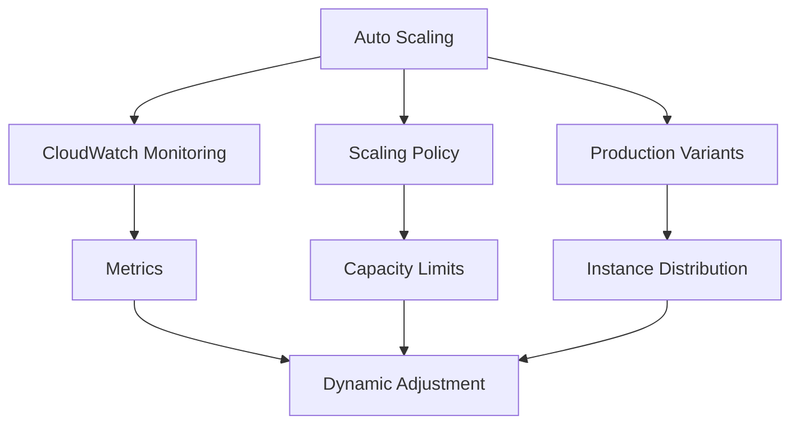
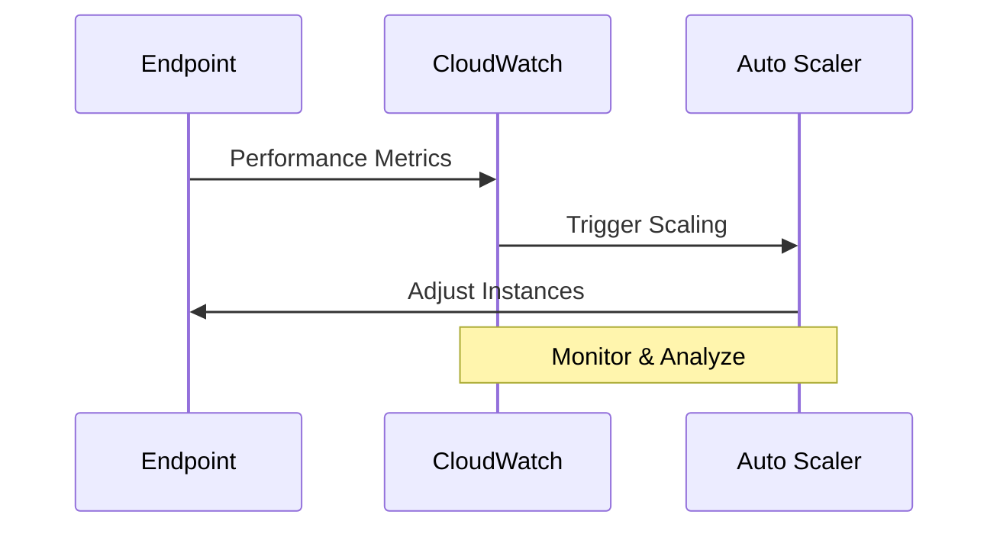
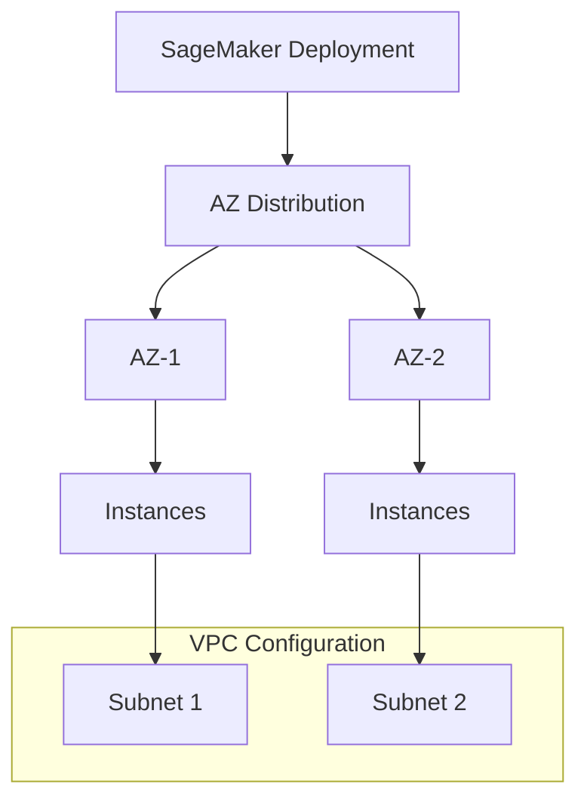

# Auto Scaling và Availability Zones trong SageMaker

## Auto Scaling Overview



## 1. Auto Scaling Configuration

### Scaling Policy
- Target metrics
- Min/max capacity
- Cool down periods
- Instance thresholds

### CloudWatch Integration


### Production Variants
- Variant-specific scaling
- Traffic distribution
- Resource allocation
- Performance monitoring

## 2. Best Practices

### Load Testing
1. **Test Environment**
   - Simulate production load
   - Verify scaling rules
   - Monitor performance
   - Tune parameters

2. **Validation**
   - Capacity response
   - Scaling triggers
   - Recovery time
   - Cost analysis

## 3. Availability Zones



### Auto Distribution
- Multiple instances
- Cross-AZ deployment
- Automatic balancing
- Failure resilience

### VPC Requirements
1. **Subnet Configuration**
   - Minimum 2 subnets
   - Different AZs
   - Proper routing
   - Security groups

2. **Network Planning**
   - Redundancy
   - Failover
   - Load balancing
   - Traffic routing

## 4. Implementation Strategy

### Initial Setup
1. **Policy Definition**
   ```json
   {
     "AutoScalingPolicy": {
       "MinCapacity": 2,
       "MaxCapacity": 10,
       "TargetMetric": "InvocationsPerInstance",
       "TargetValue": 1000,
       "CooldownPeriod": 300
     }
   }
   ```

2. **AZ Configuration**
   ```
   VPC:
     - Subnet-1 (AZ-1)
     - Subnet-2 (AZ-2)
     Security Groups
     Route Tables
   ```

### Monitoring Setup
1. **CloudWatch Metrics**
   - Instance utilization
   - Request latency
   - Error rates
   - Throughput

2. **Alerts**
   - Scaling events
   - Performance issues
   - Capacity limits
   - Error thresholds

## 5. Production Guidelines

### Scaling Strategy
1. **Proactive Planning**
   - Analyze traffic patterns
   - Set appropriate limits
   - Plan for spikes
   - Cost optimization

2. **Reactive Adjustment**
   - Monitor performance
   - Tune parameters
   - Adjust thresholds
   - Update policies

### High Availability
1. **Instance Distribution**
   - Multiple instances
   - Cross-AZ deployment
   - Load balancing
   - Failover planning

2. **Resilience**
   - Redundant components
   - Automatic recovery
   - Data replication
   - Backup strategy

## Exam Tips

1. **Auto Scaling**
   - CloudWatch integration
   - Policy configuration
   - Production variants
   - Load testing importance

2. **Availability Zones**
   - Multiple instances needed
   - VPC subnet requirements
   - AZ distribution
   - Resilience planning

3. **Best Practices**
   - Test before production
   - Monitor performance
   - Regular validation
   - Cost management