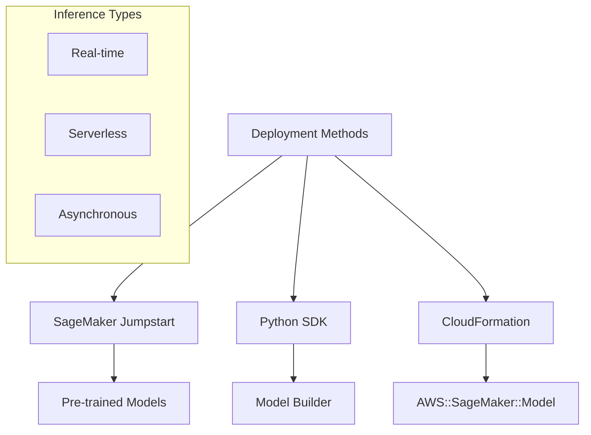
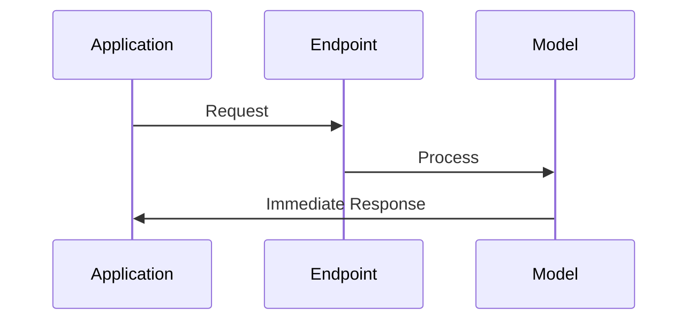
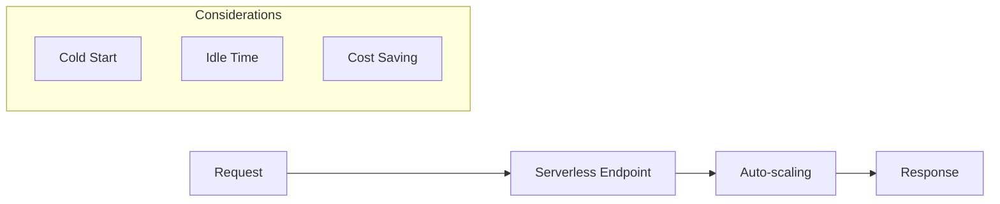
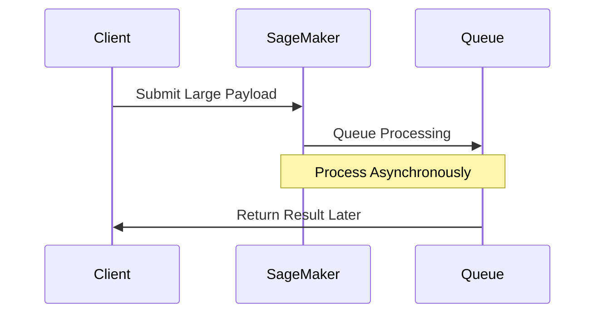
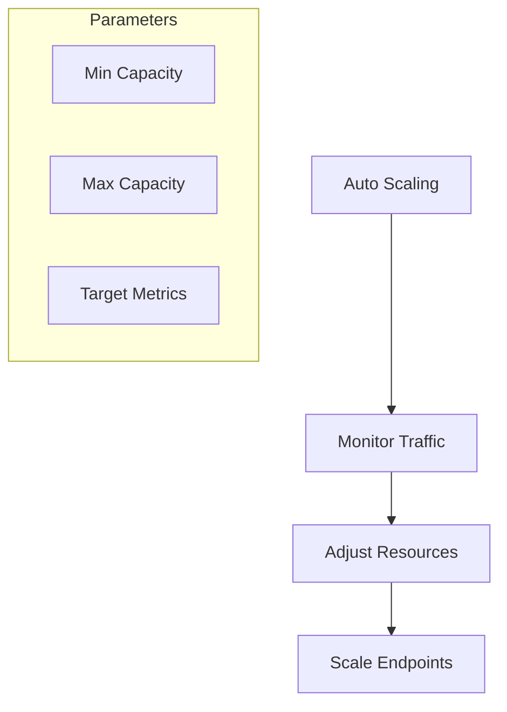

# Triển khai Model trong SageMaker

## Phương pháp Triển khai

## 1. SageMaker Jumpstart
- Giải pháp đơn giản nhất
- Pre-trained models
- Pre-configured endpoints
- Templates có sẵn

## 2. Python SDK Model Builder
- Kiểm soát chi tiết hơn
- Cấu hình linh hoạt
- Deployment programmatically
- Tích hợp với notebooks

## 3. AWS CloudFormation
- Triển khai tự động
- CI/CD integration
- Infrastructure as Code
- Quản lý resources

## 4. Inference Types

### Real-time Inference

#### Đặc điểm
- Low latency
- Interactive workloads
- Immediate response
- Small payload size

### Serverless Inference

#### Use Cases
- Uneven traffic
- Cost optimization
- Idle periods
- Flexible scaling

### Asynchronous Inference

#### Characteristics
- Large payloads (up to 1GB)
- Long processing times
- Non-blocking operation
- Batch processing

## 5. Auto Scaling

### Configuration

### Features
- Dynamic adjustment
- Traffic-based scaling
- Resource optimization
- Cost management

## 6. SageMaker Neo Integration

### Optimization
- AWS Inferentia support
- Performance tuning
- Platform-specific
- Resource efficiency

### Benefits
- Faster inference
- Lower latency
- Better throughput
- Cost reduction

## Best Practices

### 1. Deployment Selection
- Evaluate requirements
- Consider latency needs
- Assess payload size
- Analyze traffic patterns

### 2. Resource Management
- Monitor usage
- Configure auto-scaling
- Optimize costs
- Plan capacity

### 3. Performance Optimization
- Use Neo when applicable
- Test different configs
- Monitor metrics
- Regular tuning

## Exam Tips

1. **Deployment Methods**
   - Jumpstart simplicity
   - SDK flexibility
   - CloudFormation automation

2. **Inference Types**
   - Real-time vs Async
   - Serverless considerations
   - Payload limits

3. **Auto Scaling**
   - Configuration options
   - Traffic patterns
   - Resource optimization

4. **Neo Usage**
   - Optimization cases
   - Platform support
   - Performance gains