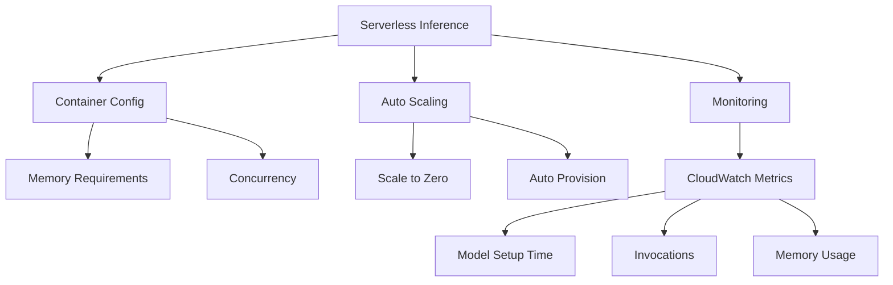
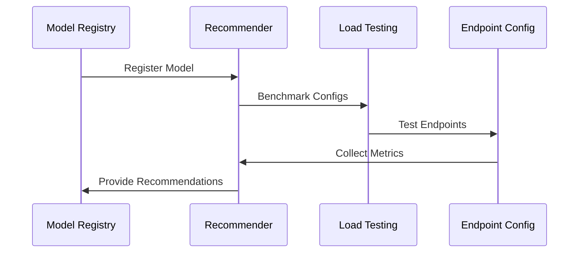
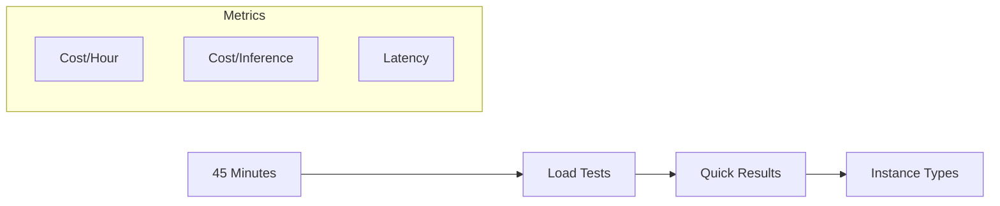
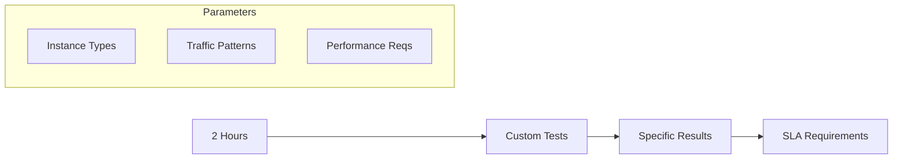

# Serverless Inference và Inference Recommender trong SageMaker

## 1. Serverless Inference

### Đặc điểm Chính
1. **Auto Provisioning**
   - Tự động scale
   - Không cần quản lý servers
   - Pay per use
   - Scale to zero

2. **Use Cases**
   - Unpredictable traffic
   - Infrequent requests
   - Cost optimization
   - Variable workloads

3. **Monitoring**
- **CloudWatch Metrics**
  - Model setup time
  - Invocations count
  - Error tracking
  - Memory utilization

## 2. Inference Recommender

### Modes of Operation

#### 1. Instance Recommendations

- Quick benchmarking
- 45 phút runtime
- Basic load testing
- General recommendations

#### 2. Endpoint Recommendations

- Custom load tests
- 2 giờ runtime
- Specific requirements
- Detailed analysis

## 3. So sánh Phương pháp Triển khai

### Deployment Options Matrix

| Feature | Serverless | Auto Scaling | Manual |
|---------|------------|--------------|--------|
| Management | Minimal | Medium | High |
| Cost Model | Pay per use | Instance based | Instance based |
| Setup Complexity | Low | Medium | High |
| Control | Limited | Medium | Full |
| Scale to Zero | Yes | No | No |
| Cold Start | Yes | No | No |

## 4. Best Practices

### Serverless Inference
1. **Container Configuration**
   - Accurate memory specs
   - Proper concurrency
   - Resource optimization
   - Performance testing

2. **Monitoring Setup**
   - CloudWatch alerts
   - Performance metrics
   - Error tracking
   - Usage patterns

### Inference Recommender
1. **Mode Selection**
   - Requirements analysis
   - Time constraints
   - SLA needs
   - Cost considerations

2. **Testing Strategy**
   - Load patterns
   - Performance goals
   - Resource limits
   - Cost targets

## 5. Implementation Guidelines

### 1. Serverless Setup
- Configure container
- Set memory limits
- Define concurrency
- Setup monitoring

### 2. Recommender Usage
1. **Instance Recommendations**
   - Quick assessment
   - General needs
   - Basic requirements

2. **Endpoint Recommendations**
   - Specific SLAs
   - Custom patterns
   - Detailed analysis

## 6. Cost Management

### Serverless
- Pay-per-use model
- No idle costs
- Auto-scaling costs
- Usage monitoring

### Traditional
- Instance costs
- Capacity planning
- Resource optimization
- Scaling costs

## Exam Tips

1. **Serverless Knowledge**
   - Auto-provisioning
   - Scaling behavior
   - Monitoring metrics
   - Use cases

2. **Recommender Understanding**
   - Two modes
   - Runtime differences
   - Metrics provided
   - Configuration options

3. **Decision Making**
   - When to use each
   - Cost considerations
   - Performance needs
   - Management overhead