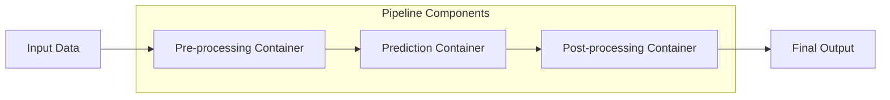
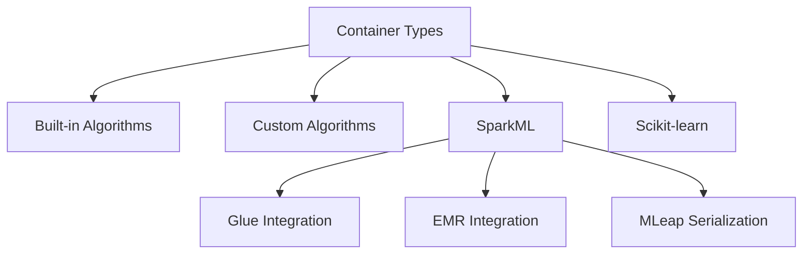
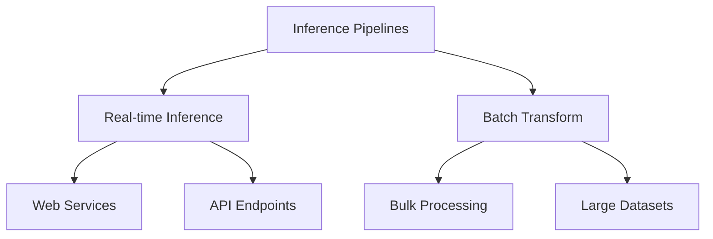
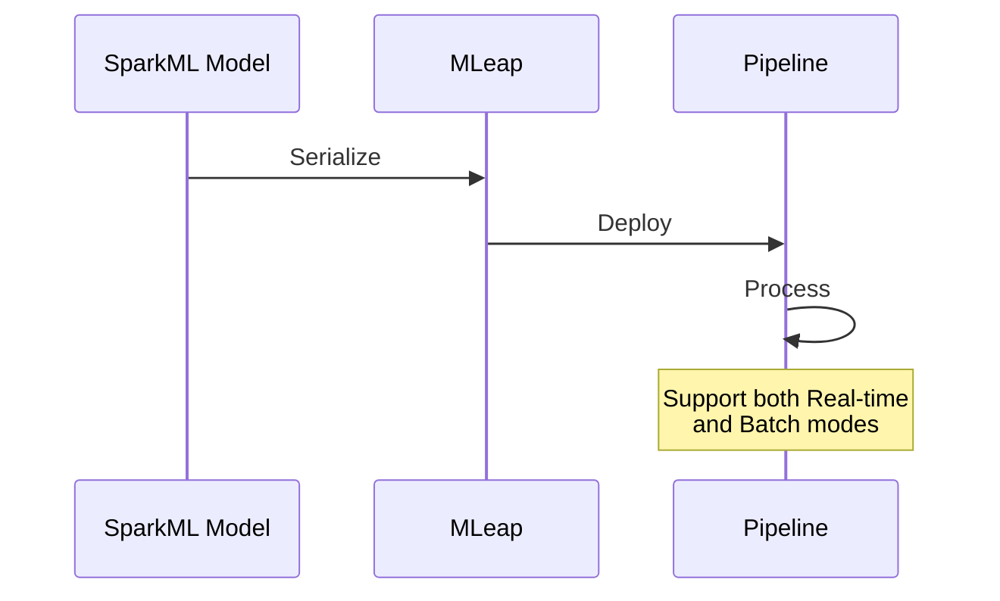

# Inference Pipelines trong SageMaker

## Tổng quan

## 1. Cấu trúc Pipeline

### Đặc điểm Chính
- Chuỗi 2-5 containers
- Xử lý tuyến tính
- Tích hợp nhiều model
- Linh hoạt configuration

### Container Types

## 2. Use Cases

### Pre-processing
- Data cleaning
- Feature engineering
- Normalization
- Transformation

### Predictions
- Model inference
- Multiple models
- Ensemble methods
- Scoring

### Post-processing
- Result formatting
- Response enrichment
- Business logic
- Validation

## 3. Deployment Modes

### Real-time Mode
- API endpoints
- Low latency
- Individual requests
- Interactive usage

### Batch Mode
- Large scale processing
- Offline inference
- Batch jobs
- Bulk transformations

## 4. SparkML Integration

### Components
- Glue integration
- EMR support
- MLeap serialization
- Distributed processing

### Configuration

## 5. Implementation Guidelines

### 1. Pipeline Design
- Identify components
- Define sequence
- Optimize flow
- Test integration

### 2. Container Setup
- Resource allocation
- Communication config
- Error handling
- Monitoring setup

### 3. Deployment Strategy
- Mode selection
- Scaling config
- Performance tuning
- Monitoring plan

## 6. Best Practices

### 1. Performance
- Minimize latency
- Optimize resources
- Balance loads
- Monitor bottlenecks

### 2. Reliability
- Error handling
- Failover plans
- Data validation
- Quality checks

### 3. Maintenance
- Version control
- Update strategy
- Monitoring
- Documentation

## Exam Tips

1. **Pipeline Structure**
   - 2-5 containers
   - Linear sequence
   - Container types
   - Integration options

2. **SparkML Knowledge**
   - MLeap format
   - Glue/EMR usage
   - Serialization

3. **Deployment Modes**
   - Real-time vs Batch
   - Use cases
   - Configuration

4. **Integration**
   - Container compatibility
   - Framework support
   - Communication flow
   - Error handling