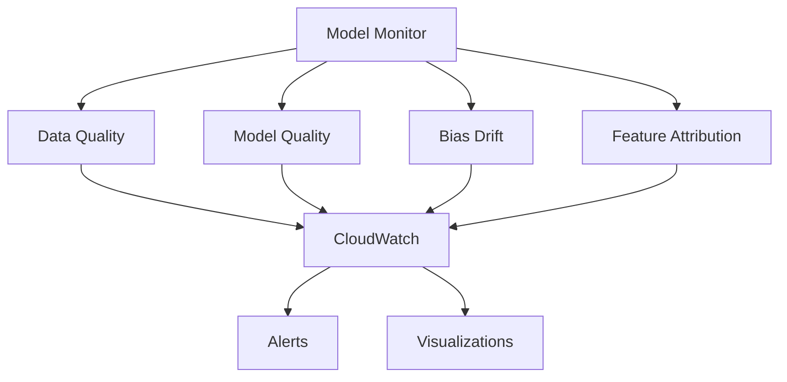
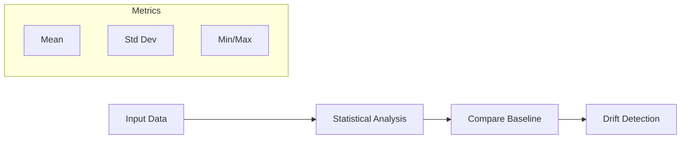
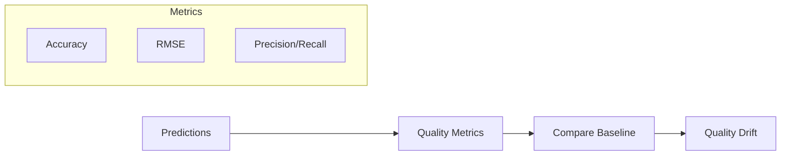
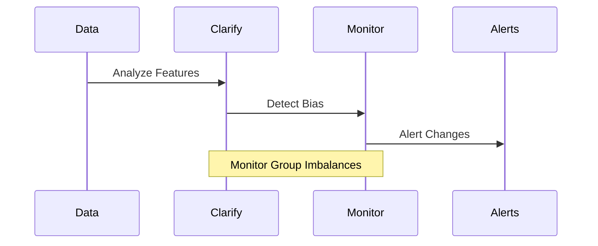
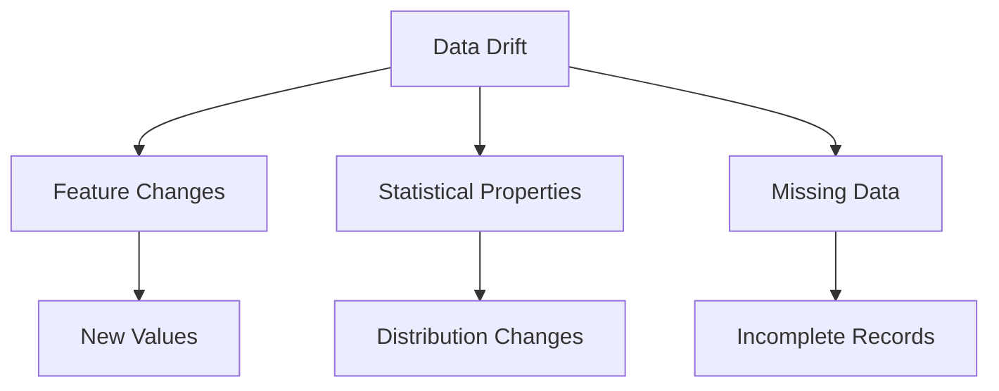

# SageMaker Model Monitor

## Tổng quan Kiến trúc

## 1. Các Loại Monitoring

### Data Quality Monitor

### Model Quality Monitor

### Bias Monitor

## 2. Key Features

### Data Drift Detection
- Feature changes
- Statistical variations
- Missing data
- New features

### Anomaly Detection
- Outlier identification
- Pattern changes
- Unusual behaviors
- Alert thresholds

### Bias Monitoring
- Group imbalances
- Feature attribution
- NDCG metrics
- Training vs Live data

## 3. Integration Points

### Storage & Security
- S3 storage
- Security measures
- Access control
- Encryption

### Visualization Tools
- TensorBoard
- QuickSight
- Tableau
- SageMaker Studio

### Monitoring Schedule
1. **Configuration**
   - Schedule setup
   - Baseline creation
   - Threshold definition
   - Alert configuration

2. **Execution**
   - Regular monitoring
   - Data collection
   - Analysis
   - Reporting

## 4. Drift Types

### Data Drift

### Feature Attribution Drift
- NDCG metric
- Feature ranking
- Training vs Live
- Importance changes

## 5. Ground Truth Integration

### Label Monitoring
- Human annotations
- Model predictions
- Divergence detection
- Quality assessment

### Performance Metrics
- Accuracy tracking
- Error analysis
- Quality trends
- Baseline comparison

## 6. Implementation Guide

### 1. Setup Process
1. **Baseline Creation**
   - Data quality baseline
   - Model quality baseline
   - Bias metrics baseline
   - Attribution baseline

2. **Schedule Configuration**
   - Monitoring frequency
   - Resource allocation
   - Alert thresholds
   - Storage settings

### 2. Alert Configuration
- CloudWatch metrics
- Notification settings
- Threshold levels
- Response actions

## 7. Best Practices

### 1. Monitoring Strategy
- Regular assessments
- Comprehensive metrics
- Clear baselines
- Action plans

### 2. Alert Management
- Priority levels
- Response procedures
- Documentation
- Team notification

### 3. Maintenance
- Baseline updates
- Threshold adjustments
- Performance review
- Resource optimization

## Exam Tips

1. **Monitor Types**
   - Data quality
   - Model quality
   - Bias drift
   - Feature attribution

2. **Integration Knowledge**
   - CloudWatch
   - Clarify
   - Visualization tools
   - Ground truth

3. **Metrics Understanding**
   - NDCG
   - Statistical measures
   - Quality metrics
   - Drift detection