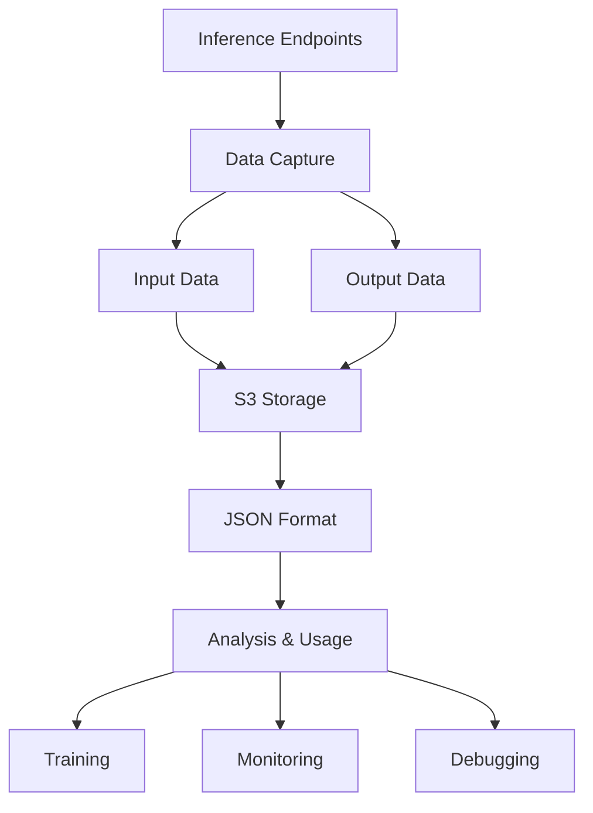
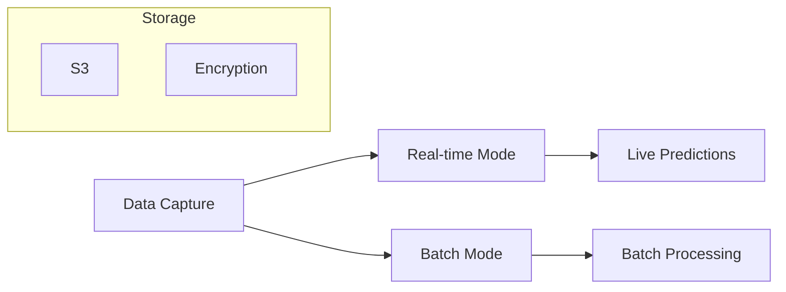
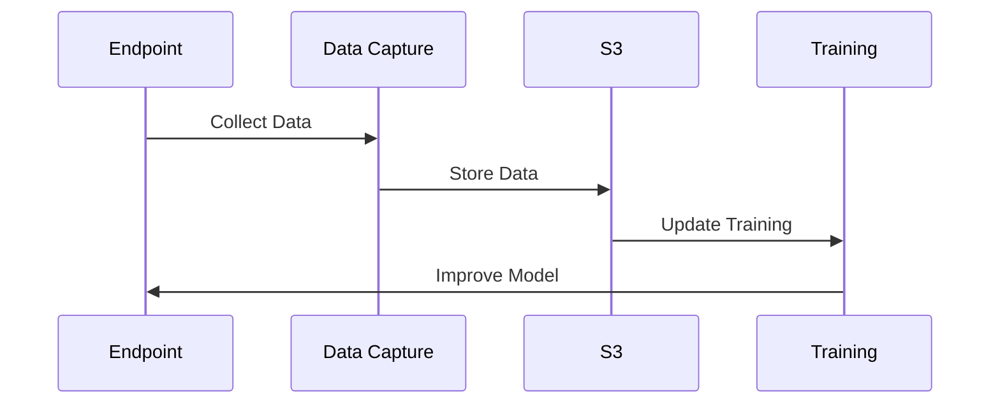
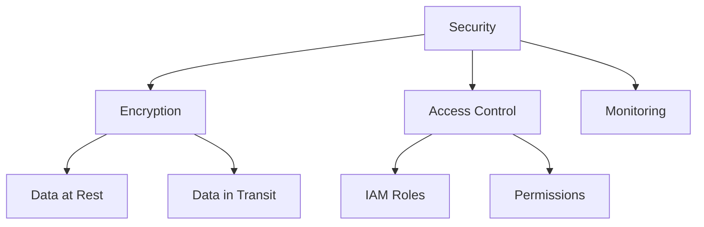
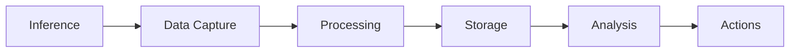

# Data Capture trong SageMaker Model Monitor

## Tổng quan

## 1. Chức năng Chính

### Thu thập Dữ liệu
- Input endpoints
- Inference outputs
- JSON format
- S3 storage

### Phạm vi Áp dụng

## 2. Use Cases

### Continuous Training

### Monitoring & Debug
1. **Monitoring**
   - Performance tracking
   - Data drift detection
   - Quality assessment
   - Metric comparisons

2. **Debugging**
   - Error analysis
   - Issue tracking
   - Performance issues
   - Data problems

## 3. Implementation

### SDK Support
- Python Boto library
- SageMaker Python SDK
- API integration
- Custom configuration

### Security Features

## 4. Baseline Comparison

### Metrics Analysis
- Data statistics
- Performance metrics
- Drift detection
- Anomaly identification

### Alerts
- Threshold violations
- Unusual patterns
- Quality issues
- System problems

## 5. Best Practices

### 1. Storage Management
- Retention policy
- Cleanup strategy
- Storage optimization
- Cost management

### 2. Security
- Encryption setup
- Access controls
- Audit logging
- Compliance

### 3. Performance
- Sampling rate
- Resource usage
- Latency impact
- Optimization

## 6. Integration Points

### Data Pipeline

### Tools & Services
- CloudWatch
- S3
- SageMaker Studio
- Analytics tools

## 7. Configuration Guide

### 1. Setup
- Enable capture
- Configure storage
- Set permissions
- Define metrics

### 2. Monitoring
- Setup alerts
- Define baselines
- Configure thresholds
- Schedule reviews

### 3. Management
- Resource planning
- Cost monitoring
- Performance tuning
- Maintenance tasks

## Exam Tips

1. **Core Features**
   - Data collection
   - Storage formats
   - Security options
   - Implementation methods

2. **Use Cases**
   - Continuous training
   - Monitoring
   - Debugging
   - Analysis

3. **Technical Details**
   - SDK support
   - Security features
   - Integration points
   - Configuration options