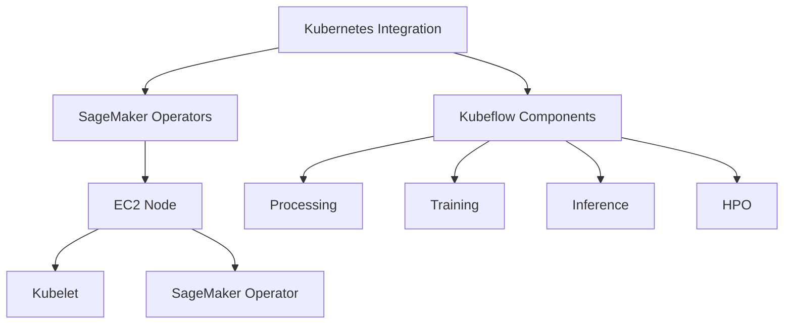
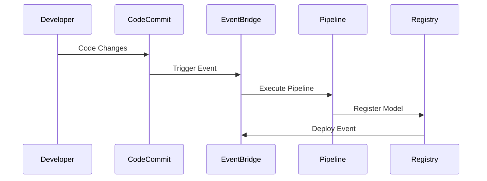
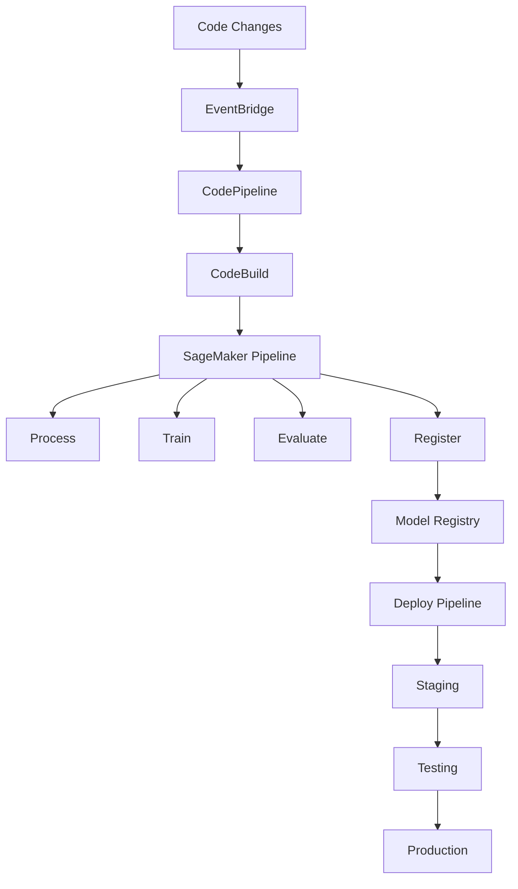
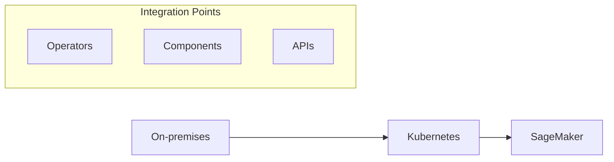

# MLOps và Giải pháp Tích hợp trong SageMaker

## 1. Kubernetes Integration



### SageMaker Operators for Kubernetes
- Tích hợp với EKS
- Kubernetes API support
- kubectl compatibility
- Native integration

### Kubeflow Components
- Processing tasks
- Training workloads
- Inference hosting
- Hyperparameter tuning

## 2. SageMaker Projects



### Components
1. **Code Repository**
   - Version control
   - Collaboration
   - Change tracking
   - CI/CD triggers

2. **SageMaker Pipelines**
   - Data processing
   - Model training
   - Evaluation
   - Deployment

## 3. Complex MLOps Workflow



### Pipeline Stages

#### 1. Build Phase
- Code commit triggers
- EventBridge events
- Pipeline execution
- Model building

#### 2. Deploy Phase
- Model registration
- Staging deployment
- Testing validation
- Production rollout

## 4. Integration Options

### Hybrid Workflows


### Security & Compliance
- Data sensitivity
- On-premises requirements
- Cloud integration
- Access control

## 5. Implementation Guide

### 1. Kubernetes Setup
- Install operators
- Configure EKS
- Set permissions
- Test integration

### 2. SageMaker Projects
1. **Project Creation**
   - Template selection
   - Repository setup
   - Pipeline definition
   - Monitoring config

2. **Pipeline Development**
   ```python
   pipeline = Pipeline(
       name="MLOpsProject",
       steps=[
           ProcessingStep(...),
           TrainingStep(...),
           EvaluationStep(...),
           RegisterModel(...)
       ]
   )
   ```

## 6. Best Practices

### 1. Architecture Design
- Modular components
- Clear interfaces
- Error handling
- Monitoring setup

### 2. Development Flow
- Version control
- Testing strategy
- Deployment process
- Rollback plans

### 3. Operations
- Resource management
- Cost optimization
- Performance monitoring
- Security measures

## 7. Tool Selection Guide

### Criteria
1. **Existing Infrastructure**
   - Kubernetes presence
   - Current MLOps
   - Integration needs
   - Team expertise

2. **Requirements**
   - Scalability needs
   - Security concerns
   - Performance goals
   - Budget constraints

## Exam Tips

1. **Integration Knowledge**
   - Kubernetes operators
   - Kubeflow components
   - SageMaker projects
   - Pipeline architecture

2. **Workflow Understanding**
   - Build process
   - Deployment stages
   - Testing procedures
   - Monitoring setup

3. **Tool Selection**
   - Use case analysis
   - Integration options
   - Security considerations
   - Best practices