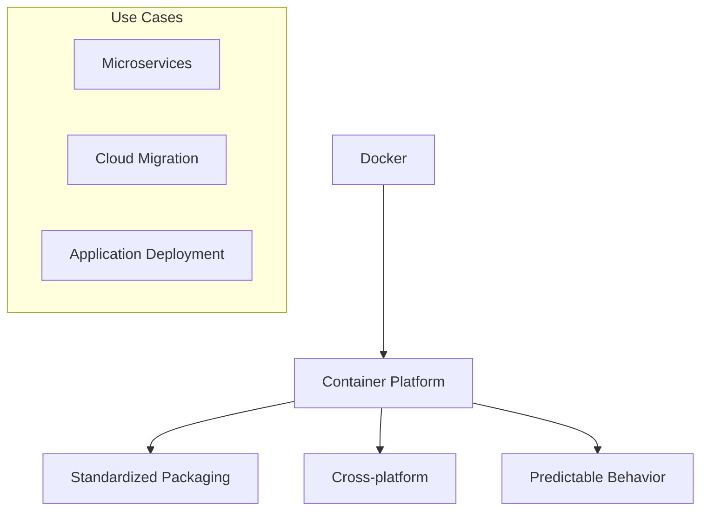
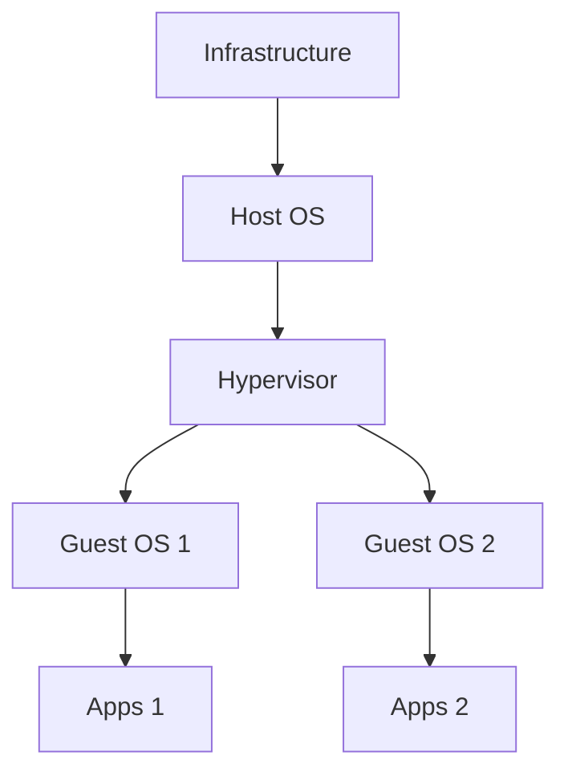
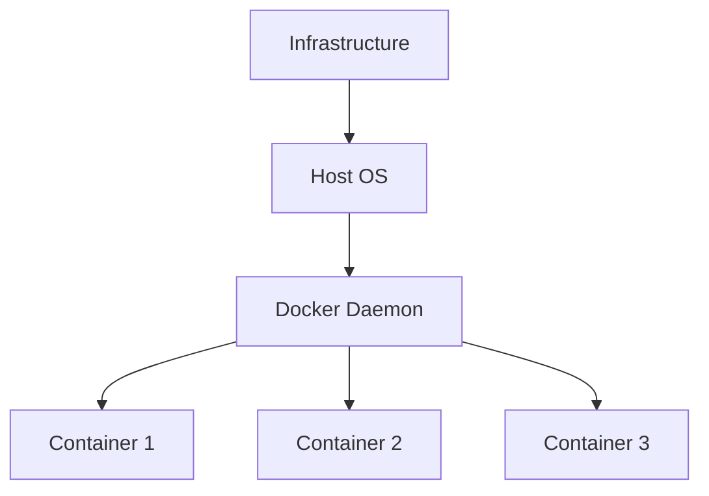
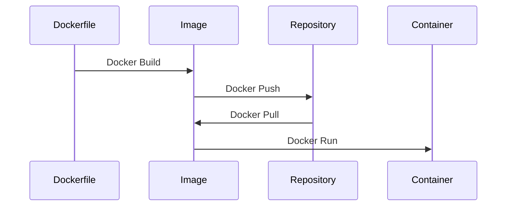
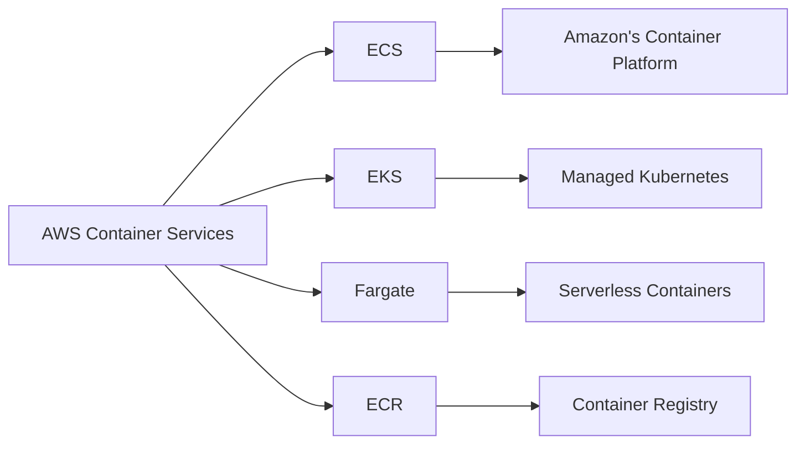
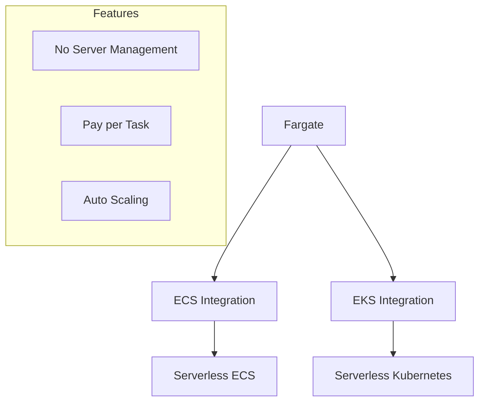

# Docker và Container Management trong AWS

## Docker Overview

## Kiến trúc Docker vs VM

### Virtual Machine Architecture

### Docker Architecture

## Docker Workflow

## Container Management trong AWS

## 1. Docker Repositories

### Public Options
- Docker Hub
  - Base images
  - Public repository
  - Popular platforms

### Private Options
- Amazon ECR
  - Private registry
  - AWS integration
  - Security features

## 2. Container Management Services

### Amazon ECS
1. **Features**
   - Native AWS integration
   - Task definitions
   - Service management
   - Auto scaling

2. **Use Cases**
   - Microservices
   - Batch processing
   - Application hosting
   - CI/CD

### Amazon EKS
1. **Features**
   - Managed Kubernetes
   - Multi-zone deployment
   - Auto scaling
   - Container orchestration

2. **Benefits**
   - Open source
   - Portability
   - Ecosystem
   - Flexibility

### AWS Fargate

## 3. Implementation Guide

### 1. Docker Setup
- Install Docker
- Write Dockerfile
- Build image
- Test locally

### 2. AWS Integration
1. **ECR Setup**
   - Create repository
   - Configure access
   - Push images

2. **Service Selection**
   - ECS vs EKS
   - Fargate consideration
   - Scaling needs

## 4. Best Practices

### 1. Image Management
- Layer optimization
- Multi-stage builds
- Security scanning
- Version control

### 2. Container Security
- IAM roles
- Network isolation
- Secret management
- Image scanning

### 3. Resource Management
- CPU allocation
- Memory limits
- Storage optimization
- Cost monitoring

## 5. Migration Strategies

### Lift and Shift
1. **Steps**
   - Containerize apps
   - Test compatibility
   - Deploy to AWS
   - Monitor performance

2. **Considerations**
   - Application complexity
   - Dependencies
   - State management
   - Network requirements

## Exam Tips

1. **Container Basics**
   - Docker concepts
   - Image vs Container
   - Repository types
   - Build process

2. **AWS Services**
   - ECS features
   - EKS capabilities
   - Fargate use cases
   - ECR management

3. **Architecture**
   - Container vs VM
   - Resource sharing
   - Service integration
   - Security practices