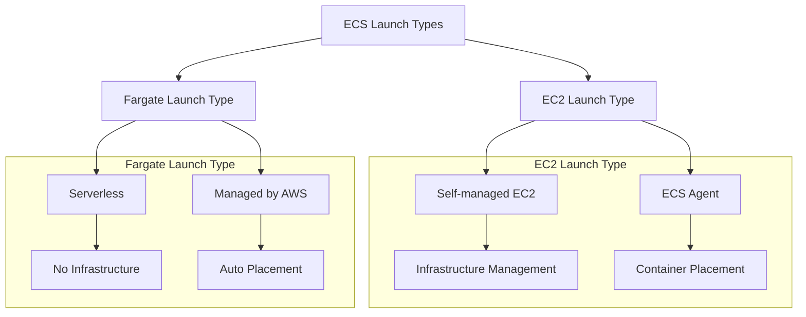
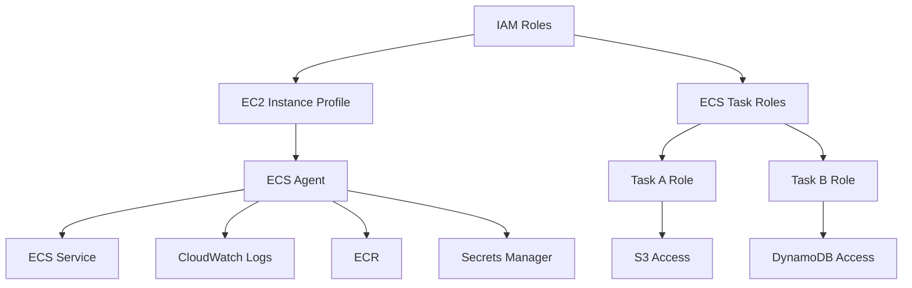
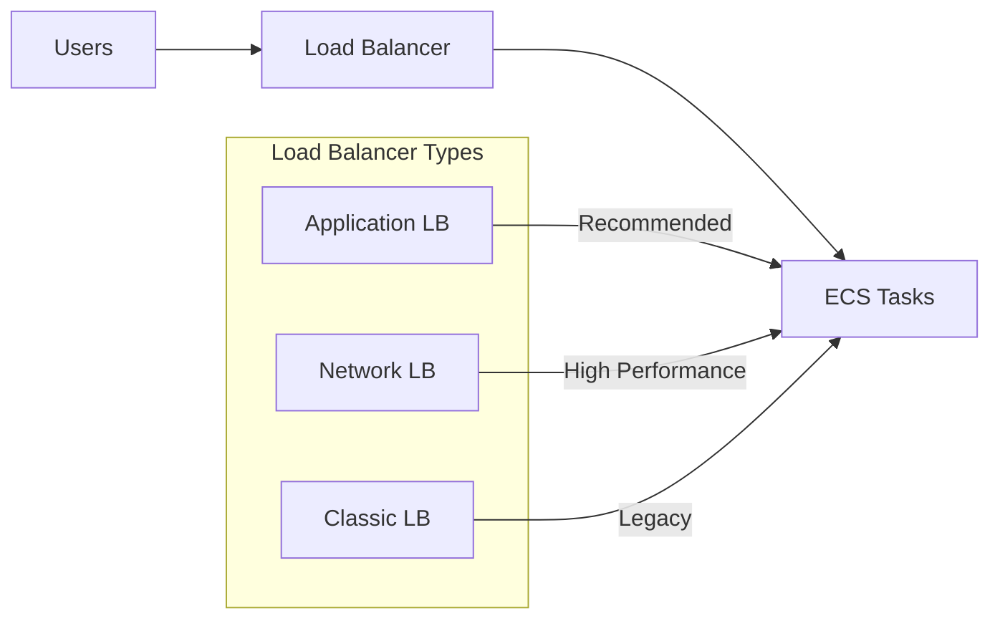
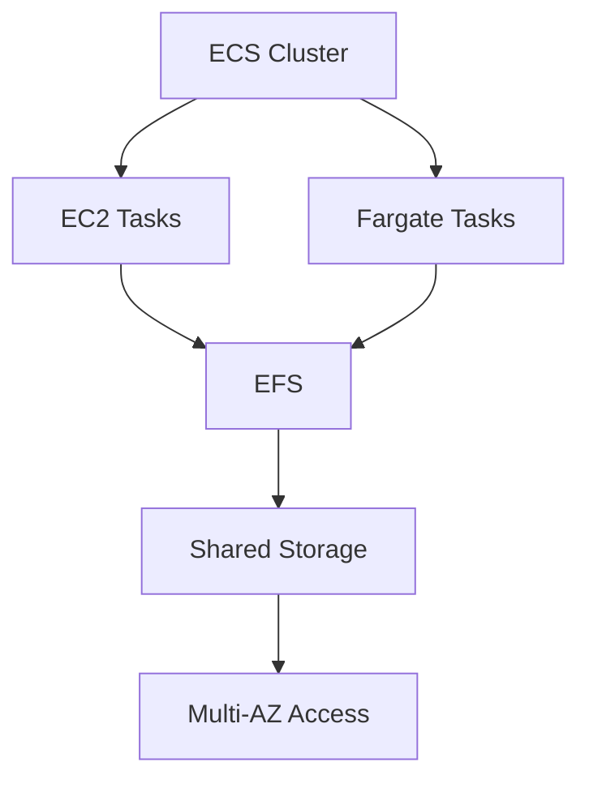

# Amazon ECS (Elastic Container Service)

## Launch Types

## IAM Roles Architecture

## Load Balancer Integration

## Data Persistence

## 1. EC2 Launch Type

### Components
1. **ECS Cluster**
   - EC2 instances
   - Infrastructure management
   - Resource provisioning

2. **ECS Agent**
   - Container management
   - Instance registration
   - Task placement

## 2. Fargate Launch Type

### Features
1. **Serverless**
   - No infrastructure management
   - Automatic provisioning
   - Pay per task

2. **Scaling**
   - Task-based scaling
   - Resource allocation
   - Auto management

## 3. IAM Roles Configuration

### EC2 Instance Profile
- ECS Agent permissions
- Service communication
- Log management
- Image pulling

### Task Roles
1. **Task-specific**
   - Service access
   - Resource permissions
   - Security isolation

2. **Configuration**
   - Task definition
   - Role assignment
   - Permission management

## 4. Load Balancer Options

### Application Load Balancer
- Default choice
- HTTP/HTTPS routing
- Advanced features
- Fargate compatible

### Network Load Balancer
- High performance
- TCP/UDP traffic
- PrivateLink support

### Classic Load Balancer
- Legacy support
- Limited features
- Not recommended

## 5. Data Volume Management

### EFS Integration
1. **Features**
   - Network file system
   - Cross-AZ access
   - Shared storage

2. **Benefits**
   - Serverless
   - Pay as you go
   - Scalable

## Best Practices

### 1. Launch Type Selection
- Evaluate management needs
- Consider cost model
- Assess scaling requirements

### 2. Security
- IAM role separation
- Least privilege
- Regular audits

### 3. Performance
- Load balancer selection
- Storage optimization
- Resource allocation

## Exam Tips

1. **Launch Types**
   - EC2 vs Fargate
   - Management overhead
   - Use case scenarios

2. **IAM Roles**
   - Instance profile
   - Task roles
   - Permission scope

3. **Infrastructure**
   - Load balancer choice
   - Storage options
   - Scaling considerations