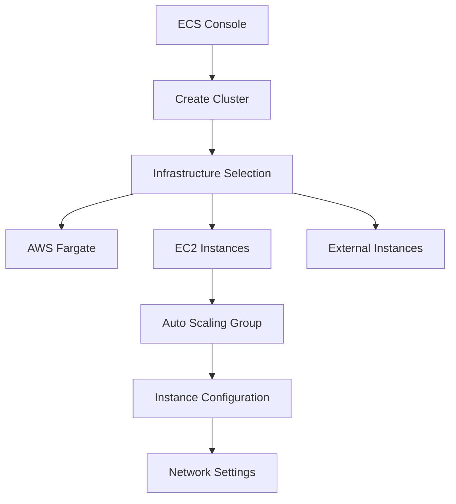
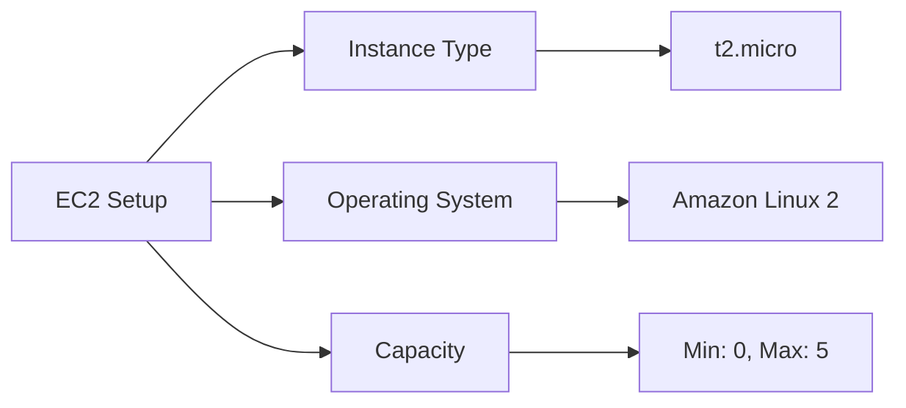
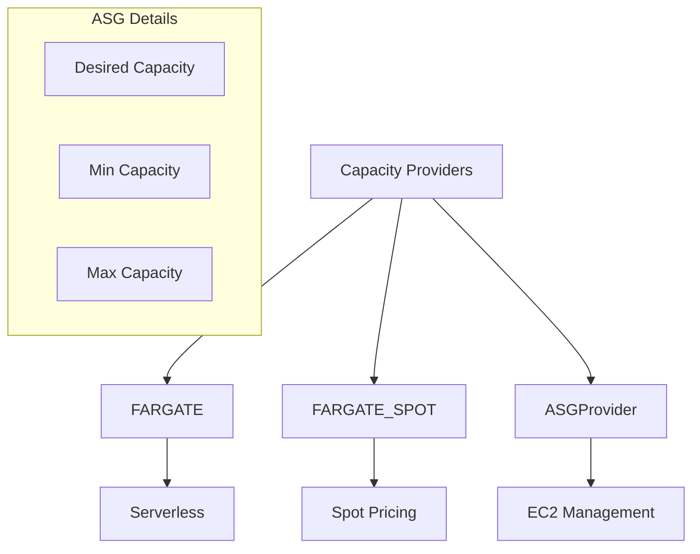
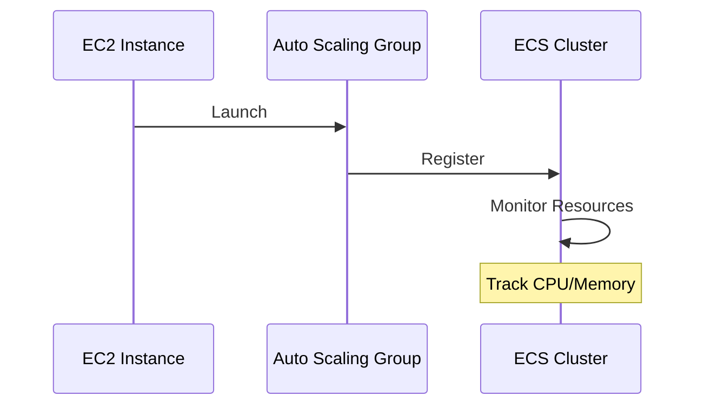

# Hướng dẫn Tạo ECS Cluster

## Quy trình Thiết lập

## 1. Cấu hình Cơ bản

### Cluster Settings
- Tên: DemoCluster
- Namespace: Default
- Infrastructure Options:
  - AWS Fargate
  - Amazon EC2
  - External instances

## 2. Infrastructure Setup

### EC2 Configuration

### Network Settings
1. **VPC Configuration**
   - Default VPC
   - 3 subnets
   - Default security group
   - Auto-assign public IP

## 3. Capacity Providers

### Provider Types
1. **FARGATE**
   - Serverless
   - Managed by AWS
   - On-demand pricing

2. **FARGATE_SPOT**
   - Spot pricing
   - Cost optimization
   - Variable capacity

3. **ASGProvider**
   - EC2 instances
   - Auto scaling
   - Custom capacity

## 4. Container Instances

### Resource Metrics
- CPU units: 1,024
- Memory: 982MB
- Task capacity
- Instance status

### Monitoring

## 5. Implementation Steps

### 1. Initial Setup
1. Access ECS Console
2. Enable new ECS experience
3. Navigate to Clusters
4. Click Create Cluster

### 2. Infrastructure Choice
1. Enable Fargate
2. Configure EC2
   - Instance type
   - Operating system
   - Capacity limits

### 3. Network Configuration
1. Select VPC
2. Choose subnets
3. Configure security group
4. Set IP assignment

### 4. Capacity Management
1. Set ASG parameters
2. Monitor instances
3. Adjust capacity
4. Track resources

## 6. Verification Steps

### 1. Cluster Health
- Check status
- Verify providers
- Monitor instances
- Review capacity

### 2. Instance Status
- Running state
- Registration
- Resource availability
- Task capacity

## Best Practices

### 1. Capacity Planning
- Start small
- Monitor usage
- Scale gradually
- Plan redundancy

### 2. Network Design
- Multi-AZ setup
- Security groups
- IP management
- Subnet allocation

### 3. Monitoring
- Resource tracking
- Performance metrics
- Capacity alerts
- Health checks

## Exam Tips

1. **Infrastructure Options**
   - Fargate benefits
   - EC2 management
   - External instances

2. **Capacity Providers**
   - Provider types
   - Use cases
   - Management options

3. **Resource Management**
   - ASG configuration
   - Instance monitoring
   - Scaling strategies