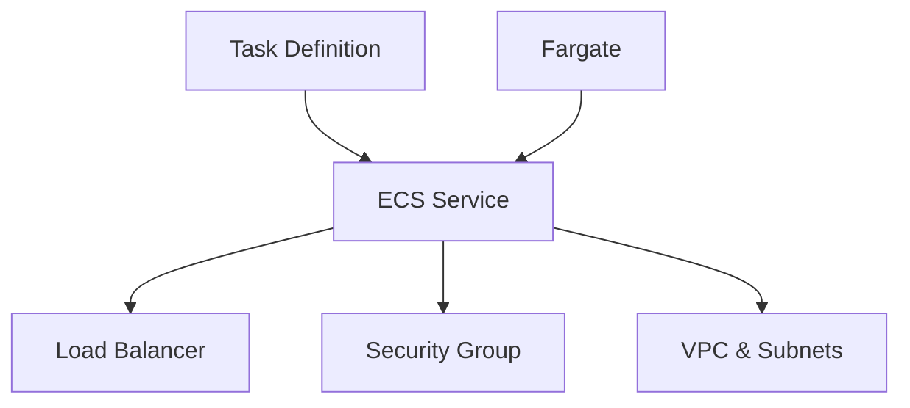
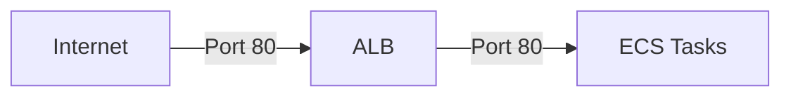

# Hướng dẫn Triển khai Dịch vụ trên Amazon ECS

## Mục lục
1. [Tổng quan](#tổng-quan)
2. [Các thành phần chính](#các-thành-phần-chính)
3. [Quy trình triển khai](#quy-trình-triển-khai)
4. [Chi tiết cấu hình](#chi-tiết-cấu-hình)
5. [Quản lý và giám sát](#quản-lý-và-giám-sát)

## Tổng quan

Amazon ECS (Elastic Container Service) là dịch vụ điều phối container có khả năng mở rộng cao. Bài hướng dẫn này tập trung vào việc triển khai một ứng dụng web NGINX sử dụng ECS với AWS Fargate.

## Các thành phần chính

### 1. Task Definition
- **Cấu hình container**:
  - Image: nginxdemos/hello
  - Port mapping: 80:80
  - CPU: 0.5 vCPU
  - Memory: 1GB
  
### 2. ECS Service
- **Loại triển khai**: Fargate (Serverless)
- **Số lượng task**: Có thể điều chỉnh (1-3 replicas)
- **Network mode**: awsvpc
- **Load balancing**: Application Load Balancer

## Quy trình triển khai

### Bước 1: Tạo Task Definition
1. Đặt tên task definition: `nginxdemos-hello`
2. Chọn launch type: Fargate
3. Cấu hình container:
   - Image: nginxdemos/hello
   - Port mapping: 80:80
   - Resource limits: 0.5 vCPU, 1GB memory

### Bước 2: Tạo ECS Service
1. Chọn compute options: Fargate
2. Cấu hình service:
   - Service type: REPLICA
   - Số lượng tasks
   - Network configuration
   - Load balancer settings

### Bước 3: Cấu hình Network
1. Chọn VPC và subnets
2. Tạo security group:
   - Inbound rule: Port 80
   - Source: 0.0.0.0/0

### Bước 4: Cấu hình Load Balancer
1. Tạo Application Load Balancer
2. Cấu hình target group:
   - Protocol: HTTP
   - Health check path: /
   - Port: 80

## Chi tiết cấu hình

### Security Group

### Monitoring
- **Metrics quan trọng**:
  - Số lượng tasks đang chạy
  - Target group health
  - ALB metrics
  - Container logs

## Quản lý và giám sát

### Scaling
1. **Horizontal scaling**:
   - Điều chỉnh số lượng tasks
   - Có thể cấu hình auto-scaling

### Logging và Monitoring
1. **Container logs**: Có thể xem trực tiếp từ ECS console
2. **Service events**: Theo dõi các thay đổi và deployment
3. **Health checks**: Kiểm tra qua ALB target group

### Các lệnh quản lý thường dùng
- Update service (scale up/down)
- View service events
- Check task status
- Monitor load balancer health

## Lưu ý quan trọng
1. **Costs**: 
   - Fargate tính phí theo CPU/Memory sử dụng
   - ALB tính phí theo số lượng requests
   
2. **Security**: 
   - Luôn review security group rules
   - Sử dụng IAM roles appropriately
   
3. **Best Practices**:
   - Luôn có health checks
   - Monitoring và logging đầy đủ
   - Cân nhắc auto-scaling rules