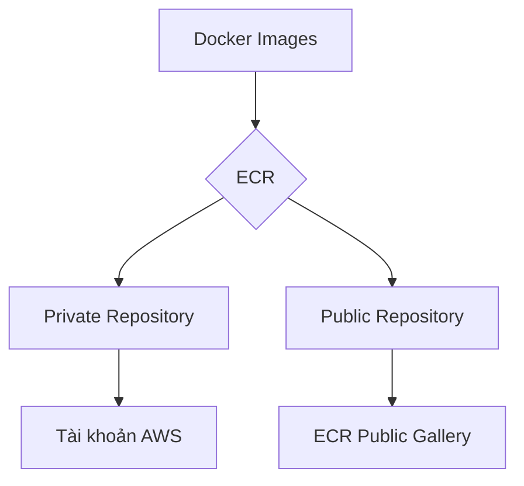
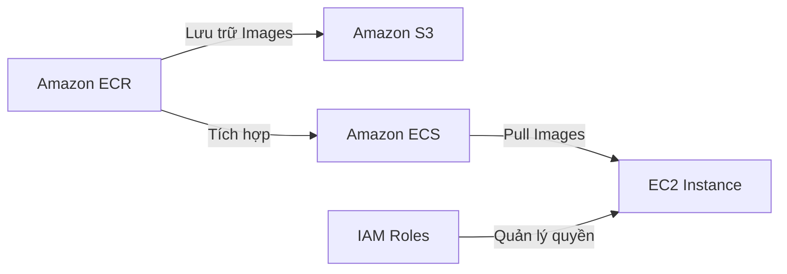

# Tổng quan về Amazon ECR (Elastic Container Registry)

## Mục lục
1. [Giới thiệu về ECR](#giới-thiệu-về-ecr)
2. [Kiến trúc và Tích hợp](#kiến-trúc-và-tích-hợp)
3. [Tính năng chính](#tính-năng-chính)
4. [Bảo mật và Quyền truy cập](#bảo-mật-và-quyền-truy-cập)

## Giới thiệu về ECR

Amazon ECR (Elastic Container Registry) là dịch vụ quản lý registry container của AWS, cho phép lưu trữ, quản lý và triển khai các Docker image.

### Các loại Repository
- **Private Repository**: Dành riêng cho tài khoản AWS của bạn
- **Public Repository**: Có thể chia sẻ rộng rãi thông qua Amazon ECR Public Gallery

## Kiến trúc và Tích hợp

### Tích hợp với các dịch vụ AWS

### Quy trình làm việc
1. Images được lưu trữ trong ECR repositories
2. Được backup tự động vào Amazon S3
3. ECS cluster có thể pull images thông qua:
   - EC2 instances với IAM roles phù hợp
   - Fargate tasks với proper permissions

## Tính năng chính

### 1. Quản lý Image
- **Versioning**: Quản lý phiên bản images
- **Image Tags**: Đánh dấu và phân loại images
- **Lifecycle Policies**: Tự động quản lý vòng đời images

### 2. Bảo mật
- **Vulnerability Scanning**: Quét lỗ hổng bảo mật
- **Encryption**: Mã hóa images tại rest
- **IAM Integration**: Kiểm soát truy cập chi tiết

### 3. Tích hợp
- Tích hợp sẵn với ECS
- Hỗ trợ CI/CD pipelines
- Cross-Region replication

## Bảo mật và Quyền truy cập

### IAM Permissions
1. **EC2 Instance Role**:
   - Cần quyền pull images từ ECR
   - Permissions cần thiết:
     - ecr:GetAuthorizationToken
     - ecr:BatchCheckLayerAvailability
     - ecr:GetDownloadUrlForLayer
     - ecr:BatchGetImage

### Best Practices
1. **Bảo mật**:
   - Sử dụng private repositories cho sensitive images
   - Implement least privilege access
   - Regular security scanning

2. **Quản lý**:
   - Implement tagging strategy
   - Set up lifecycle policies
   - Monitor repository usage

## Lưu ý quan trọng

1. **Troubleshooting**:
   - Kiểm tra IAM permissions khi gặp lỗi truy cập
   - Verify registry authentication
   - Check network connectivity

2. **Chi phí**:
   - Storage trong S3
   - Data transfer
   - API calls

3. **Use Cases**:
   - Private container registry
   - Sharing container images across accounts
   - Public image distribution