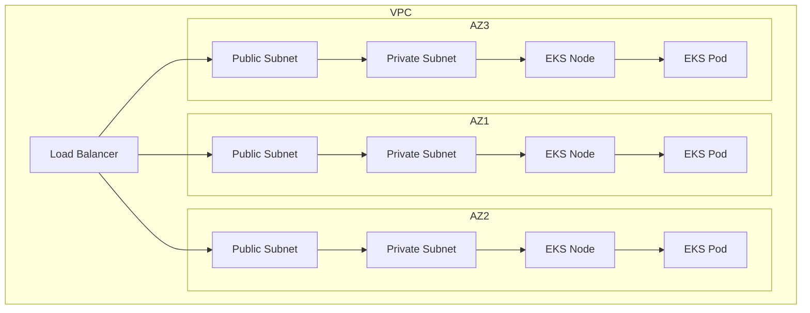
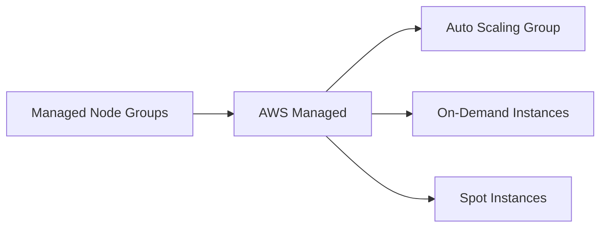
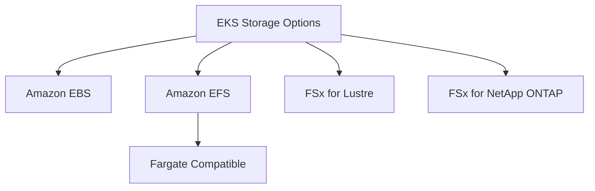

# Tổng quan về Amazon EKS (Elastic Kubernetes Service)

## Mục lục
1. [Giới thiệu](#giới-thiệu)
2. [Kiến trúc](#kiến-trúc)
3. [Các loại Node](#các-loại-node)
4. [Storage](#storage)
5. [So sánh với ECS](#so-sánh-với-ecs)

## Giới thiệu

Amazon EKS là dịch vụ cho phép chạy Kubernetes trên AWS. Kubernetes là hệ thống mã nguồn mở dùng để triển khai, mở rộng và quản lý các ứng dụng container hóa.

### Đặc điểm chính
- Hỗ trợ 2 chế độ: EC2 và Fargate
- Tương thích với Kubernetes chuẩn
- Cloud-agnostic (có thể chạy trên nhiều cloud khác nhau)

### Use Cases
- Doanh nghiệp đã sử dụng Kubernetes on-premises
- Cần khả năng di chuyển giữa các cloud
- Muốn sử dụng API chuẩn của Kubernetes

## Kiến trúc

## Các loại Node

### 1. Managed Node Groups

- AWS tạo và quản lý nodes
- Là một phần của Auto Scaling group
- Hỗ trợ cả On-Demand và Spot Instances

### 2. Self-Managed Nodes
- Tự tạo và quản lý nodes
- Đăng ký với EKS cluster
- Có thể sử dụng:
  - Amazon EKS Optimized AMI
  - Custom AMI
- Hỗ trợ cả On-Demand và Spot Instances

### 3. AWS Fargate
- Serverless
- Không cần quản lý nodes
- Tự động scale

## Storage

### Storage Classes

### Đặc điểm
- Sử dụng StorageClass manifest
- Container Storage Interface (CSI) driver
- EFS là duy nhất work với Fargate

## So sánh với ECS

| Tính năng | EKS | ECS |
|-----------|-----|-----|
| API | Kubernetes API (Open-source) | AWS proprietary API |
| Tính di động | Cao (cloud-agnostic) | Thấp (AWS-specific) |
| Độ phức tạp | Cao hơn | Thấp hơn |
| Use Cases | Multi-cloud, Kubernetes existing | AWS-native |

## Lưu ý quan trọng

1. **Triển khai**:
   - Cần hiểu về Kubernetes
   - Xem xét kinh nghiệm team
   - Đánh giá yêu cầu di động giữa các cloud

2. **Quản lý**:
   - Chọn loại node phù hợp
   - Cấu hình storage đúng cách
   - Monitoring và logging

3. **Chi phí**:
   - Worker nodes (EC2)
   - Load Balancer
   - Storage costs