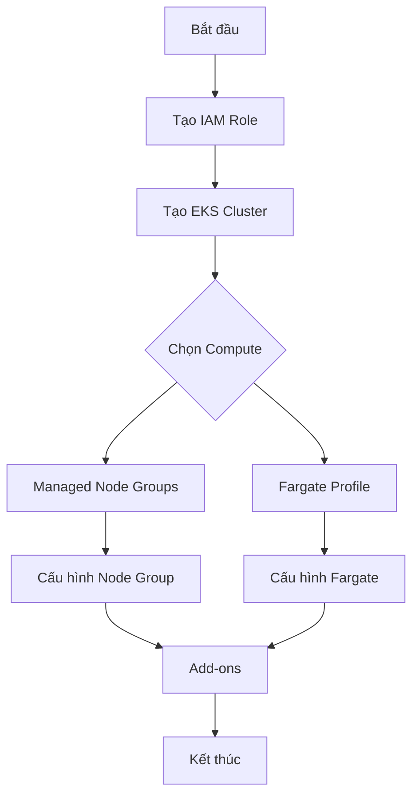
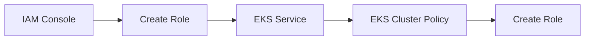
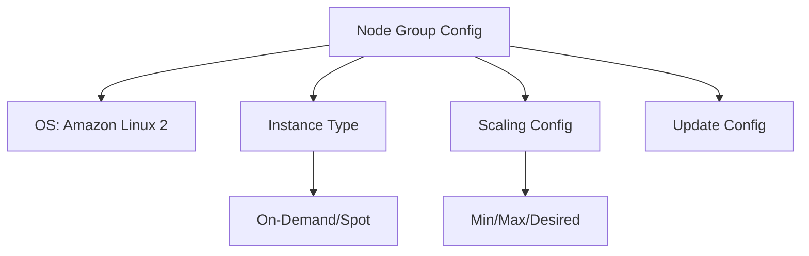

# Hướng dẫn Thực hành Triển khai Amazon EKS

## Mục lục
1. [Tạo EKS Cluster](#tạo-eks-cluster)
2. [Cấu hình Node Groups](#cấu-hình-node-groups)
3. [Cấu hình Fargate](#cấu-hình-fargate)
4. [Add-ons và Tích hợp](#add-ons-và-tích-hợp)
5. [Quản lý Cluster](#quản-lý-cluster)

## Quy trình Triển khai

## Tạo EKS Cluster

### 1. Cấu hình Cơ bản
- Tên cluster: `demoEKS`
- Phiên bản Kubernetes: Chọn phiên bản mới nhất
- Service role: Tạo mới

### 2. Tạo IAM Role cho Cluster

Các bước:
1. Vào IAM Console
2. Tạo Role mới cho EKS service
3. Chọn EKS cluster policy
4. Đặt tên: `EKSClusterRole`

### 3. Cấu hình Network
- VPC: Chọn VPC hiện có
- Subnets: Chọn nhiều AZ
- Security Groups: Default hoặc custom
- Cluster endpoint: Public access

## Cấu hình Node Groups

### 1. IAM Role cho Node Group
Tạo role mới với policies:
- AmazonEKSWorkerNodePolicy
- AmazonEC2ContainerRegistryReadOnly

### 2. Cấu hình Node

Thông số cấu hình:
- AMI: Amazon Linux 2
- Instance Type: t3.medium/t3.micro
- Disk Size: Tùy chọn
- Scaling: Min/Max/Desired nodes
- Update Configuration: Max unavailable

## Add-ons và Tích hợp

### Storage Add-ons
1. **EBS CSI Driver**
   - Cho phép sử dụng EBS volumes
   - Tích hợp với Kubernetes storage

### Network Add-ons
1. **VPC CNI**
2. **CoreDNS**
3. **kube-proxy**

## Quản lý Chi phí

### 1. Chi phí chính
- Control plane charges
- Worker node (EC2) costs
- Storage costs
- Network transfer

### 2. Tối ưu chi phí
- Sử dụng Spot Instances
- Tận dụng Auto Scaling
- Xóa resources không sử dụng

## Lưu ý Quan trọng

1. **Vấn đề Bảo mật**:
   - IAM roles phù hợp
   - Security groups
   - Network policies

2. **Best Practices**:
   - Monitoring đầy đủ
   - Backup regularly
   - Update version Kubernetes

3. **Troubleshooting**:
   - Kiểm tra IAM permissions
   - Verify network connectivity
   - Check logs và events

## Clean Up Resources

Thứ tự xóa resources:
1. Delete node groups
2. Delete Fargate profiles
3. Remove add-ons
4. Delete cluster
5. Delete IAM roles