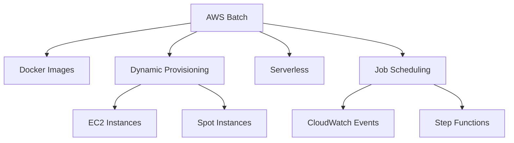
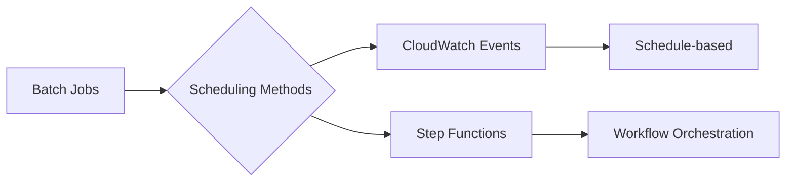
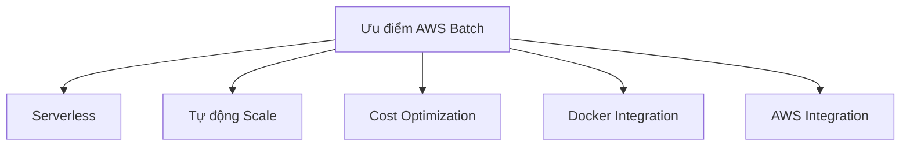
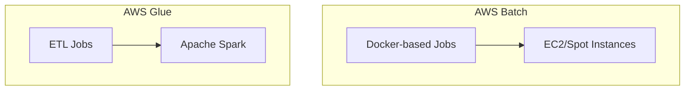

# Tổng quan về AWS Batch

## Mục lục
1. [Giới thiệu](#giới-thiệu)
2. [Kiến trúc và Hoạt động](#kiến-trúc-và-hoạt-động)
3. [Use Cases](#use-cases)
4. [So sánh với AWS Glue](#so-sánh-với-aws-glue)

## Giới thiệu

AWS Batch là dịch vụ serverless cho phép chạy các batch jobs dựa trên Docker images. Dịch vụ tự động quản lý việc provision và scale các compute resources.

### Đặc điểm chính

## Kiến trúc và Hoạt động

### 1. Quản lý Tài nguyên
- Tự động provision EC2 instances
- Tối ưu số lượng và loại instances
- Dựa trên volume và yêu cầu của jobs

### 2. Job Scheduling

## Use Cases

### 1. Các trường hợp phù hợp
- Clean-up tasks trên S3
- Xử lý dữ liệu định kỳ
- Tính toán khoa học
- Render video/hình ảnh
- Phân tích dữ liệu batch

### 2. Ưu điểm

## So sánh với AWS Glue

### AWS Batch
- **Mục đích**: Xử lý batch jobs đa dạng
- **Công nghệ**: Dựa trên Docker images
- **Phạm vi**: Mọi loại công việc tính toán batch
- **Tài nguyên**: EC2 instances trong tài khoản của bạn
- **Use Cases**: Non-ETL batch processing

### AWS Glue
- **Mục đích**: ETL specific
- **Công nghệ**: Apache Spark (Scala/Python)
- **Phạm vi**: Chuyên biệt cho ETL
- **Tài nguyên**: Fully managed
- **Use Cases**: Data transformation, ETL jobs

## Lưu ý Quan trọng

### 1. Khi nào dùng AWS Batch
- Cần chạy jobs dựa trên Docker
- Công việc không liên quan đến ETL
- Cần tính linh hoạt trong xử lý
- Muốn tận dụng spot instances

### 2. Khi nào dùng AWS Glue
- Cần thực hiện ETL
- Làm việc với Apache Spark
- Cần data catalog
- Focus vào data transformation

### 3. Cost Optimization
- Tận dụng spot instances
- Tự động scale theo nhu cầu
- Chỉ trả tiền cho EC2 resources được sử dụng

## Best Practices

1. **Docker Images**:
   - Tối ưu kích thước image
   - Đảm bảo tính ổn định
   - Quản lý versions

2. **Job Management**:
   - Định nghĩa retry policies
   - Monitoring và logging đầy đủ
   - Cấu hình timeout phù hợp

3. **Resource Management**:
   - Chọn instance types phù hợp
   - Cân nhắc sử dụng spot instances
   - Theo dõi resource utilization