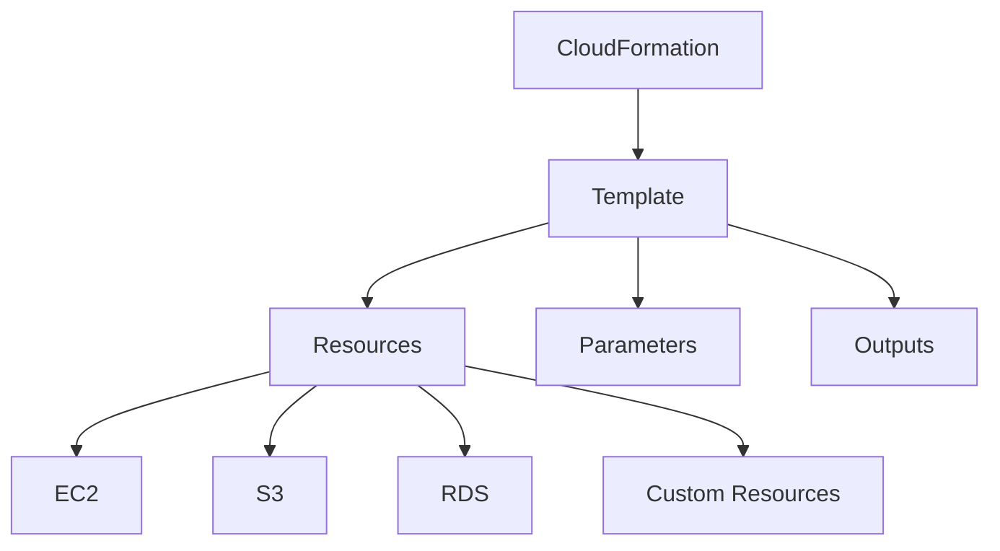
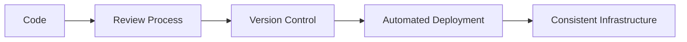
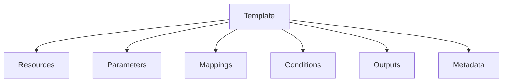
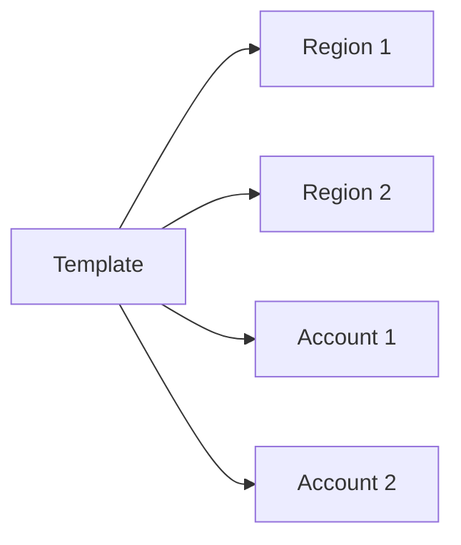
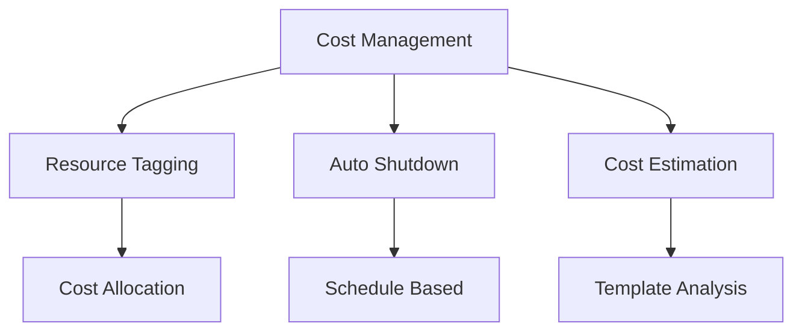

# Tổng quan về AWS CloudFormation

## Mục lục
1. [Giới thiệu](#giới-thiệu)
2. [Lợi ích chính](#lợi-ích-chính)
3. [Kiến trúc và Hoạt động](#kiến-trúc-và-hoạt-động)
4. [Use Cases](#use-cases)
5. [Best Practices](#best-practices)

## Giới thiệu

AWS CloudFormation là công cụ Infrastructure as Code (IaC) cho phép khai báo và quản lý tài nguyên AWS một cách tự động và có kiểm soát.

### Đặc điểm chính

## Lợi ích chính

### 1. Infrastructure as Code

### 2. Quản lý Chi phí
- Tự động gắn tags cho resources
- Dễ dàng ước tính chi phí
- Chiến lược tiết kiệm tự động:
  - Xóa resources sau giờ làm việc
  - Tạo lại vào sáng hôm sau

### 3. Productivity
- Tạo/xóa infrastructure nhanh chóng
- Tự động tạo sơ đồ kiến trúc
- Lập trình khai báo (declarative)
- Tái sử dụng templates

## Kiến trúc và Hoạt động

### 1. Template Structure

### 2. Application Composer
- Trực quan hóa template
- Hiển thị quan hệ giữa resources
- Hỗ trợ thiết kế kiến trúc

## Use Cases

### 1. Môi trường Phát triển
- Dev/Test/Prod environments
- Đồng bộ cấu hình
- Quản lý phiên bản

### 2. Multi-Region/Account

## Best Practices

### 1. Template Design
- Sử dụng parameters cho flexibility
- Tận dụng conditions cho logic
- Tổ chức resources hợp lý

### 2. Security
- Review code thường xuyên
- Kiểm soát quyền truy cập
- Mã hóa sensitive data

### 3. Cost Management

## Lưu ý Quan trọng

1. **Lifecycle Management**:
   - Version control cho templates
   - Change management process
   - Rollback strategy

2. **Resource Dependencies**:
   - Tự động xử lý thứ tự tạo/xóa
   - Quản lý references giữa resources
   - Xử lý circular dependencies

3. **Monitoring**:
   - Stack events và status
   - Resource health checks
   - Drift detection

## Tips and Tricks

1. **Template Development**:
   - Sử dụng CloudFormation Designer
   - Validate templates trước khi deploy
   - Tận dụng existing templates

2. **Deployment Strategy**:
   - Testing trên môi trường dev
   - Sử dụng change sets
   - Backup important data

3. **Maintenance**:
   - Regular updates
   - Clean up unused resources
   - Monitor stack health