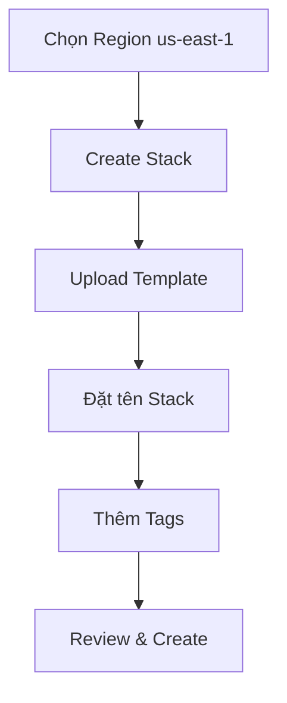
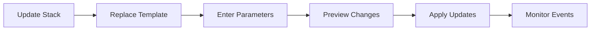
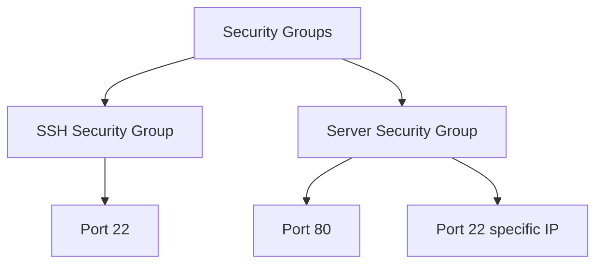
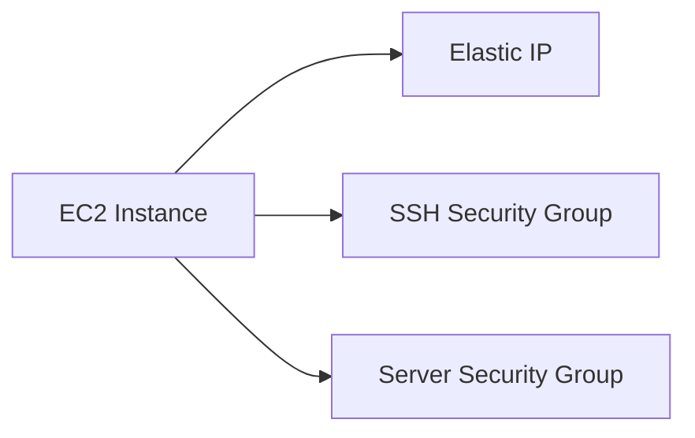
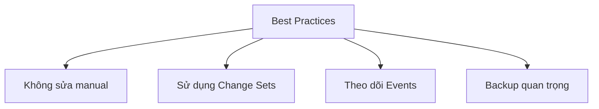

# Hướng dẫn Thực hành AWS CloudFormation

## Mục lục
1. [Tạo Stack Đầu Tiên](#tạo-stack-đầu-tiên)
2. [Cập Nhật Stack](#cập-nhật-stack)
3. [Kiểm Tra Resources](#kiểm-tra-resources)
4. [Application Composer](#application-composer)

## Tạo Stack Đầu Tiên

### Template Cơ Bản
```yaml
Resources:
  MyInstance:
    Type: AWS::EC2::Instance
    Properties:
      AvailabilityZone: us-east-1a
      ImageId: ami-xxxxx
      InstanceType: t2.micro
```

### Các bước thực hiện


## Cập Nhật Stack

### Template Nâng Cao
```yaml
Parameters:
  SGDescription:
    Type: String
    Description: Security Group Description

Resources:
  MyInstance:
    Type: AWS::EC2::Instance
    Properties:
      SecurityGroups:
        - !Ref ServerSecurityGroup
        - !Ref SSHSecurityGroup
      
  MyEIP:
    Type: AWS::EC2::EIP
    Properties:
      InstanceId: !Ref MyInstance

  ServerSecurityGroup:
    Type: AWS::EC2::SecurityGroup
    Properties:
      GroupDescription: !Ref SGDescription
      SecurityGroupIngress:
        - IpProtocol: tcp
          FromPort: 80
          ToPort: 80
          CidrIp: 0.0.0.0/0
```

### Quy trình Cập nhật


## Kiểm Tra Resources

### 1. EC2 Instance
- Kiểm tra instance type
- Verify AMI ID
- Xem tags được áp dụng

### 2. Security Groups


### 3. Elastic IP
- Verify allocation
- Kiểm tra attachment
- Xem tags

## Application Composer

### Visualization


### Chức năng
1. **Hiển thị trực quan**:
   - Xem kiến trúc
   - Quan hệ giữa resources
   - Code preview

2. **Chỉnh sửa**:
   - Double-click components
   - View properties
   - YAML/JSON switch

## Lưu ý Quan trọng

### 1. Region Dependency
- Template chỉ hoạt động trong us-east-1
- AMI IDs là region-specific

### 2. Change Management
- Preview changes trước khi apply
- Hiểu về resource replacement
- Theo dõi events

### 3. Best Practices


## Cleanup Process

### 1. Xóa Stack
- Sử dụng Delete Stack
- Không xóa resources thủ công
- CloudFormation tự xác định thứ tự xóa

### 2. Verification
- Kiểm tra resources đã xóa
- Verify tags đã được dọn dẹp
- Check dependencies