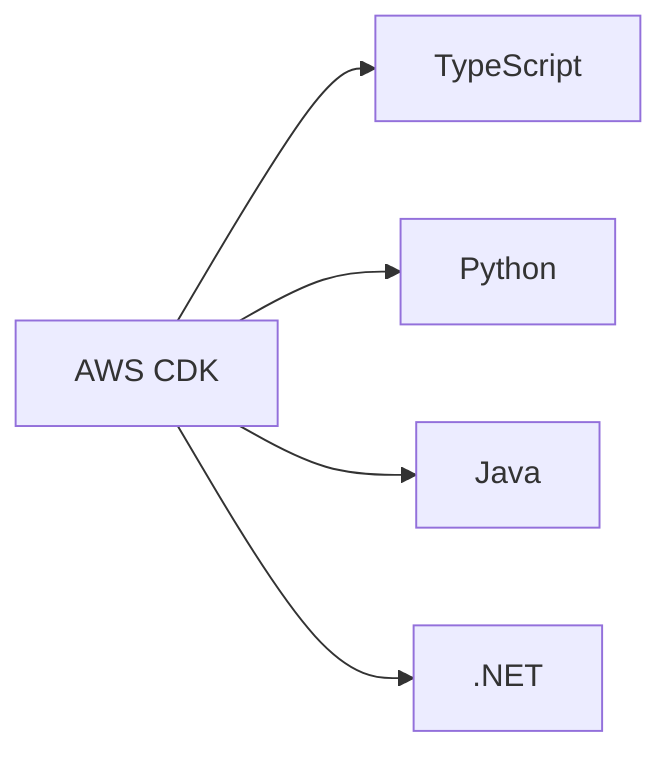
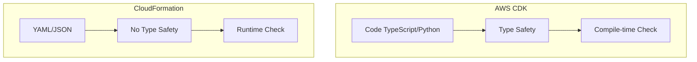
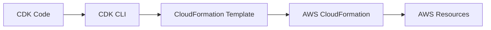
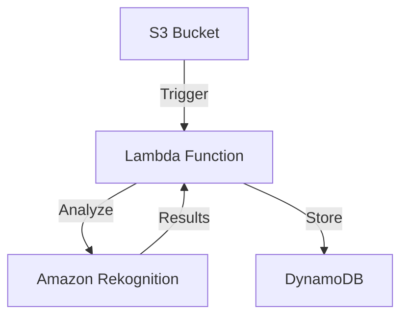
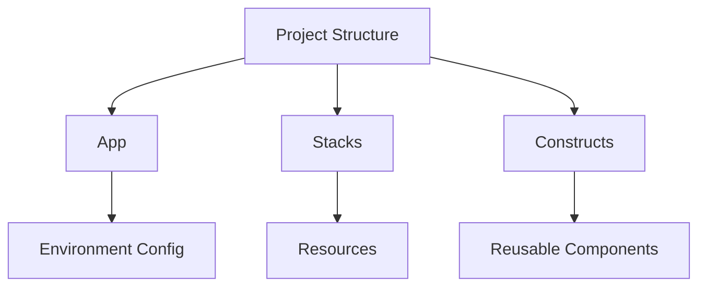
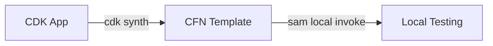

# Tổng quan về AWS CDK (Cloud Development Kit)

## Mục lục
1. [Giới thiệu](#giới-thiệu)
2. [So sánh với các công cụ khác](#so-sánh-với-các-công-cụ-khác)
3. [Kiến trúc và Hoạt động](#kiến-trúc-và-hoạt-động)
4. [Ví dụ Thực tế](#ví-dụ-thực-tế)

## Giới thiệu

AWS CDK là công cụ cho phép định nghĩa infrastructure bằng ngôn ngữ lập trình quen thuộc, sau đó tự động chuyển đổi thành CloudFormation templates.

### Ngôn ngữ hỗ trợ


## So sánh với các công cụ khác

### 1. CDK vs CloudFormation


### 2. CDK vs SAM
| Tính năng | CDK | SAM |
|-----------|-----|-----|
| Focus | Tất cả services | Serverless |
| Ngôn ngữ | Programming languages | YAML/JSON |
| Phạm vi | Full AWS | Lambda-focused |
| Backend | CloudFormation | CloudFormation |

## Kiến trúc và Hoạt động

### Quy trình làm việc


### Constructs
1. **Level 1 (L1)**:
   - CFN Resources
   - Mapping 1:1 với CloudFormation
   
2. **Level 2 (L2)**:
   - AWS Constructs
   - Cấu hình mặc định tốt
   
3. **Level 3 (L3)**:
   - Patterns
   - Solutions Constructs

## Ví dụ Thực tế

### 1. Định nghĩa Infrastructure
```typescript
// Định nghĩa VPC
const vpc = new ec2.Vpc(this, 'MyVPC', {
  maxAzs: 3
});

// Tạo ECS Cluster
const cluster = new ecs.Cluster(this, 'MyCluster', {
  vpc: vpc
});

// Tạo Fargate Service với ALB
const fargateService = new ecs_patterns.ApplicationLoadBalancedFargateService(
  this,
  'MyFargateService',
  {
    cluster: cluster,
    cpu: 512,
    desiredCount: 6,
    taskImageOptions: {
      image: ecs.ContainerImage.fromRegistry("amazon/amazon-ecs-sample")
    },
    memoryLimitMiB: 2048,
    publicLoadBalancer: true
  }
);
```

### 2. Image Recognition App Architecture


## Best Practices

### 1. Phát triển
- Sử dụng type safety
- Tận dụng constructs có sẵn
- Unit testing cho infrastructure

### 2. Tổ chức Code


### 3. Testing và Deployment
- Unit tests cho constructs
- Integration với CI/CD
- Snapshots testing

## Kết hợp CDK và SAM

### Local Testing
1. Chạy `cdk synth`
2. Generate CloudFormation template
3. Sử dụng SAM local invoke



## Lưu ý Quan trọng

1. **Hiệu suất**:
   - Compile-time validation
   - Tái sử dụng code
   - Custom constructs

2. **Maintainability**:
   - Version control
   - Code review
   - Documentation

3. **Security**:
   - IAM policies
   - Security groups
   - Network config